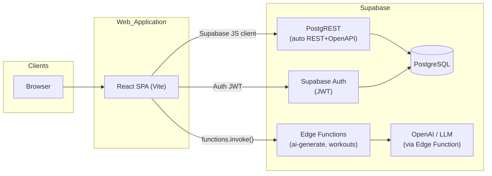

# Architecture

Product intent and functional scope are defined in [docs/PRD.md](PRD.md). This document reflects the **as-built** system.

## Overview

Training Records is a **React SPA** for logging workouts, backed by **Supabase** for database, authentication, and serverless functions.



> **MVP note:** The SPA calls Supabase PostgREST directly via the Supabase JS client for all CRUD operations. Edge Functions are used only for AI workout generation. A future iteration will route all mutations through the Edge Function gateway (`/api/v1/`).

## Data Models

### `profiles`

Extends `auth.users` — one row per user.

```sql
create table public.profiles (
  id   uuid primary key references auth.users(id) on delete cascade,
  role text not null default 'athlete' check (role in ('athlete', 'admin'))
);
```

### `workouts`

```sql
create table public.workouts (
  id               uuid primary key default gen_random_uuid(),
  user_id          uuid not null references auth.users(id) on delete cascade,
  title            text not null,
  type             text not null check (type in ('crossfit', 'functional')),
  performed_at     timestamptz not null,
  duration_minutes integer not null check (duration_minutes > 0),
  notes            text,
  rpe              integer check (rpe between 1 and 10),
  -- iteration 2: structured WOD fields
  wod_format       text check (wod_format in ('amrap', 'for_time', 'emom', 'tabata', 'ladder', 'rft')),
  wod_text         text,
  payload          jsonb,
  created_at       timestamptz not null default now(),
  updated_at       timestamptz not null default now()
);
```

### `categories`

Exercise categories. RLS: read = authenticated, write = admin.

```sql
create table public.categories (
  id          uuid primary key default gen_random_uuid(),
  name        text not null unique,
  description text
);
```

### `equipment`

Equipment types. RLS: read = authenticated, write = admin.

```sql
create table public.equipment (
  id          uuid primary key default gen_random_uuid(),
  name        text not null unique,
  description text
);
```

### `exercises`

Exercise catalog. RLS: read = authenticated, write = admin.

```sql
create table public.exercises (
  id            uuid primary key default gen_random_uuid(),
  name          text not null,
  description   text,
  movement_type text,
  category_id   uuid references public.categories(id),
  equipment     jsonb,
  created_at    timestamptz not null default now(),
  updated_at    timestamptz not null default now()
);
```

---

## BJJ Extension Data Model (Iteration 5)

### `workouts.type` extension

The `type` CHECK constraint is extended to include `'bjj'`:

```sql
ALTER TABLE public.workouts DROP CONSTRAINT workouts_type_check;
ALTER TABLE public.workouts ADD CONSTRAINT workouts_type_check
  CHECK (type IN ('crossfit', 'functional', 'bjj'));
```

### `bjj_techniques`

Admin-managed technique catalog (name, description, category, optional YouTube reference).

```sql
CREATE TABLE public.bjj_techniques (
  id          uuid        PRIMARY KEY DEFAULT gen_random_uuid(),
  name        text        NOT NULL UNIQUE,
  description text,
  category    text        CHECK (category IN ('guard', 'takedown', 'submission', 'escape', 'transition', 'other')),
  youtube_url text,
  created_at  timestamptz NOT NULL DEFAULT now(),
  updated_at  timestamptz NOT NULL DEFAULT now()
);
```

**RLS summary:**

| Operation                | Policy                         |
| ------------------------ | ------------------------------ |
| SELECT                   | Any `authenticated` user       |
| INSERT / UPDATE / DELETE | `profiles.role = 'admin'` only |

### `bjj_sections`

Ordered sections within a single BJJ workout. Each section has a goal and optional free-text + AI-enhanced description.

```sql
CREATE TABLE public.bjj_sections (
  id               uuid    PRIMARY KEY DEFAULT gen_random_uuid(),
  workout_id       uuid    NOT NULL REFERENCES public.workouts(id) ON DELETE CASCADE,
  section_number   integer NOT NULL CHECK (section_number >= 1),
  goal             text    NOT NULL,
  raw_description  text,
  ai_description   text,
  duration_minutes integer CHECK (duration_minutes BETWEEN 1 AND 300),
  created_at       timestamptz NOT NULL DEFAULT now(),
  UNIQUE (workout_id, section_number)
);
```

**RLS summary:**

| Operation                         | Policy                                                    |
| --------------------------------- | --------------------------------------------------------- |
| SELECT / INSERT / UPDATE / DELETE | Row owner only — via `workouts.user_id = auth.uid()` JOIN |

### `bjj_section_techniques`

Junction table linking a section to one or more techniques from the catalog.

```sql
CREATE TABLE public.bjj_section_techniques (
  section_id   uuid NOT NULL REFERENCES public.bjj_sections(id) ON DELETE CASCADE,
  technique_id uuid NOT NULL REFERENCES public.bjj_techniques(id) ON DELETE CASCADE,
  PRIMARY KEY (section_id, technique_id)
);
```

**RLS summary:**

| Operation                | Policy                                                                                        |
| ------------------------ | --------------------------------------------------------------------------------------------- |
| SELECT / INSERT / DELETE | Row owner only — via `bjj_sections.workout_id → workouts.user_id = auth.uid()` two-level JOIN |

### Cascade delete behaviour

Deleting a `workouts` row cascades to → `bjj_sections` → `bjj_section_techniques`. No orphan data is possible.

### Atomic save: `bjj_create_workout` RPC

BJJ workout creation (workout + sections + technique links) is wrapped in a single PostgreSQL transaction via a `SECURITY DEFINER` RPC function. The client calls `supabase.rpc('bjj_create_workout', {...})` — never parallel PostgREST calls — to prevent partial inserts (Risk R2 from proposal).

```sql
-- Signature (simplified)
CREATE OR REPLACE FUNCTION public.bjj_create_workout(
  p_title        text,
  p_performed_at timestamptz,
  p_duration_min integer,
  p_notes        text,
  p_rpe          integer,
  p_sections     bjj_section_input[]   -- custom composite type
)
RETURNS uuid   -- returns new workout.id
LANGUAGE plpgsql SECURITY DEFINER;
```

## Directory Structure

```
training-records/
├── .github/workflows/       # CI (GitHub Actions)
├── docs/                    # Project documentation
│   ├── PRD.md
│   ├── PRODUCT.md
│   ├── ARCHITECTURE.md      # This file
│   ├── STANDARDS.md
│   ├── rls-verification.md
│   └── features/            # Per-feature specs (e.g. calendar.md)
├── e2e/                     # Playwright smoke tests
│   └── smoke.spec.ts
├── src/
│   ├── app/                 # App shell, router, global providers
│   │   ├── AppShell.tsx
│   │   ├── router.tsx
│   │   └── main.tsx
│   ├── components/
│   │   └── ui/              # shadcn/ui components (button, card, dialog, form, …)
│   ├── features/
│   │   ├── auth/            # LoginPage, AuthContext, ProtectedRoute, AdminRoute
│   │   ├── workouts/        # WorkoutListPage, WorkoutDetailPage, WorkoutFormPage, WorkoutTypePicker
│   │   │   ├── components/  # WodFormatSelector, ExercisePicker, MovementFieldArray, WorkoutTypePicker
│   │   │   ├── hooks/       # useWorkouts, useWorkoutMutations, mapRow
│   │   │   ├── pages/
│   │   │   ├── registry/    # Code-first WOD format registry
│   │   │   │   ├── formats/ # amrap, for_time, emom, tabata, ladder, rft handlers
│   │   │   │   ├── index.ts
│   │   │   │   ├── registry.test.ts
│   │   │   │   └── types.ts
│   │   │   ├── workout.schema.ts
│   │   │   └── workout.types.ts
│   │   ├── bjj/             # BJJ training modality (iteration 5)
│   │   │   ├── bjj.types.ts             # BJJTechnique, BJJSection, BJJWorkout domain types
│   │   │   ├── bjj.schema.ts            # bjjTechniqueSchema, bjjSectionSchema, bjjWorkoutSchema
│   │   │   ├── pages/
│   │   │   │   └── BJJWorkoutFormPage.tsx   # Section-based workout creation form
│   │   │   ├── hooks/
│   │   │   │   ├── useBJJTechniques.ts      # TanStack Query: fetch/search technique catalog
│   │   │   │   ├── useBJJWorkoutMutations.ts # Mutation: calls bjj_create_workout RPC
│   │   │   │   ├── useBJJSectionAI.ts       # Mutation: calls bjj-section-ai Edge Function
│   │   │   │   └── mapRow.ts                # DB → domain mappers for BJJ tables
│   │   │   └── components/
│   │   │       ├── BJJSectionEditor.tsx     # Single section card (goal, description, technique picker)
│   │   │       ├── BJJWorkoutDetail.tsx     # Detail view: sections, techniques, AI/raw toggle
│   │   │       └── TechniqueSearch.tsx      # Combobox: ILIKE search + multi-select for techniques
│   │   ├── admin/           # Admin features (iteration 5+)
│   │   │   └── bjj-techniques/
│   │   │       ├── pages/
│   │   │       │   ├── BJJTechniqueListPage.tsx  # Table: name, category, youtube_url, edit/delete
│   │   │       │   └── BJJTechniqueFormPage.tsx  # Add/edit technique (create + edit modes)
│   │   │       └── hooks/
│   │   │           └── useBJJTechniqueMutations.ts  # create, update, delete mutations
│   │   ├── exercises/       # Exercise catalog (types, schema, hooks, pages)
│   │   │   ├── hooks/       # useExercises, useExerciseMutations, mapExerciseRow
│   │   │   ├── pages/       # ExerciseListPage, ExerciseFormPage
│   │   │   ├── exercise.schema.ts
│   │   │   ├── exercise.types.ts
│   │   │   └── index.ts
│   │   ├── calendar/        # CalendarPage; month/week/day; URL calendarParams
│   │   │   ├── components/  # CalendarHeader, CalendarGrid, WeekGrid, DayView, CalendarCell, WorkoutChip
│   │   │   ├── hooks/       # useWorkoutsByDateRange (+ useWorkoutsByMonth wrapper)
│   │   │   ├── pages/
│   │   │   ├── utils/       # buildCalendarDays, buildWeekDays, calendarParams
│   │   │   ├── calendar.types.ts
│   │   │   └── index.ts
│   │   └── ai/              # AIChatPage, useGenerateWorkout
│   ├── lib/
│   │   ├── api.ts           # Fetch wrapper with Bearer auth
│   │   ├── supabase.ts      # Supabase client instance
│   │   └── utils.ts
│   └── types/
│       └── supabase.ts      # Generated DB types (supabase gen types typescript)
├── supabase/
│   ├── functions/
│   │   ├── ai-generate/     # Edge Function: AI workout generation (OpenAI + mock)
│   │   ├── bjj-section-ai/  # Edge Function: AI section enhancement (iteration 5)
│   │   ├── exercises/       # Edge Function: REST CRUD for exercises, categories, equipment
│   │   └── workouts/        # Edge Function: CRUD gateway (future use)
│   ├── migrations/          # Versioned SQL migrations
│   └── seed.sql             # Development fixtures
├── playwright.config.ts
├── vitest.config.ts
└── package.json
```

## Components and Modules

### Frontend (React SPA)

| Module                               | Responsibility                                                                                                      |
| ------------------------------------ | ------------------------------------------------------------------------------------------------------------------- |
| `src/features/auth/`                 | Email/password login, JWT session via Supabase Auth, `AuthContext`, `ProtectedRoute`, `AdminRoute`                  |
| `src/features/workouts/`             | List, detail, create, and edit workout records; RHF+Zod form validation; two-step type picker                       |
| `src/features/workouts/registry/`    | Code-first WOD format registry — each format self-registers with schema + `FormSection`                             |
| `src/features/workouts/components/`  | `WodFormatSelector`, `ExercisePicker`, `MovementFieldArray`, `WorkoutTypePicker`                                    |
| `src/features/bjj/`                  | BJJ workout creation form, section editing, technique search combobox, detail view, AI enhancement hook, DB mappers |
| `src/features/admin/bjj-techniques/` | Admin CRUD for the BJJ technique catalog — list page, form page, mutations hook                                     |
| `src/features/exercises/`            | Exercise catalog — list and create/edit exercises; calls `exercises` Edge Function                                  |
| `src/features/calendar/`             | Training calendar (month/week/day) — URL `view`+`date`; `useWorkoutsByDateRange`; Supabase `workouts`; `date-fns`   |
| `src/features/ai/`                   | AI-powered workout generation — calls `ai-generate` Edge Function                                                   |
| `src/lib/supabase.ts`                | Single Supabase JS client instance (singleton)                                                                      |
| `src/lib/api.ts`                     | Fetch wrapper for raw HTTP calls with `Authorization: Bearer` header                                                |
| `src/types/supabase.ts`              | Auto-generated TypeScript types from live DB schema                                                                 |

### Backend (Supabase)

| Component                            | Responsibility                                                                                                                                           |
| ------------------------------------ | -------------------------------------------------------------------------------------------------------------------------------------------------------- |
| `supabase/migrations/`               | All schema changes and RLS policies as versioned SQL                                                                                                     |
| `supabase/functions/ai-generate/`    | Accepts a prompt, calls OpenAI (or returns a mock), returns a structured workout proposal                                                                |
| `supabase/functions/bjj-section-ai/` | Accepts section goal + raw description; retrieves matching techniques via ILIKE; calls GPT-4o-mini; returns enhanced description + matched technique IDs |
| `supabase/functions/exercises/`      | REST CRUD for exercises, categories, and equipment; admin-guarded write operations                                                                       |
| `supabase/functions/workouts/`       | CRUD gateway (reserved for future `/api/v1/` migration)                                                                                                  |
| `supabase/seed.sql`                  | Dev fixtures: 3 users (`athlete1`, `athlete2`, `admin`) + sample workouts                                                                                |

## Interfaces

### Auth (Supabase Auth)

- **Flow:** email/password (MVP)
- **Tokens:** short-lived JWT (1 hour) + refresh token; managed by `@supabase/supabase-js`, stored in `localStorage`
- **Roles:** `athlete` | `admin` — stored in `public.profiles.role`

### Row Level Security

See [docs/rls-verification.md](rls-verification.md) for full policy definitions and manual verification steps.

### Edge Functions

| Function         | Method                | Description                                                                                       |
| ---------------- | --------------------- | ------------------------------------------------------------------------------------------------- |
| `ai-generate`    | POST                  | Accepts `{ prompt: string }`, returns `WorkoutProposal`                                           |
| `exercises`      | GET/POST              | List all exercises or create one; admin guard on writes                                           |
| `exercises`      | GET/PUT/DELETE `/:id` | Fetch, update, or delete a single exercise; admin guard on writes                                 |
| `exercises`      | GET                   | `/categories` — list all categories                                                               |
| `exercises`      | GET                   | `/equipment` — list all equipment types                                                           |
| `workouts`       | ALL                   | CRUD gateway (not yet used by the SPA)                                                            |
| `bjj-section-ai` | POST                  | Accepts section goal + raw description; returns AI-enhanced description and matched technique IDs |

All Edge Functions validate the JWT before processing:

```typescript
const {
  data: { user },
  error,
} = await supabase.auth.getUser(req.headers.get('Authorization')?.replace('Bearer ', '') ?? '')
if (error || !user) return new Response('Unauthorized', { status: 401 })
```

### `bjj-section-ai` Edge Function (Iteration 5)

**File:** `supabase/functions/bjj-section-ai/index.ts`

Stateless function — takes raw section text, retrieves matching techniques from the DB via ILIKE, calls GPT-4o-mini, and returns an enriched description. The client persists the result (updates form state; optionally patches DB after save). AI enhancement is **opt-in only** — never called automatically on form submit or page load.

**Request:**

```json
{
  "section_goal": "string", // required
  "raw_description": "string" // required, min 10 chars
}
```

**Response (200):**

```json
{
  "ai_description": "string", // 2–4 sentence enhanced description
  "matched_technique_ids": ["uuid"] // subset of bjj_techniques.id
}
```

**Error responses:**

| Code | Condition                                               |
| ---- | ------------------------------------------------------- |
| 400  | Missing required fields or `raw_description` < 10 chars |
| 401  | Missing or invalid JWT                                  |
| 422  | OpenAI returned invalid response shape                  |
| 502  | OpenAI API error or empty response                      |

**Mock fallback:** When `OPENAI_API_KEY` is absent, returns a deterministic mock response (consistent with `ai-generate` and `training-evaluation` patterns). CI never depends on a live OpenAI key.

## WOD Format Registry

The registry (`src/features/workouts/registry/`) implements a **code-first extensible pattern** for CrossFit workout formats. Each format is a self-contained handler module that registers itself via a side-effect import — the core registry never hardcodes format names.

### How it works

1. Each format module calls `registerFormat(handler)` on import.
2. The barrel `registry/formats/index.ts` imports all format modules (side-effects only).
3. Consumers import from `registry/index.ts`, which re-exports `getFormat`, `listFormats`, and the shared types.
4. The dynamic `WorkoutFormPage` calls `getFormat(wod_format)` to render the correct `FormSection` and validate the correct Zod schema.

### Supported formats

| Format ID  | Label    | Score type       |
| ---------- | -------- | ---------------- |
| `amrap`    | AMRAP    | Rounds + reps    |
| `for_time` | For Time | Time (mm:ss)     |
| `emom`     | EMOM     | Completed rounds |
| `tabata`   | Tabata   | Total rounds     |
| `ladder`   | Ladder   | Reps completed   |
| `rft`      | RFT      | Time (mm:ss)     |

### `WodFormatHandler<TPayload>` interface

```ts
interface WodFormatHandler<TPayload> {
  id: WodFormat
  label: string
  scoreType: ScoreType
  defaultPayload: TPayload
  schema: ZodType<TPayload>
  FormSection: React.FC<WodFormSectionProps<TPayload>>
  normalizeScore?: (payload: TPayload) => Score
}
```

Adding a new format requires only: creating a new file in `registry/formats/`, implementing the interface, calling `registerFormat()`, and adding the import to `registry/formats/index.ts`. No changes to routing, the form page, or schema validation are needed.

## External Dependencies

| Service                        | Purpose                                        |
| ------------------------------ | ---------------------------------------------- |
| **Supabase Auth**              | Authentication; issues JWTs                    |
| **Supabase PostgreSQL**        | Primary data store                             |
| **Supabase PostgREST**         | Auto-generated REST API from DB schema         |
| **Supabase Edge Functions**    | AI workout generation; future API gateway      |
| **OpenAI (or compatible LLM)** | Powers `ai-generate` (key is server-side only) |

## Technology Stack

| Layer                 | Technology                                       |
| --------------------- | ------------------------------------------------ |
| UI                    | React 19                                         |
| Language              | TypeScript 5.x                                   |
| Styling               | Tailwind CSS v4                                  |
| Build                 | Vite 8                                           |
| Component library     | shadcn/ui (`@base-ui/react` + Radix UI)          |
| Forms                 | React Hook Form v7 + Zod v4                      |
| State / data fetching | TanStack Query v5                                |
| Date utilities        | date-fns v4                                      |
| Routing               | React Router v7                                  |
| Auth                  | Supabase Auth (JWT)                              |
| BaaS                  | Supabase (PostgreSQL, PostgREST, Edge Functions) |
| Unit tests            | Vitest v4 + React Testing Library                |
| E2E tests             | Playwright                                       |
| CI                    | GitHub Actions                                   |

## Design Decisions

| Decision                              | Status        | Notes                                                                                                                              |
| ------------------------------------- | ------------- | ---------------------------------------------------------------------------------------------------------------------------------- |
| React 19 + TypeScript + Tailwind v4   | Adopted       | Per PRD §10                                                                                                                        |
| Vite SPA                              | Adopted       | Fast dev server, minimal config                                                                                                    |
| shadcn/ui on `@base-ui/react`         | Adopted       | shadcn v4 migrated from Radix to base-ui; no `asChild` prop on Button                                                              |
| Supabase BaaS                         | Adopted       | PostgreSQL + PostgREST + Auth + Edge Functions in one platform                                                                     |
| Direct PostgREST for CRUD             | Adopted (MVP) | Hooks use Supabase JS client directly; Edge Function gateway is future work                                                        |
| Zod v4                                | Adopted       | `datetime-local` inputs need `normalizeDateTime` transform — see `workout.schema.ts`                                               |
| RLS for data isolation                | Adopted       | All user-owned tables have RLS; athletes see only their own rows                                                                   |
| Conventional Commits                  | Adopted       | No ticket-prefix format; `type(scope): description`                                                                                |
| Code-first WOD format registry        | Adopted       | Each format self-registers; adding a new format requires only a new file with no changes to the form page or router                |
| `exercises` Edge Function for catalog | Adopted       | Exercise/category/equipment CRUD lives in an Edge Function (not PostgREST direct) to enforce admin-only writes via `profiles.role` |
