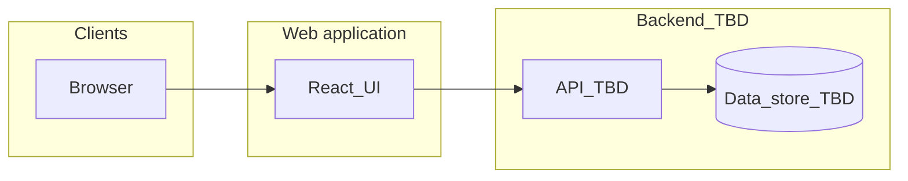

# Architecture

Product intent and functional scope for the current initiative are defined in [docs/PRD.md](PRD.md). Update this document as implementation decisions are made so it reflects the **as-built** system.

## Overview

The Training Records application is a **web front end** for logging **workouts** (fitness training sessions). It is built with **React**, **TypeScript**, and **Tailwind CSS**. Persistence, authentication, and hosting follow the choices recorded in the PRD and summarised below; replace placeholders once the stack is fixed.

## Data Models

Define concrete schemas when the API and storage are chosen. Conceptual entities from the PRD:

- **WorkoutRecord** (or **TrainingSession**) — a single **workout / exercise session** attributed to a user (fields: activity, date/time, duration or distance, notes, optional intensity, etc.).
- **User** — identity and roles when multi-user access is implemented (e.g. coach viewing athlete logs).

## Components or Modules

Structure will depend on the chosen React framework (e.g. Vite SPA vs Next.js). Typical layers:

- **UI** — pages and components (Tailwind; optional headless component primitives).
- **Data access** — API client, validation, and caching (e.g. TanStack Query) as adopted.
- **Auth** — session or token handling per chosen provider (TBD).

## Interfaces

- **HTTP API** — REST or GraphQL per PRD decision; document base URL, auth headers, and error shape here when available.
- **External IdP** — TBD (OAuth2/OIDC, etc.).

## External Dependencies

| Service | Purpose |
| --- | --- |
| TBD | Authentication / user directory |
| TBD | API and database hosting |

## Technology Stack

See [README.md](../README.md) for installation and local setup when the repo is scaffolded.

| Layer | Technology |
| --- | --- |
| UI | React |
| Language | TypeScript |
| Styling | Tailwind CSS |
| Framework | TBD (e.g. Vite, Next.js) — see [docs/PRD.md](PRD.md#10-technical-approach-fixed-stack--open-choices) |
| API | TBD |
| Tests | TBD (e.g. Vitest, Playwright) |

## Directory Structure

Document the repository layout after the project is initialised (e.g. `src/`, `app/`, `components/`).

## Design Decisions

| Decision | Status | Notes |
| --- | --- | --- |
| React + TypeScript + Tailwind | Adopted | Per [docs/PRD.md](PRD.md) |
| App framework (Vite vs Next.js, etc.) | Open | Record here when chosen |
| Auth and API contract | Open | Align early to unblock FRs |
