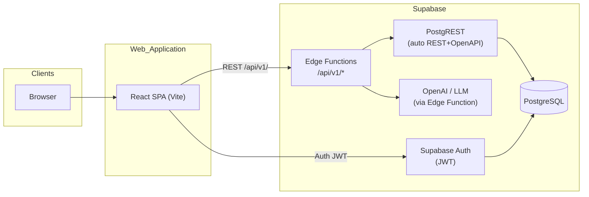

# Architecture

Product intent and functional scope for the current initiative are defined in [docs/PRD.md](PRD.md). Update this document as implementation decisions are made so it reflects the **as-built** system.

## Overview

The Training Records application is a **web front end** for logging **workouts** (fitness training sessions). It is built with **React**, **TypeScript**, and **Tailwind CSS**, backed by **Supabase** for database, authentication, and serverless functions.



## Data Models

Define concrete schemas when the API and storage are chosen. Conceptual entities from the PRD:

- **WorkoutRecord** (or **TrainingSession**) — a single **workout / exercise session** attributed to a user (fields: activity, date/time, duration or distance, notes, optional intensity, etc.).
- **User** — identity and roles when multi-user access is implemented (e.g. coach viewing athlete logs).

## Components or Modules

Frontend layers (Vite + React SPA):

- **UI** — pages and components (`src/pages/`, `src/components/`); Tailwind + shadcn/ui
- **Data access** — centralised API client (`src/lib/api.ts`), TanStack Query hooks (`src/hooks/use*.ts`), types from `src/types/supabase.ts`
- **Auth** — Supabase JS client (`src/lib/supabase.ts`); auth context/provider wrapping the app; protected route component that redirects unauthenticated users

Backend layers (Supabase):

- **Edge Functions** (`supabase/functions/`) — one function per logical route group (`workouts`, `me`, `ai`)
- **Migrations** (`supabase/migrations/`) — all schema changes and RLS policies as versioned SQL files
- **Seed** (`supabase/seed.sql`) — development fixtures

## Interfaces

### HTTP API

- **Base URL:** `https://<project>.supabase.co/functions/v1/api/v1` (Edge Function gateway)
- **Auth header:** `Authorization: Bearer <supabase-jwt>`
- **OpenAPI spec:** auto-generated by PostgREST at `https://<project>.supabase.co/rest/v1/` and extended by Edge Function schemas; TypeScript types committed at `src/types/supabase.ts`
- **Error shape:** standardised per PRD §10 — `{ "error": { "code": string, "message": string, "details": {} } }`
- Core routes: see PRD §10 for the full endpoint list (`/workouts`, `/me`, `/ai/workouts/generate`)

### Auth (Supabase Auth)

- **Flow:** email/password (MVP); social providers can be enabled later with no schema changes
- **Tokens:** short-lived JWT (access token, 1 hour) + refresh token; managed automatically by `@supabase/supabase-js` and stored in `localStorage`
- **Roles:** a `role` custom claim is added to the JWT via a Supabase Auth Hook (database function triggered on sign-in). Values: `athlete` | `admin`

**Custom claim hook** (PostgreSQL function, runs on token refresh):

```sql
-- supabase/migrations/xxxx_auth_hook_set_role.sql
create or replace function public.custom_access_token_hook(event jsonb)
returns jsonb language plpgsql as $$
declare
  user_role text;
begin
  select role into user_role from public.profiles where id = (event->>'user_id')::uuid;
  return jsonb_set(event, '{claims,role}', to_jsonb(coalesce(user_role, 'athlete')));
end;
$$;
```

**Profiles table** (extends `auth.users`, one row per user):

```sql
create table public.profiles (
  id   uuid primary key references auth.users(id) on delete cascade,
  role text not null default 'athlete' check (role in ('athlete', 'admin'))
);
alter table public.profiles enable row level security;
```

**Row Level Security policies** (applied to all user-owned tables, e.g. `workouts`):

```sql
-- Athletes see and modify only their own rows
create policy "athlete_own_rows" on public.workouts
  for all using (auth.uid() = user_id);

-- Admins can read all rows (no write bypass — admins manage via profiles/users only)
create policy "admin_read_all" on public.workouts
  for select using (
    (select role from public.profiles where id = auth.uid()) = 'admin'
  );
```

**Edge Function auth validation:**

Every Edge Function validates the JWT before processing any request:

```typescript
const { data: { user }, error } = await supabase.auth.getUser(
  req.headers.get('Authorization')?.replace('Bearer ', '') ?? ''
)
if (error || !user) return new Response('Unauthorized', { status: 401 })
```

## External Dependencies

| Service | Purpose |
| --- | --- |
| **Supabase Auth** | Authentication and user directory; issues JWTs consumed by the SPA and Edge Functions |
| **Supabase PostgreSQL** | Primary data store for workout records and user data |
| **Supabase PostgREST** | Auto-generated REST API + OpenAPI 3.0 spec from the database schema |
| **Supabase Edge Functions** | Custom serverless endpoints — exposes `/api/v1/*` routes and proxies AI workout generation |
| **OpenAI (or compatible LLM)** | Powers the `POST /api/v1/ai/workouts/generate` endpoint (called from Edge Functions; key never in client bundle) |

## Technology Stack

See [README.md](../README.md) for installation and local setup when the repo is scaffolded.

| Layer | Technology |
| --- | --- |
| UI | React |
| Language | TypeScript |
| Styling | Tailwind CSS |
| Framework | Vite + React SPA |
| Component library | shadcn/ui (Radix UI + Tailwind) |
| State / data fetching | TanStack Query |
| Routing | React Router |
| API | REST + OpenAPI 3.x (Supabase PostgREST + Edge Functions) |
| TypeScript types | Auto-generated from Supabase schema via `supabase gen types typescript` |
| Auth | Supabase Auth (JWT); Athlete / Administrator roles |
| BaaS / hosting | Supabase (PostgreSQL, PostgREST, Edge Functions, Auth) |
| Tests | Vitest + React Testing Library; Playwright for critical E2E |

## Directory Structure

Document the repository layout after the project is initialised (e.g. `src/`, `app/`, `components/`).

## Design Decisions

| Decision | Status | Notes |
| --- | --- | --- |
| React + TypeScript + Tailwind | Adopted | Per [docs/PRD.md](PRD.md) |
| App framework | Adopted | Vite + React SPA (per PRD §10) |
| Component library | Adopted | shadcn/ui (Radix UI + Tailwind) — per PRD §16 |
| BaaS / backend | Adopted | **Supabase** — PostgreSQL, PostgREST (REST + OpenAPI), Auth, Edge Functions; see rationale below |
| API URL pattern | Adopted | **Edge Functions expose `/api/v1/*`** — PRD mandates `/api/v1/` prefix; PostgREST (`/rest/v1/`) is used internally by Edge Functions; the SPA only talks to `/api/v1/` |
| Auth strategy | Adopted | **Supabase Auth (JWT)** with a `role` custom claim (`athlete` \| `admin`); Row Level Security (RLS) policies on all tables enforce data isolation per user |
| TypeScript type generation | Adopted | `supabase gen types typescript` produces types from the live DB schema; committed to `src/types/supabase.ts` and kept in sync via CI |

### BaaS Selection Rationale (Supabase)

The PRD mandates a REST API with an **OpenAPI 3.x contract** and TypeScript type generation from that spec — requirements that ruled out Firebase (NoSQL, no native REST+OpenAPI surface) and partially ruled out PocketBase (no first-class OpenAPI 3.x). Supabase was chosen because:

- **PostgREST** auto-generates a compliant REST API and OpenAPI spec from the PostgreSQL schema.
- **PostgreSQL** is a natural fit for structured, typed workout data and future Phase 2 analytics (PR charts, zone summaries).
- **Edge Functions** (Deno) handle custom logic: the `/api/v1/` routing gateway and AI workout generation — keeping the OpenAI API key server-side (satisfies NFR-004).
- **Supabase Auth** provides JWT issuance, session management, and integrates with RLS out of the box.
- `supabase gen types typescript` closes the OpenAPI → TypeScript types loop without manual work.
