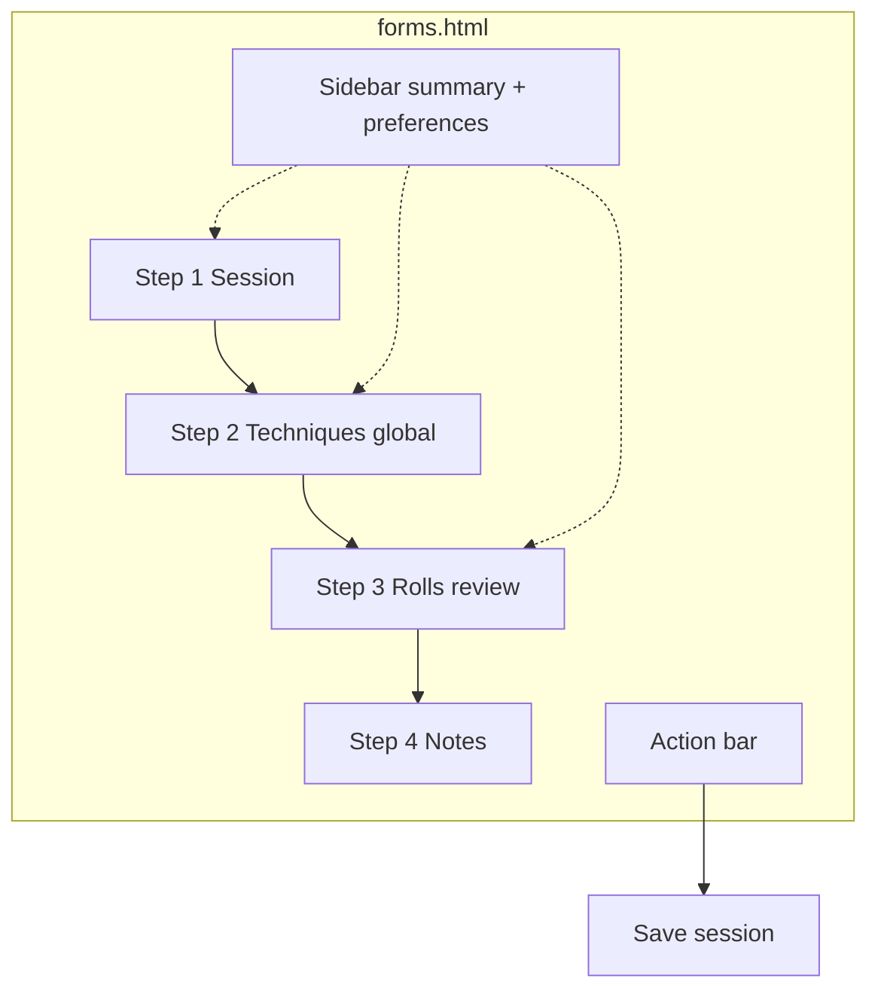
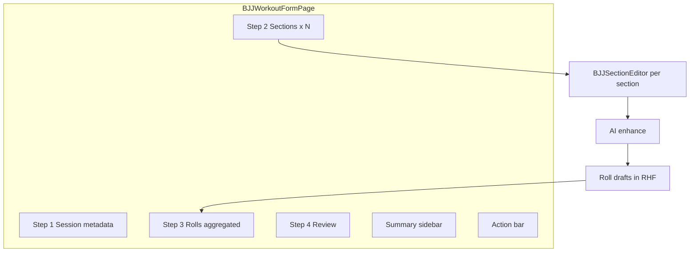

# BJJ Workout Form — Open Design Parity

> **Status**: Apply complete (Phases A–E + review fixes in working tree)
> **Design source**: Open Design `forms.html` — project *TheFoundry - Training Records* (`5e17c655-dae0-443c-b191-c1967d177f4b`)
> **Production route**: `/bjj/workouts/new`, `/bjj/workouts/:id/edit`
> **Related**: `bjj-form-material-review` (roll review + Material shell v1)

---

## Overview

Open Design **`forms.html`** defines a **Registrar** flow: a four-step Material session form with a technique catalog, AI roll review, live summary sidebar, and fixed action bar. Training Records uses a **section-based workout model** (multiple training blocks, AI enhance per section, canonical roll positions for the evolution dashboard).

This document maps **what OD proposes**, **what the app already implements**, and **how to close remaining gaps** without breaking the section model or dashboard data contracts.

---

## Design reference

| Item | Location |
|------|----------|
| OD prototype | Open Design → `forms.html` (Registrar tab) |
| Dashboard tokens | `open-design/.../bjj-evolution-dashboard/template.html` |
| App CSS port | `src/theme/material-dashboard.css` (`.bjj-form` section) |
| SDD explore | `openspec/changes/bjj-form-open-design-parity/explore.md` |
| SDD proposal | `openspec/changes/bjj-form-open-design-parity/proposal.md` |

Open the OD artifact in Open Design or export HTML for side-by-side comparison with the running form.

---

## Information architecture

### Open Design (flat session)

### Training Records (section-based — keep)

**Rule**: Do not collapse sections into OD’s single technique card. Instead, **surface rolls in a dedicated `#cardRolls`** and reuse OD picker styling inside each section.

---

## Feature matrix: OD vs app

| # | Open Design suggests | Current app | Recommendation |
|---|---------------------|-------------|----------------|
| 1 | 4-step stepper with scroll | ✅ Implemented | Keep; fix `cardRolls` target |
| 2 | Page title + eyebrow + subtitle | ✅ English equivalents | Optional i18n later |
| 3 | Session: date + duration | ✅ `performedAt` + `durationMinutes` | Keep datetime-local |
| 4 | Session type (Gi/No-Gi/…) | ❌ Missing | Phase D — add optional `sessionType` if product approves |
| 5 | Gym + coach | ❌ Missing | Phase D — optional metadata fields |
| 6 | Intensity slider 1–10 + labels | ✅ Range + number → `rpe` | Phase D complete |
| 7 | Global technique catalog + chips | ✅ Per-section `TechniqueSearch` + category chips | Phase C complete |
| 8 | Dedicated `#cardRolls` card | ✅ Aggregated `BJJFormRollsCard` | Phase A complete |
| 9 | Per-roll Confirm/Edit/Discard | ✅ `RollReviewPanel` per-roll actions | Phase B complete |
| 10 | Free-text flow chain | ❌ Position selects (required) | Show **read-only** `flow-read` from labels |
| 11 | Skip review (omit rolls) | ✅ Skip for now per section | Aggregate skip in `#cardRolls` banner |
| 12 | Notes Step 4 + char counter | ✅ `#cardReview` + soft 500 counter (schema 2000) | Phase D complete |
| 13 | Summary: duration, type, intensity, techniques, rolls | ⚠️ Roll `M/N confirmed`; no session type yet | Phase A partial |
| 14 | Preferences sidebar | ✅ UI-only preview card | Phase E complete |
| 15 | Save draft button | ✅ localStorage MVP | Phase E complete |
| 16 | Theme toggle in topbar | ❌ System `prefers-color-scheme` | Out of scope (product decision) |
| 17 | Fixed action bar status tone | ✅ `data-tone` warn/ok | Keep |
| 18 | Material form CSS | ✅ `.bjj-form` in theme CSS | Extend for `.seg-radio`, `.chip-filter`, `.switch` |

---

## Implementation guide

### Phase A — Dedicated roll review card (~250 lines)

**Goal**: Stepper step “Rolls” scrolls to `#cardRolls` when any section has roll drafts.

1. **Add `#cardRolls` section** to `BJJWorkoutFormPage.tsx` after `cardSections`:
   - Render when `progress.totalRolls > 0` OR always with empty state (“Run AI enhance on a section to propose rolls”).
   - Move or duplicate `RollReviewPanel` content here; pass aggregated rolls from RHF `sections[].rolls`.

2. **Lift roll state display** from `BJJSectionEditor`:
   - Keep AI enhance in section editor.
   - On enhance success, rolls still write to `sections[i].rolls`.
   - `#cardRolls` reads all sections via `useWatch({ name: 'sections' })`.

3. **Update `useBJJFormProgress`**:
   - Step 3 `targetId: 'cardRolls'` must exist in DOM.
   - Summary row: `confirmed / total` — track per-roll confirmed flag in draft or infer from validation + user action.

4. **Tests**:
   - Stepper click scrolls to `#cardRolls`.
   - Summary updates when rolls added.

**Files**: `BJJWorkoutFormPage.tsx`, `BJJSectionEditor.tsx`, `RollReviewPanel.tsx`, `useBJJFormProgress.ts`, `BJJWorkoutFormPage.test.tsx`

---

### Phase B — Per-roll interaction (~300 lines)

**Goal**: Match OD confirm/edit/discard pattern while keeping Option A validation.

1. **Extend `BJJRollDraft`** with optional `confirmed?: boolean` (client-only until save).

2. **Refactor `RollReviewPanel`**:
   - Read view: role, outcome, `flow-read` string built from position labels.
   - Edit view: existing selects (hidden until “Edit”).
   - Buttons: Confirm (toggle), Edit, Discard — mirror OD `data-act` behavior.
   - Remove or demote “Confirm all” to secondary when all rows confirmed individually.

3. **Save pipeline** unchanged: on submit, only validated drafts go to `useConfirmRolls`.

4. **Tests**: `RollReviewPanel.test.tsx` — per-roll confirm toggles tag; discard removes row.

**Files**: `RollReviewPanel.tsx`, `bjj.types.ts`, `RollReviewPanel.test.tsx`

---

### Phase C — Technique picker parity (~200 lines)

**Goal**: OD-style search + category chips in `TechniqueSearch`.

1. Add **chip filter row** (`chip-filter` CSS in `material-dashboard.css`) using technique categories from catalog.

2. Add **empty state** (`empty-note`) when search/filter returns zero rows.

3. Add **`pickStatus` sr-only** live region for screen reader (OD pattern).

4. Reuse existing `.pick-row`, `.pick-cat`, `.chip-sel` styles already in theme CSS.

**Files**: `TechniqueSearch.tsx`, `material-dashboard.css`, tests in `TechniqueSearch` or section editor tests.

---

### Phase D — Session polish (~250 lines)

**Goal**: Align session card and review step with OD.

1. **Split notes** into `#cardNotes` or keep under `#cardReview` with 500-char counter (`notesCount` CSS).

2. **Optional intensity slider** replacing or supplementing RPE number — map slider value to existing `rpe` field.

3. **Session type** (if approved):
   - Migration: `workouts.session_type` enum or text.
   - UI: `.seg-radio` segmented control from OD CSS.

4. **Gym/coach** — defer unless product requests; would need schema + RPC updates.

**Files**: `BJJWorkoutFormPage.tsx`, `bjj.schema.ts`, migration (if session type approved), CSS for `.seg-radio`, `.range-head`.

---

### Phase E — Draft and preferences (~350 lines)

**Goal**: OD sidebar preferences + save draft.

1. **Save draft**: `localStorage` key `bjj-workout-draft:{userId}` with form values JSON; restore on new workout page load with prompt.

2. **Preferences card**: UI-only switches in `BJJFormPreferencesCard` (preview). Wiring to settings / dashboard window is deferred — see hint copy in the card.

3. **Action bar**: “Save draft” button persists `getValues()` JSON to `bjj-workout-draft:{userId}`; cleared after successful save.

**Files**: `BJJFormActionBar.tsx`, new `useBJJWorkoutDraft.ts`, `BJJFormSummarySidebar.tsx` (preferences section), CSS for `.pref-row`, `.switch`.

---

## CSS additions checklist

Port from `forms.html` into `.bjj-form` block as needed:

| Class | Used for | Phase |
|-------|----------|-------|
| `.seg-radio` | Session type | D |
| `.chip-filters`, `.chip-filter` | Technique categories | C |
| `.range-head`, `.range-val`, `.range-scale` | Intensity slider | D |
| `.field-foot`, `.count` | Notes char counter | D |
| `.pref-list`, `.pref-row`, `.switch` | Preferences | E |
| `.link-btn` | Skip review inline link | B |

Most roll, picker, stepper, and action-bar classes **already exist** in `material-dashboard.css`.

---

## Product rationale — what we adopt from Open Design

Open Design `forms.html` is a **Registrar UX prototype**, not a domain spec. Training Records keeps the **section-based workout model** because real BJJ sessions have multiple blocks (drilling, positional sparring, open mat), each with its own goal and AI enhance context.

| OD idea | Verdict | Reason |
|---------|---------|--------|
| Stepper, sidebar, action bar | **Adopt** | Long-form registration needs orientation |
| Dedicated `#cardRolls` | **Adopt** | Rolls feed dashboard; review must be prominent |
| Per-roll confirm / edit / discard | **Adopt (Phase B)** | Better data quality than batch confirm |
| Technique chips + search | **Adopt (Phase C)** | Large catalog needs filtering |
| Save draft | **Adopt (Phase E)** | localStorage MVP on create form |
| Flat global `#cardTech` | **Reject** | Breaks section goals + AI per block |
| Free-text position flows | **Reject** | Dashboard RPC needs `bjj_positions.key` |
| Preferences on form page | **Preview (Phase E)** | UI-only toggles; wire to settings later |
| Gym / coach fields | **Defer** | Scope creep unless product requests |
| In-form theme toggle | **Reject** | System theme is the product default |

**Implementation rule:** match OD on **shell and roll review UX**; keep **sections, canonical positions, and Option A validation** unchanged.

---

## Acceptance criteria

- [x] `#cardRolls` exists and stepper step 3 navigates to it
- [x] Summary shows roll confirmation progress (`N / M` or equivalent)
- [x] Per-roll confirm/discard works with Option A validation gate
- [x] Technique search supports category chip filters
- [x] Session notes live in review step with 500-character counter
- [x] Intensity slider maps to RPE and stays synced with number input
- [x] Save draft persists to `localStorage` and restore prompt works on new workout
- [x] Preferences card renders UI-only toggles in summary sidebar
- [ ] Feature doc and SDD artifacts linked from tracking issue
- [x] BJJ test suite passes (`pnpm exec vitest run src/features/bjj`)

---

## Out of scope

- Replacing canonical position keys with free-text flows
- OD topbar / Registrar app navigation
- In-app theme toggle (system theme remains default)
- Backend draft sync (localStorage only for MVP)

---

## Changelog

| Date | Change |
|------|--------|
| 2026-08-16 | Initial doc from SDD explore/proposal (`bjj-form-open-design-parity`) |
