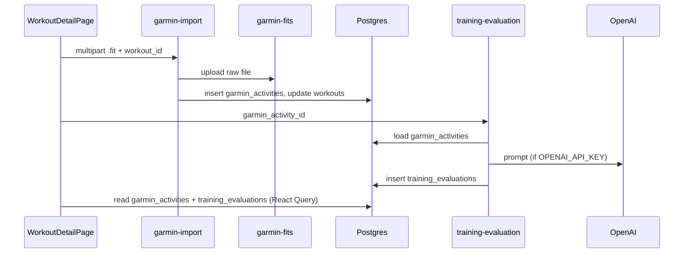

# Garmin integration — implementation overview

This document describes the **Garmin `.fit` import** and **training intelligence** feature in the codebase: what it does, how components connect, and where the code lives. It is **manual file upload** linked to an existing workout—not Garmin Connect OAuth or live device sync.

Canonical requirements: `openspec/specs/garmin.md` and the archived change `openspec/changes/archive/2026-04-12-garmin-import-training-intelligence/`.

---

## Product intent

Athletes can upload a **Garmin `.fit` file** from a workout’s detail page. The app:

1. Stores the raw file in **Supabase Storage** (`garmin-fits`).
2. Parses the file server-side and saves **metrics** in **`garmin_activities`**.
3. Links the workout via **`workouts.garmin_activity_id`**.
4. Calls **`training-evaluation`** to get an **LLM summary** (readiness, next session, optional adaptation note) stored in **`training_evaluations`**.
5. Shows a **metrics panel**, **AI evaluation card**, and optionally an **adaptation warning** if the next scheduled workout is **before** the estimated recovery window.

---

## Database and storage (migrations)

| Migration | Purpose |
|-----------|---------|
| `supabase/migrations/20260412000001_create_garmin_activities.sql` | `garmin_activities`: workout FK, user, file path, elapsed time, HR, TSS, recovery, calories, VO₂, per-zone seconds; **RLS** for owner |
| `supabase/migrations/20260412000002_create_training_evaluations.sql` | `training_evaluations`: one row per Garmin activity (unique on `garmin_activity_id`); readiness via check constraint; **RLS** |
| `supabase/migrations/20260412000003_workouts_garmin_activity_fk.sql` | Nullable **`workouts.garmin_activity_id`** → `garmin_activities` (`ON DELETE SET NULL`) |
| `supabase/migrations/20260412000004_garmin_fits_storage_bucket.sql` | Private bucket **`garmin-fits`**; policies so objects live under **`{user_id}/...`** |

---

## Edge functions (Supabase)

### `supabase/functions/garmin-import/index.ts`

- **POST** with **multipart**: `file` + `workout_id`.
- **Auth**: JWT; Supabase client uses the user’s token with service role for server-side DB/storage.
- **Guards**: 10 MB max; workout must belong to the user (**403** if not); if the workout already has a **`garmin_activity_id`**, the old **`garmin_activities`** row is **deleted** first (CASCADE drops old evaluations).
- **Storage path**: `{user_id}/{workout_id}/{timestamp}.fit` in **`garmin-fits`**.
- **Parsing**: `fit-file-parser` (`parseFitFile`), first **session** only; **`extractMetrics`** maps session fields to **`GarminMetrics`** (HR zones from `time_in_hr_zone` ms → seconds; TSS → **derived recovery hours** via `deriveRecoveryHours`).
- **DB**: `INSERT` into **`garmin_activities`**, then **`UPDATE workouts`** with the new **`garmin_activity_id`**.
- **Response**: JSON with **`garmin_activity_id`** and **`metrics`** (camelCase metrics object).

Shared types/validators: `supabase/functions/_shared/garmin-schemas.ts` (`GarminMetrics`, `EvaluationResponse`, `isValidEvaluationResponse`).

### `supabase/functions/training-evaluation/index.ts`

- **POST** JSON: **`garmin_activity_id`**.
- Loads **`garmin_activities`** row and checks **`user_id`**.
- **`buildEvaluationPrompt`**: turns DB columns into a coach-style prompt with zone percentages.
- If **`OPENAI_API_KEY`** is missing: **mock** evaluation inserted into **`training_evaluations`** (useful for local dev).
- If key present: **OpenAI** `gpt-4o-mini`, **`response_format: { type: 'json_object' }`**, then **`isValidEvaluationResponse`**.
- **Inserts** into **`training_evaluations`**; returns **`{ evaluation: { ...fields, id } }`** (nested; readiness etc. in **snake_case** in the LLM contract).

Tests: `supabase/functions/garmin-import/index.test.ts`, `supabase/functions/training-evaluation/index.test.ts`.

---

## Frontend: `src/features/garmin/`

### Orchestration — `hooks/useGarminImport.ts`

- **`importMutation`**: `supabase.functions.invoke('garmin-import', { body: formData })`.
- **`onSuccess`**: chains **`evaluateMutation.mutate(result.garminActivityId)`** — TypeScript types expect **`garminActivityId`**, while the Edge Function returns **`garmin_activity_id`**. Verify at runtime that the client normalizes or the invoke payload matches what the hook reads.
- **`evaluateMutation`**: `invoke('training-evaluation', { body: { garmin_activity_id } })`; types the response as **`TrainingEvaluation`**, while the function returns a **nested `evaluation`** object with **snake_case** fields — align wire format vs. types/UI.

Exports **`evaluationError`** for failed evaluation; **`GarminImportModal`** currently only surfaces **`error`** (import), not evaluation errors.

### Data display — `hooks/useGarminActivity.ts`

- Loads **`garmin_activities`** by **`workout_id`** (`maybeSingle()`).
- Maps DB row → **`GarminActivity`** / **`GarminMetrics`**.

**Note:** The mapper types **`time_in_hr_zone: number[]`**, but the migration and generated **`src/types/supabase.ts`** use **`hr_zone_1_seconds` … `hr_zone_5_seconds`**. Zone data from the DB may not map correctly unless something else provides `time_in_hr_zone`. The Edge Function writes **`hr_zone_*`** columns.

### Other hooks

- **`useTrainingEvaluation.ts`**: reads **`training_evaluations`** by **`garmin_activity_id`**; maps to camelCase **`TrainingEvaluation`**.
- **`useNextWorkout.ts`**: next **`workouts.performed_at`** after the current workout’s date (for adaptation logic).
- **`useAdaptationWarning.ts`**: if **`recoveryTimeHours`** and a next workout exist, compares **`nextWorkoutPerformedAt`** to **`performedAt + recovery`**; returns a fixed warning string when the next session is **too soon**.

### UI

- **`GarminImportTrigger.tsx`**: opens modal; label **Import** vs **Re-import** when data exists.
- **`GarminImportModal.tsx`**: `.fit` only, client-side size check, wires **`useGarminImport`**, loading states, **`onSuccess`** when import + evaluation finish (see `useEffect` on **`importResult`** / busy flags).
- **`TrainingMetricsPanel.tsx`**: elapsed time, HR, **`HRZoneBar`**, load, recovery, calories, VO₂max.
- **`AIEvaluationCard.tsx`**: skeleton while **`isEvaluating`**; readiness badge; summary; next session; **`AdaptationWarning`**; optional error/retry/generate props (not all wired from the detail page).
- **`HRZoneBar.tsx`**: stacked proportional bar by zone seconds.
- **`AdaptationWarning.tsx`**: amber callout when warning text is set.

**`index.ts`** re-exports the public Garmin surface.

---

## Workout detail integration — `WorkoutDetailPage.tsx`

- **`useGarminActivity(id)`** drives whether the Garmin block shows.
- **`useTrainingEvaluation(garminActivity?.id)`** loads persisted evaluation.
- **`liveEvaluation`** state prefers the **just-finished** import flow over the query result.
- **`adaptationWarning`** combines recovery from Garmin metrics + **`useNextWorkout`**.

Workout model: **`workout.types.ts`** + **`mapRow.ts`** include **`garminActivityId`** from **`garmin_activity_id`**.

---

## Tests and E2E

- **Unit**: `src/features/garmin/__tests__/parseFit.test.ts`, `evaluationResponse.test.ts`, `useAdaptationWarning.test.ts`.
- **E2E**: `e2e/garmin-import.spec.ts` — mocks **`/functions/v1/garmin-import`**, **`training-evaluation`**, and **`garmin_activities`** REST reads to drive the UI without live Edge Functions.

---

## End-to-end flow (diagram)

---

## Review checklist (integration gaps)

1. **Wire format vs. TypeScript**: Edge responses use **`garmin_activity_id`** and nested **`evaluation`** with **snake_case**; React types often use **camelCase** — confirm the client unwraps/renames where needed.
2. **`useGarminActivity` mapping**: DB columns **`hr_zone_*_seconds`** vs. mapper expecting **`time_in_hr_zone`**.
3. **Cache updates after import**: There is no **`queryClient.invalidateQueries`** in **`useGarminImport`**; the metrics panel depends on **`useGarminActivity`** refetching (e.g. focus/refetch defaults) unless invalidation is added.
