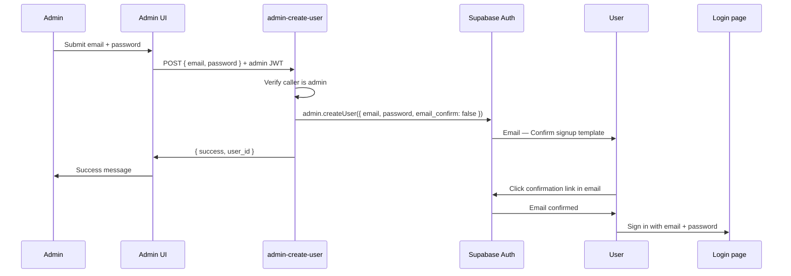

# Product Requirements Document: Admin User Registration & Invitation

## 1. Document control

| Field       | Value                                                                 |
| ----------- | --------------------------------------------------------------------- |
| **Title**   | Admin User Registration & Invitation — Administration               |
| **Version** | 0.1                                                                   |
| **Date**    | 2026-05-30                                                            |
| **Author**  | Francisco José Seva Mora                                              |
| **Status**  | Draft — Replace broken implementation with Supabase Auth email flows |

**Related links**

- Parent PRD: [docs/PRD.md](PRD.md)
- Product context: [docs/PRODUCT.md](PRODUCT.md)
- Architecture: [docs/ARCHITECTURE.md](ARCHITECTURE.md)
- Existing design (partially implemented): [openspec/changes/user-registration/design.md](../openspec/changes/user-registration/design.md)

**Terminology**

- **Confirm signup** — Supabase Auth email template sent when a user account is created and must verify their email before signing in.
- **Invite** — Supabase Auth email template sent when an administrator invites a user who has not yet set a password.
- **Athlete** — Default application role assigned to users created by an administrator (`profiles.role = 'athlete'`).

---

## 2. Summary

Administrators need two reliable ways to onboard users from **Admin → Create User** (`/admin/create-user`):

1. **Create user with email and password** — the new user receives Supabase’s **Confirm signup** email, confirms their address, then signs in with the credentials the admin set.
2. **Send invitation** — the new user receives Supabase’s **You have been invited** email, opens the link, sets their password, then signs in.

Both flows must use **Supabase Auth built-in email delivery and templates**, not a parallel custom SMTP + custom token system. The current implementation is broken because both admin actions call the same invite endpoint, the create-user form has no password field, users are auto-confirmed (`email_confirm: true`), and the invite flow mixes Supabase `inviteUserByEmail` with a separate custom URL that does not match the email link.

This PRD defines the target behaviour, acceptance criteria, and the technical changes required to make both use cases work end to end.

---

## 3. Problem and goals

### Problem

The admin user-management feature was built with overlapping flows:

| Issue | Current behaviour | Impact |
| ----- | ----------------- | ------ |
| Wrong API for “Create User” | `useCreateUser` calls `create_invite` | Admin cannot create a user with a chosen password |
| No password in UI | Create User form only collects email | Use case 1 is impossible from the UI |
| Email confirmation disabled | `enable_confirmations = false` and `email_confirm: true` in `register-user` | No **Confirm signup** email is sent |
| Dual invite mechanisms | `inviteUserByEmail` + custom `invitations.token` + `/accept-invite?token=` | Email link and app link disagree; acceptance may fail or duplicate users |
| Misleading success copy | Both buttons show “Invitation sent successfully” | Admin cannot tell which action ran |

### Goals

- **G1:** An administrator can create a user by entering **email + password**; the user receives the Supabase **Confirm signup** email and can sign in after confirming.
- **G2:** An administrator can invite a user by entering **email only**; the user receives the Supabase **You have been invited** email, sets a password from the link, and can sign in.
- **G3:** All user creation from admin flows assigns **`role = athlete`** in `profiles` (via existing `handle_new_user` trigger).
- **G4:** Only authenticated **admin** users can perform these actions.
- **G5:** Error and success messages clearly reflect which flow ran and what the invited user must do next.
- **G6:** Local development can verify both email types via **Inbucket** (Supabase local stack).

### Non-goals

- **NG1:** Custom HTML email templates managed inside this app (use Supabase Dashboard / `config.toml` templates).
- **NG2:** Admin creation of users with `role = admin` (always athlete).
- **NG3:** Bulk CSV import of users.
- **NG4:** Replacing public self-registration (`/register`) — covered separately by registration mode settings.
- **NG5:** Password reset / forgot-password flows (separate initiative).

---

## 4. Users and stakeholders

| Role              | Needs                                                                 |
| ----------------- | --------------------------------------------------------------------- |
| **Administrator** | Create accounts or send invites quickly; clear feedback on success/failure. |
| **Invited user**  | Receive one clear email; complete setup in one session; then log in.  |
| **Developer**     | Single source of truth: Supabase Auth APIs + templates; testable locally. |

---

## 5. User stories

### Use case 1 — Create user with password

- **US-01:** As an **administrator**, I want to enter an **email and password** on the Create User page, so that I can provision an account with known credentials.
- **US-02:** As a **new user**, I want to receive a **Confirm signup** email after an admin creates my account, so that I can verify my email before accessing the app.
- **US-03:** As a **new user**, I want to **sign in with the email and password** the admin set after I confirm my email, so that I can use the application.

### Use case 2 — Send invitation

- **US-04:** As an **administrator**, I want to enter only an **email** and send an invitation, so that the user chooses their own password.
- **US-05:** As an **invited user**, I want to receive a **You have been invited** email with a working link, so that I can activate my account.
- **US-06:** As an **invited user**, I want to **set my password** after opening the invite link, so that I can sign in immediately afterward.

### Administration & safety

- **US-07:** As an **administrator**, I want **clear success and error messages** (duplicate email, pending invite, invalid password), so that I know whether the action succeeded.
- **US-08:** As a **non-admin**, I must **not** access `/admin/create-user` or the backing Edge Functions.
- **US-09:** As an **administrator**, I want pending invitations visible in **Registration Settings**, so that I can audit outstanding invites.

---

## 6. Functional requirements

### 6.1. Admin Create User page (`/admin/create-user`)

The page exposes **two distinct actions** on one form:

| Action            | Fields              | Button label   | Backend                         |
| ----------------- | ------------------- | -------------- | ------------------------------- |
| Create user       | Email, password, confirm password | Create User    | `admin-create-user` (new or refactored) |
| Send invitation   | Email only          | Send Invite    | `create_invite` (refactored)    |

**Validation (client + server)**

- Email: required, valid format.
- Password (create only): minimum 8 characters; confirmation must match.
- Invite: email must not already have a **pending** row in `invitations` (if tracking is kept).

**Success messages**

- Create user: *“User created. A confirmation email was sent to {email}.”*
- Send invite: *“Invitation sent to {email}.”*

**Failure messages (examples)**

| Code | Message |
| ---- | ------- |
| `EMAIL_ALREADY_EXISTS` | A user with this email already exists. |
| `INVITE_EXISTS` | A pending invitation already exists for this email. |
| `FORBIDDEN` | You do not have permission to perform this action. |
| `WEAK_PASSWORD` | Password does not meet minimum requirements. |

The page must **not** display a custom invite URL for use case 1. For use case 2, showing the invite URL is **optional** (the user receives the real link by email); if shown, it must match the Supabase-generated link, not a fabricated app token URL.

---

### 6.2. Use case 1 — Create user with password (Confirm signup)

#### Flow



#### Requirements

1. Edge Function must require **admin JWT** and verify `profiles.role = 'admin'`.
2. Call **`supabase.auth.admin.createUser`** with:
   - `email`
   - `password`
   - `email_confirm: false` — forces unconfirmed state so Supabase sends confirmation email
   - `user_metadata: { role: 'athlete' }` (profile still created by trigger)
3. **`enable_confirmations`** must be **`true`** in Supabase Auth settings (`supabase/config.toml` for local; Dashboard for production).
4. **Site URL** and **Redirect URLs** must include the app’s auth callback route (e.g. `/auth/callback` or existing equivalent).
5. After confirmation, the user signs in via the normal login form with the admin-provided password.
6. If email already registered → **409** with `EMAIL_ALREADY_EXISTS`.

#### Supabase template

Use the built-in **Confirm signup** template (`auth.email.template.confirmation` in `config.toml`). Subject/body may be customised in Supabase Dashboard but the flow must remain Supabase-native.

---

### 6.3. Use case 2 — Send invitation (You have been invited)

#### Flow

```mermaid
sequenceDiagram
  participant Admin
  participant App as Admin UI
  participant EF as create_invite
  participant Auth as Supabase Auth
  participant User
  participant Accept as Accept invite page
  participant Login as Login page

  Admin->>App: Submit email
  App->>EF: POST { email } + admin JWT
  EF->>EF: Verify admin; check no pending invite
  EF->>Auth: admin.inviteUserByEmail(email, { redirectTo })
  Auth->>User: Email — You have been invited template
  EF->>EF: Insert invitations audit row (optional)
  EF->>App: { success }
  App->>Admin: Invitation sent
  User->>Auth: Click link in email
  Auth->>Accept: Redirect with session (hash tokens)
  Accept->>Auth: updateUser({ password })
  Accept->>Login: Redirect — account ready
```

#### Requirements

1. Use **`supabase.auth.admin.inviteUserByEmail`** as the **only** mechanism that sends the invite email.
2. Pass **`redirectTo`** pointing to the app’s accept-invite route (e.g. `${APP_URL}/accept-invite`).
3. **Do not** build a parallel invite URL (`/accept-invite?token=<custom-uuid>`) that differs from the Supabase email link.
4. **`AcceptInvitePage`** must handle the **Supabase invite callback**:
   - On load, read session from URL hash / `supabase.auth.getSession()` after `detectSessionInUrl`.
   - If session exists → show set-password form.
   - On submit → `supabase.auth.updateUser({ password })` (not a custom Edge Function that re-creates the user).
   - On success → redirect to `/login?activated=true` (or auto sign-in if product prefers).
5. If the invited user record already exists (re-invite edge case) → return a clear error or resend flow; do not create duplicate auth users.
6. Optionally persist an **`invitations`** row for admin audit (`email`, `invited_by`, `status`, `expires_at`). Expiry may align with `app_settings.invite_expiry_hours` for display/revocation; **authoritative invite validity remains Supabase Auth**.

#### Supabase template

Use the built-in **Invite user** template (`auth.email.template.invite`). Default subject: *“You have been invited”*.

#### Deprecate / remove

- Custom token validation in `accept-invite` Edge Function that calls `admin.createUser` again (conflicts with `inviteUserByEmail`, which already creates the user).
- Display of admin-copyable invite URLs based on custom tokens unless they match Supabase’s link.

---

### 6.4. Authorization

| Endpoint / page        | Auth        | Rule                          |
| ---------------------- | ----------- | ----------------------------- |
| `/admin/create-user`   | Authenticated | `profiles.role = 'admin'` |
| `admin-create-user` EF | Bearer JWT  | Admin only                    |
| `create_invite` EF     | Bearer JWT  | Admin only                    |
| `/accept-invite`       | Public      | Valid Supabase invite session |
| Login                  | Public      | Email confirmed (UC1) or invite completed (UC2) |

---

### 6.5. Registration Settings integration

The existing **Registration Settings** page (`/admin/registration-settings`) continues to manage:

- `registration_mode`: `open` | `invite_only` (affects **public** `/register`, not admin flows).
- `invite_expiry_hours`: display and optional cleanup of stale `invitations` rows.

Admin create/invite flows **always work** regardless of public registration mode (admin bypass, already partially implemented in `register-user`).

---

## 7. Acceptance criteria

### Use case 1 — Create user with password

- [ ] Admin form includes email, password, and confirm password.
- [ ] Submitting **Create User** calls a dedicated admin Edge Function (not `create_invite`).
- [ ] New user appears in Supabase Auth with `email_confirmed_at = null` until they confirm.
- [ ] **Confirm signup** email appears in Inbucket (local) or user inbox (production).
- [ ] User can confirm via email link (redirect succeeds).
- [ ] After confirmation, user logs in with admin-set email and password.
- [ ] Duplicate email returns a visible error; no second auth user is created.
- [ ] `profiles.role` is `athlete` for the new user.

### Use case 2 — Send invitation

- [ ] **Send Invite** sends only email (no password fields required).
- [ ] **You have been invited** email appears in Inbucket / inbox.
- [ ] Email link opens the app’s accept-invite page with a valid Supabase session.
- [ ] User sets password on accept-invite page via `updateUser`.
- [ ] User can sign in after setting password.
- [ ] No duplicate `auth.users` row is created during acceptance.
- [ ] Pending invite listed in Registration Settings (if audit table retained).

### General

- [ ] Non-admin receives 403 on admin pages and Edge Functions.
- [ ] Success/error copy differs between the two actions.
- [ ] Unit/integration tests updated for hooks and Edge Functions.
- [ ] Local dev documented: Inbucket URL, `enable_confirmations`, `APP_URL`, redirect URLs.

---

## 8. Non-functional requirements

### NFR-001: Security

- Admin checks enforced server-side in Edge Functions; never trust client role claims alone.
- Passwords never logged or returned in API responses.
- Invite and confirmation links are single-use / time-bound per Supabase Auth defaults.

### NFR-002: Reliability

- If `inviteUserByEmail` succeeds but DB audit insert fails, return error or compensating action (avoid “email sent but no audit” without admin visibility).

### NFR-003: Accessibility

- Form labels, `aria-live` for errors (existing pattern on Create User page).
- Accept-invite page keyboard-accessible.

### NFR-004: Observability

- Edge Functions log structured errors (no PII); distinguish `CREATE_USER` vs `INVITE` in logs.

---

## 9. Technical approach

### 9.1. Supabase Auth configuration

**Local (`supabase/config.toml`)**

```toml
[auth]
site_url = "http://localhost:5173"
additional_redirect_urls = ["http://localhost:5173/accept-invite", "http://localhost:5173/auth/callback"]

[auth.email]
enable_signup = true
enable_confirmations = true   # Required for Use case 1

# Optional: customise templates
# [auth.email.template.confirmation]
# subject = "Confirm your signup"
# [auth.email.template.invite]
# subject = "You have been invited"
```

**Production**

- Enable **Confirm email** in Supabase Dashboard → Authentication → Providers → Email.
- Configure **Site URL** and **Redirect URLs** for production domain.
- Use Supabase hosted email or configure SMTP in Dashboard (not custom app SMTP).

**Environment variables**

| Variable | Purpose |
| -------- | ------- |
| `APP_URL` | `redirectTo` for invites and email links (e.g. `https://app.example.com`) |
| `SUPABASE_URL` | Edge Functions |
| `SUPABASE_SERVICE_ROLE_KEY` | Admin Auth API |

---

### 9.2. Edge Functions

| Function | Status | Responsibility |
| -------- | ------ | -------------- |
| `admin-create-user` | **New** (or refactor `register-user`) | Admin-only; `createUser` with `email_confirm: false` |
| `create_invite` | **Refactor** | Admin-only; `inviteUserByEmail`; optional audit insert |
| `accept-invite` | **Deprecate** or reduce | Replace with client-side `updateUser` after Supabase redirect |
| `register-user` | **Keep** | Public registration only; separate from admin create |

**`admin-create-user` request/response**

```typescript
// POST — Authorization: Bearer <admin JWT>
{ email: string; password: string }

// 200
{ success: true; user_id: string }

// 409
{ error: { code: 'EMAIL_ALREADY_EXISTS'; message: string } }
```

**`create_invite` request/response**

```typescript
// POST — Authorization: Bearer <admin JWT>
{ email: string }

// 200
{ success: true; expires_at?: string }

// 400
{ error: { code: 'INVITE_EXISTS'; message: string } }
```

---

### 9.3. Frontend changes

| File | Change |
| ---- | ------ |
| `CreateUserPage.tsx` | Add password + confirm fields; distinct handlers and messages |
| `useCreateUser.ts` | Invoke `admin-create-user` with `{ email, password }` |
| `useCreateInvite.ts` | Keep `create_invite`; remove duplicate logic from create user |
| `AcceptInvitePage.tsx` | Handle Supabase invite session; `updateUser({ password })` |
| `lib/supabase.ts` | Ensure `detectSessionInUrl: true` for invite callback |

---

### 9.4. Database

Keep **`invitations`** table for admin audit and Registration Settings UI. Suggested columns unchanged:

- `email`, `status`, `invited_by`, `expires_at`, `used_at`
- Store `auth_user_id` after invite instead of custom `token` if custom tokens are removed

No migration required for use case 1. Optional migration: drop `token` column if fully moving to Supabase-native invites.

---

### 9.5. Testing

| Layer | Tests |
| ----- | ----- |
| `admin-create-user` | 401/403 non-admin; 409 duplicate; 200 creates unconfirmed user |
| `create_invite` | 401; pending duplicate; 200 calls `inviteUserByEmail` |
| `useCreateUser` / `useCreateInvite` | Correct function names and payloads |
| `CreateUserPage` | Separate buttons, password validation, messages |
| `AcceptInvitePage` | Mock Supabase session; password update |
| Manual | Inbucket: both templates received; full click-through |

---

## 10. Gap analysis — current vs target

| Area | Current | Target |
| ---- | ------- | ------ |
| Create User button | Calls `create_invite` | Calls `admin-create-user` with password |
| Create User form | Email only | Email + password + confirm |
| Email confirmation | Disabled; users auto-confirmed | `enable_confirmations: true`; `email_confirm: false` on create |
| Invite email | `inviteUserByEmail` ✓ | Keep; fix redirect and acceptance |
| Invite acceptance | Custom `token` + `accept-invite` EF creates user again | Supabase session + `updateUser` |
| Invite URL shown to admin | Custom `/accept-invite?token=` | Remove or show Supabase link only |
| Success message | Both say “Invitation sent” | Distinct messages per flow |

---

## 11. Rollout and verification

1. Update Supabase Auth config (`enable_confirmations`, redirect URLs).
2. Deploy new/refactored Edge Functions.
3. Ship frontend changes to `/admin/create-user` and `/accept-invite`.
4. Verify in local stack:
   - Mailpit/Inbucket at `http://127.0.0.1:54324`
   - Full use case 1 and 2 manual runs
5. Verify in staging/production with real email provider.
6. Update [openspec/changes/user-registration](../openspec/changes/user-registration/) specs to match Supabase-native email (replace SMTP/custom-token design).

---

## 12. Open questions

| # | Question | Default recommendation |
| - | -------- | ---------------------- |
| 1 | After invite password set, auto sign-in or redirect to login? | Redirect to `/login?activated=true` (matches current UX) |
| 2 | Keep `invitations.token` for audit or remove? | Remove custom token; track by `email` + `auth.users.id` |
| 3 | Minimum password rules beyond 8 chars? | Match existing register page (8 chars minimum) |
| 4 | Re-send invite for pending emails? | Phase 2; call `inviteUserByEmail` again from Registration Settings |

---

## 13. Changelog

| Version | Date       | Changes |
| ------- | ---------- | ------- |
| 0.1     | 2026-05-30 | Initial draft from broken implementation analysis and Supabase email requirements |
