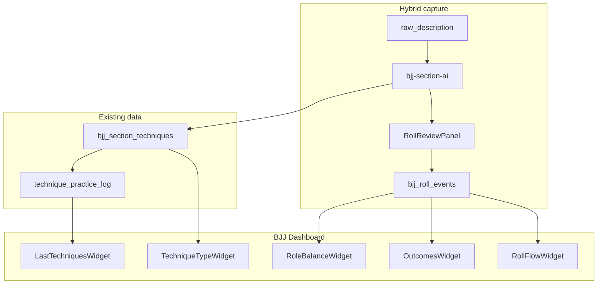

# Product Requirements Document: BJJ Evolution Dashboard

## 1. Document control

| Field       | Value                                                                 |
| ----------- | --------------------------------------------------------------------- |
| **Title**   | BJJ Evolution Dashboard — Iteration 8                                 |
| **Version** | 0.3                                                                   |
| **Date**    | 2026-06-12                                                            |
| **Author**  | Francisco José Seva Mora                                              |
| **Status**  | Draft — Aligned with Open Design live artifact (BJJ Evolution Dashboard) |

**Related links**

- Parent PRD: [docs/PRD.md](PRD.md)
- Product context: [docs/PRODUCT.md](PRODUCT.md)
- Architecture: [docs/ARCHITECTURE.md](ARCHITECTURE.md)
- Related PRD: [prd-bjj-technique-tracking.md](prd-bjj-technique-tracking.md) (Iteration 7)
- Related PRD: [prd-bjj-blue-belt-progression.md](prd-bjj-blue-belt-progression.md) (Iteration 6)
- BJJ extension: [BJJ extension.md](BJJ%20extension.md) (Iteration 4)
- **Open Design (source of truth for UI):** [open-design/5e17c655-dae0-443c-b191-c1967d177f4b/.live-artifacts/bjj-evolution-dashboard/](../open-design/5e17c655-dae0-443c-b191-c1967d177f4b/.live-artifacts/bjj-evolution-dashboard/)
  - Template: `template.html`
  - Data contract: `data.json`
  - Preview: `index.html` (generated)

**Terminology:**

- **Roll event**: A single sparring round (or discrete exchange) with structured fields: role, outcome, position transitions, and optional techniques.
- **Roll review**: A post-AI-enhance UI step where the athlete confirms, edits, or deletes AI-proposed roll events before they are persisted.
- **Technique category**: The `bjj_techniques.category` enum — grouped in the Blue Belt feature as takedown, guard_pass, guard, submission, escape, transition, other.
- **Dashboard window**: The selected time range or workout count used to aggregate all widget metrics.
- **Open Design artifact**: The approved visual, layout, and **design system** specification — HTML structure, CSS tokens, component sizes, and typography — stored under `open-design/5e17c655-dae0-443c-b191-c1967d177f4b/.live-artifacts/bjj-evolution-dashboard/`.
- **Dashboard locale**: All dashboard UI copy is **English** (Open Design `data.json` and production API labels; see §6.1 copy table).

---

## 2. Summary

This initiative defines a **BJJ Evolution Dashboard** for the Training Records application. The dashboard gives athletes a consolidated view of how their BJJ game is evolving based on recent workouts: which techniques they practice, how technique types are distributed, whether they spend more time attacking or defending, how rolls end, and typical position transitions during sparring.

The dashboard will be built at route `/bjj/dashboard`. **Visual design, layout, widget composition, Material tokens, and the dashboard API response shape are defined by the Open Design live artifact** (`bjj-evolution-dashboard`). Implementation uses **Material Design 3** tokens from that artifact (mapped to MUI theme), **React Bits** for motion polish, and a **unified dark/light theme** across the app.

Roll-level metrics use a **hybrid capture model**: the existing `bjj-section-ai` Edge Function proposes structured roll events from sparring descriptions; the athlete reviews and confirms them in a **Roll Review** panel before data is saved.

Technique widgets (last techniques, type breakdown) are powered by existing Iteration 7 data (`technique_practice_log`, `bjj_section_techniques`). Roll widgets (role balance, outcomes, roll flow) require the new `bjj_roll_events` table and hybrid ingestion flow.

---

## 3. Problem and goals

### Problem

BJJ athletes in Training Records already log workouts with AI-enhanced section descriptions and linked techniques (Iterations 4–7). They can track blue belt checklist progress, but they cannot answer higher-level questions:

- What techniques have I worked on most recently?
- Am I training a balanced mix of escapes, passes, guards, and submissions — or over-indexing on one area?
- During sparring, am I mostly attacking, defending, or neutral?
- How do my rolls typically end — submissions, position gains, position losses?
- What positions do I flow through most often?

Workout detail pages show individual sessions; the blue belt tracker shows checklist completion. Neither surfaces **evolution over time** in a single, scannable dashboard.

### Goals

- **G1:** Athletes can see **recently practiced techniques** with frequency and last-practiced date.
- **G2:** Athletes can see a **technique type breakdown** grouped by Blue Belt categories (takedown, guard_pass, guard, submission, escape, transition, other).
- **G3:** Athletes can see **role balance** as percentages: attacking, defending, neutral.
- **G4:** Athletes can see **roll outcomes** as percentages: submission, position gain, position loss, neutral.
- **G5:** Athletes can see a **roll flow** visualization of common position transitions during sparring.
- **G6:** Athletes can **filter the dashboard** by time window (7d / 30d / 90d / custom) or by last N BJJ workouts (default: last 30 days).
- **G7:** Athletes can **drill down** from any metric to the source workout or section.
- **G8:** The app supports **dark and light mode** with a persisted user preference, synced across MUI dashboard and shadcn app shell.
- **G9:** The dashboard and selected app surfaces use **React Bits** for tasteful motion (count-ups, fades, empty states).
- **G11:** The implemented dashboard **matches the Open Design artifact** for layout, widget types, **English copy**, category colors, typography, spacing, component specs, and responsive grid behavior (visual parity acceptance criterion).

### Non-goals

- **NG1:** Full-app migration from shadcn/ui to MUI — MUI is scoped to the dashboard feature and shared theme infrastructure only.
- **NG2:** Manual per-roll logging as the primary capture path in MVP — hybrid (AI propose + review) is the default; full structured logging is post-MVP if needed.
- **NG3:** Coach multi-athlete dashboard — defer to Iteration 8.1.
- **NG4:** Purple, brown, or black belt dashboards — blue belt category labels are reused; other belts deferred.
- **NG5:** Gamification (streaks, badges, leaderboards).
- **NG6:** Video analysis or wearable-derived roll detection.
- **NG7:** CrossFit or Garmin metrics on this dashboard — BJJ-only.

---

## 4. Users and stakeholders

| Role                           | Needs                                                                                                                              |
| ------------------------------ | ---------------------------------------------------------------------------------------------------------------------------------- |
| **Athlete (BJJ practitioner)** | See training patterns and evolution; identify gaps in technique types; understand sparring posture and outcomes; review roll flow. |
| **Coach / instructor**         | (Post-MVP) View athlete dashboard metrics to assess game development objectively.                                                  |
| **Administrator**              | No admin-specific dashboard features in MVP; existing technique catalog management unchanged.                                      |

**Approvers:** product owner / sponsor — TBD.

---

## 5. User stories

- **US-40:** As a BJJ athlete, I want to see my most recently practiced techniques so I know what I have been working on.
- **US-41:** As a BJJ athlete, I want a breakdown of technique types (escapes, chokes, passes, etc.) grouped like the blue belt checklist so I can spot gaps in my game.
- **US-42:** As a BJJ athlete, I want attacking vs defending percentages so I understand my sparring posture.
- **US-43:** As a BJJ athlete, I want outcome statistics so I see how my rolls typically end.
- **US-44:** As a BJJ athlete, I want a roll flow view so I understand my common position transitions.
- **US-45:** As a BJJ athlete, I want to filter metrics by time range so I can compare recent training to longer periods.
- **US-46:** As a BJJ athlete, I want to click a metric and jump to the source workout so I can verify context.
- **US-47:** As a BJJ athlete, I want dark and light mode across the app so the UI matches my preference and environment.
- **US-48:** As a BJJ athlete, I want to review AI-proposed roll data after enhancing a sparring section so inaccurate entries do not pollute my dashboard.
- **US-49:** As a BJJ athlete, I want to skip roll review when I am in a hurry, with a clear indication that dashboard roll metrics may be incomplete for that session.

---

## 6. Functional requirements

### 6.1. Dashboard page and navigation

**Route:** `/bjj/dashboard`

**Design reference:** Open Design live artifact `bjj-evolution-dashboard` — replicate its **CSS design system, page content layout, grid, and component specs** in React (see §6.10.6 for MUI scope). UI strings are **English** in production (copy table below).

**Navigation:** Add "BJJ Dashboard" link in the existing shadcn `AppShell` top nav. The Open Design artifact shows a Material sidenav — **MVP does not replace `AppShell`**. Only `/bjj/dashboard` uses MUI; the rest of the app stays shadcn/Tailwind until a later full-app refactor. On the dashboard route, implement the artifact's **page content** (header, filter bar, widget grid, footer) inside the standard `<Outlet />`; artifact sidenav/topbar (`appshell`) is deferred to a future app-wide MUI migration.

**Page header — English copy (production):**

| Element | English string |
| ------- | -------------- |
| Eyebrow | `Evolution · active window` (green status dot) |
| Title | `BJJ Evolution Dashboard` |
| Subtitle | Dynamic — e.g. `Your game over 30 days: techniques, role balance, and how your rolls end.` |
| Filter bar | Segmented control + refresh button |

**Widget grid (6-column, from `template.html`):**

| Widget | English title | Grid span (desktop) | Span at ≤1280px | Mobile |
| ------ | ------------- | ------------------- | --------------- | ------ |
| Last techniques | Recently practiced techniques | 3 | 2 | 1 |
| Technique types | Technique types | 3 | 2 | 1 |
| Role balance | Role balance | 2 | 2 | 1 |
| Outcomes | Roll outcomes | 4 | 4 | 1 |
| Roll flow | Roll flow | 6 (full width) | 4 | 1 |

```
Row 1:  [ Last techniques (3) ] [ Technique types (3) ]
Row 2:  [ Role balance (2) ] [ Outcomes (4)          ]
Row 3:  [ Roll flow (6 — full width)                 ]
```

**Footer:** `Live data · last updated {generated_at}`

**Empty states:** `Log a BJJ workout and confirm rolls in sparring sections to see your evolution.`

**Loading:** Skeleton cards matching widget shapes; independent error boundaries per widget.

---

### 6.2. Time range filter

**Control:** Material **segmented pill control** (`role="tablist"`) in page header — matches Open Design `filterbar`.

**Presets (English labels):**

| Preset | `data-window` key | Definition |
| ------ | ----------------- | ---------- |
| 7 days | `7d` | `performed_at >= now() - 7 days` |
| 30 days | `30d` | Default — `performed_at >= now() - 30 days` |
| 90 days | `90d` | `performed_at >= now() - 90 days` |
| 10 rolls | `10r` | Last 10 workouts with ≥1 confirmed roll event |
| Custom | — | Post-MVP: date picker start/end |

**Refresh button:** `Refresh` with sync icon — re-fetches all widget queries (TanStack Query `invalidateQueries`).

**Persistence:** `localStorage` key `bjj-dashboard-window`.

**Scope:** Filter applies to all five widgets; subtitle updates to reflect active window.

---

### 6.3. Widget 1 — Recently practiced techniques

**Design ID:** `#w-last-techniques` (span 3)

**Widget copy (English):**

| Element | String |
| ------- | ------ |
| Title | `Recently practiced techniques` |
| Subtitle | `Sorted by most recent practice` |
| Hero label | `distinct techniques practiced` |
| Footer link | `View all practiced techniques →` |

**Purpose:** Show which techniques the athlete practiced most recently and how often in the selected window.

**Data source:** `technique_practice_log` joined with `bjj_techniques`, filtered by workouts in window.

**Visual spec (from Open Design `template.html` — see §6.10):**

- Widget card: `.widget` — surface bg, `border-radius: var(--radius-md)` (12px), `box-shadow: var(--elev-raised)`, padding `var(--space-6)` (24px).
- **Hero stat:** `.hero-stat` — display font at `--text-3xl` (48px), accent color.
- **Technique list:** `.tech-list` / `.tech-row` — 3-column grid (name | count | chevron), full-bleed hover on `--surface-warm`.
- **Category chip:** `.chip[data-cat]` — pill, 11px uppercase, category token colors.
- **Count:** `.tech-count` — Roboto Mono, `×{count}`.

**Row fields:**

| Field | Source |
| ----- | ------ |
| `name` | `bjj_techniques.name` (English canonical) |
| `category` | `bjj_techniques.category` |
| `category_label` | From category label map (§6.4) |
| `count` | Practices in window |
| `last_label` | Relative date in English (e.g. `1 day ago`) |

**Sort:** `last_practiced_at` descending; limit 10 items.

**Interaction:** Click row → `TechniquePracticeModal` (Iteration 7).

**React Bits:** `CountUp` on hero stat total.

---

### 6.4. Widget 2 — Technique types

**Design ID:** `#w-technique-types` (span 3)

**Widget copy (English):**

| Element | String |
| ------- | ------ |
| Title | `Technique types` |
| Subtitle | `Grouped by Blue Belt categories` |
| Donut center label | `Practices` |

**Purpose:** Show distribution of practiced techniques by Blue Belt category.

**Data source:** Aggregate `bjj_section_techniques` → `bjj_techniques.category` for workouts in window.

**Visual spec (from Open Design):**

- **Donut:** `.donut-wrap` — 140×140px SVG ring, center total at `--text-2xl` (32px).
- **Legend:** `.legend-row` — 10px swatch, name, mono percentage.
- **Insight callout:** `.insight` — warm surface banner — e.g. `Low practice of Takedowns (10%) in this period — 6 workouts, 3-week gap.`

**Category labels and colors** (canonical English — dashboard source of truth):

| Category key | UI label (EN) | Token (light) |
| ------------ | ------------- | ------------- |
| `guard_pass` | Guard passes | `#1a73e8` |
| `submission` | Submissions | `#dc2626` |
| `escape` | Escapes | `#7c3aed` |
| `guard` | Guard | `#16a34a` |
| `takedown` | Takedowns | `#d97706` |
| `transition` | Transitions | `#0891b2` |
| `other` | Other | `#5f6368` |

**Backend computes:** `technique_types.total`, `legend[]` with `{ label, color, pct }`, and optional `insight_rows[]`. Donut SVG segments (`dasharray`/`dashoffset`) may be computed client-side from percentages.

**Interaction:** Click legend row → filter last-techniques widget; link to blue belt section.

---

### 6.5. Widget 3 — Role balance

**Design ID:** `#w-role-balance` (span 2)

**Widget copy (English):**

| Element | String |
| ------- | ------ |
| Title | `Role balance` |
| Subtitle | `Attacking vs Defending vs Neutral` |

**Purpose:** Show attacking / defending / neutral percentages from confirmed roll events.

**Data source:** `bjj_roll_events.role` where `status = 'confirmed'`.

**Visual spec (from Open Design — stacked bar, not pie chart):**

- **Stacked bar:** `.role-stacked` — 12px height, pill radius, segments width-proportional to `%`.
- **Legend:** `.role-legend` — label + swatch + mono `%` + `.role-pct-bar` mini bar (4px height).

**Roles:**

| Value | Label (EN) | Color token |
| ----- | ---------- | ----------- |
| `attacking` | Attacking | `--role-attack` (`#1a73e8` light / `#8ab4f8` dark) |
| `defending` | Defending | `--role-defend` (`#d97706` light / `#fbbf24` dark) |
| `neutral` | Neutral | `--role-neutral` (`#5f6368` light / `#9aa0a6` dark) |

**Edge case:** Empty state when no confirmed rolls in window.

**Post-MVP:** Sparkline trend of attacking % over time.

---

### 6.6. Widget 4 — Roll outcomes

**Design ID:** `#w-outcomes` (span 4)

**Widget copy (English):**

| Element | String |
| ------- | ------ |
| Title | `Roll outcomes` |
| Subtitle | `How your sparring rounds end in this window` |
| Tile count suffix | `{n} rolls` |

**Purpose:** Show how rolls end across the selected window.

**Data source:** `bjj_roll_events.outcome` where `status = 'confirmed'`.

**Visual spec (from Open Design — 2×2 tile grid):**

- **Grid:** `.outcome-grid` — 2 columns, gap `--space-3` (12px).
- **Tile:** `.outcome-tile` — tinted bg `color-mix 8%`, padding `--space-4`, radius `--radius-sm` (4px).
- **Value:** display font `--text-2xl` (32px); mini `.pct-bar` 4px height.

**Outcomes:**

| Value | Label (EN) | Color token |
| ----- | ---------- | ----------- |
| `submission` | Submission | `--outcome-sub` (`#188038` / `#6dd58c` dark) |
| `position_gain` | Position gain | `--outcome-gain` (`#1a73e8` / `#8ab4f8` dark) |
| `position_loss` | Position loss | `--outcome-loss` (`#d93025` / `#f28b82` dark) |
| `neutral` | Neutral | `--outcome-neutral` (`#5f6368` / `#9aa0a6` dark) |

**Interaction:** Click tile → list roll events with that outcome; link to workout section.

---

### 6.7. Widget 5 — Roll flow

**Design ID:** `#w-roll-flow` (span 6, full width)

**Widget copy (English):**

| Element | String |
| ------- | ------ |
| Title | `Roll flow` |
| Subtitle | `Most common position transitions during sparring` |
| Footer | `{total_transitions} transitions across {total_rolls} rolls` · `Top {top_n} flows` |

**Purpose:** Visualize the most common position transitions during sparring.

**Data source:** Aggregate `(position_from, position_to)` pairs from confirmed `bjj_roll_events`.

**Visual spec (from Open Design — horizontal bar rows):**

- **Row:** `.flow-row` — grid `120px | 1fr | 120px` (100px on mobile ≤600px).
- **Bar:** `.flow-bar` 28px height; `.flow-fill` with count label (11px mono, accent-on text).
- **Footer:** `.flow-foot` — border-top, 12px muted text.

**Display limit:** Top 7 transitions by default (`roll_flow.top_n`).

**Position labels:** Human-readable **English** display names from canonical keys — e.g. `standing` → `Standing`, `closed_guard` → `Closed guard`, finish nodes → `RNC finish`.

**Canonical keys** (stored in DB; display via vocabulary map):

```
standing, closed_guard, open_guard, half_guard, side_control,
mount, back_control, turtle, knee_on_belly, leg_entanglement, other
```

**Minimum data:** Show widget when ≥1 transition exists; otherwise empty state.

**React Bits:** Subtle bar width animation on load; respect `prefers-reduced-motion`.

---

### 6.8. Hybrid roll capture — AI propose + Roll Review

This is the **primary ingestion path** for roll widgets (G3–G5).

#### 6.8.1. When roll extraction runs

Roll extraction runs when:

1. User triggers **AI enhance** on a `bjj_sections` row, AND
2. Section `goal` or `raw_description` indicates sparring/rolling (keyword match or AI classification): e.g. "sparring", "rolls", "rondas", "libre", "posicional".

If section is clearly technique drilling only, skip roll extraction (techniques still tracked via bracketing).

#### 6.8.2. AI response extension

Extend `bjj-section-ai` response schema:

```json
{
  "ai_description": "...",
  "matched_technique_ids": ["uuid-1"],
  "rolls": [
    {
      "roll_index": 1,
      "role": "attacking",
      "outcome": "submission",
      "position_from": "closed_guard",
      "position_to": "mount",
      "technique_names": ["Triangle Choke"],
      "confidence": 0.82,
      "raw_excerpt": "Me sometió con triángulo desde guardia"
    }
  ]
}
```

**Prompt rules:**

- Propose rolls only with evidence in `raw_description`.
- Prefer fewer high-confidence rolls over many guessed rolls.
- `confidence` per roll: 0.0–1.0.
- Map `technique_names` to `bjj_techniques.name` on persist.

#### 6.8.3. Roll Review panel

**Component:** `RollReviewPanel` — shown after AI enhance completes when `rolls.length > 0`.

**Location:** Inline in `BJJSectionEditor` or modal overlay before section save is finalized.

**Per-row fields (editable):**

| Field           | Control                        |
| --------------- | ------------------------------ |
| Role            | Select: attacking/defending/neutral |
| Outcome         | Select: submission/position_gain/position_loss/neutral |
| Position from   | Select from vocabulary         |
| Position to     | Select from vocabulary (optional) |
| Techniques      | Multi-select from catalog      |
| Delete row      | Remove proposed roll           |

**Actions:**

| Action              | Behavior                                                |
| ------------------- | ------------------------------------------------------- |
| Confirm all         | Persist all rows to `bjj_roll_events` with `status = 'confirmed'` |
| Save edits          | Persist edited rows; set `source = 'ai_edited'`         |
| Add roll manually   | Insert blank row; `source = 'manual'`                   |
| Skip for now        | Discard proposals; section saves without roll events    |
| Don't ask again     | (Optional) Skip review for this section only            |

**Re-enhance:** If user re-runs AI enhance on same section, replace `status = 'proposed'` rows; never delete confirmed rows without explicit user action.

#### 6.8.4. Skip behavior

If user skips review:

- Section and techniques still save normally.
- No roll events created for that section.
- Dashboard shows informational badge on next visit: "X sparring sessions without confirmed roll data" with link to those workouts.

---

### 6.9. Database schema — `bjj_roll_events`

```sql
create type public.bjj_roll_role as enum ('attacking', 'defending', 'neutral');
create type public.bjj_roll_outcome as enum ('submission', 'position_gain', 'position_loss', 'neutral');
create type public.bjj_roll_event_status as enum ('proposed', 'confirmed', 'rejected');
create type public.bjj_roll_event_source as enum ('ai_confirmed', 'ai_edited', 'manual');

create table public.bjj_roll_events (
  id uuid primary key default gen_random_uuid(),
  user_id uuid references auth.users(id) on delete cascade not null,
  workout_id uuid references public.workouts(id) on delete cascade not null,
  section_id uuid references public.bjj_sections(id) on delete cascade not null,
  roll_index integer not null,
  role public.bjj_roll_role not null,
  outcome public.bjj_roll_outcome not null,
  position_from text not null,
  position_to text,
  technique_ids uuid[] default '{}',
  confidence real check (confidence >= 0 and confidence <= 1),
  raw_excerpt text,
  status public.bjj_roll_event_status not null default 'proposed',
  source public.bjj_roll_event_source,
  created_at timestamptz not null default now(),
  updated_at timestamptz not null default now(),

  constraint bjj_roll_events_section_index_unique unique (section_id, roll_index)
);

create index bjj_roll_events_user_workout_idx on public.bjj_roll_events(user_id, workout_id);
create index bjj_roll_events_user_status_idx on public.bjj_roll_events(user_id, status);
create index bjj_roll_events_performed_lookup_idx on public.bjj_roll_events(user_id, section_id);
```

**RLS:** User can CRUD own rows only; coach read deferred to 8.1.

**Aggregation views (SQL):**

```sql
-- Role balance for dashboard
create view public.bjj_dashboard_role_balance as
select
  r.user_id,
  r.role,
  count(*) as event_count
from public.bjj_roll_events r
join public.workouts w on w.id = r.workout_id
where r.status = 'confirmed' and w.type = 'bjj'
group by r.user_id, r.role;

-- Outcomes distribution
create view public.bjj_dashboard_outcomes as
select
  r.user_id,
  r.outcome,
  count(*) as event_count
from public.bjj_roll_events r
join public.workouts w on w.id = r.workout_id
where r.status = 'confirmed' and w.type = 'bjj'
group by r.user_id, r.outcome;

-- Position transitions for roll flow
create view public.bjj_dashboard_position_transitions as
select
  r.user_id,
  r.position_from,
  r.position_to,
  count(*) as transition_count
from public.bjj_roll_events r
join public.workouts w on w.id = r.workout_id
where r.status = 'confirmed'
  and w.type = 'bjj'
  and r.position_to is not null
group by r.user_id, r.position_from, r.position_to;
```

**Historical backfill:** One-time Edge Function or script: run roll extraction on existing sparring sections with `ai_description` or `raw_description`; insert as `status = 'proposed'`; prompt athlete to review on next dashboard visit (banner).

---

### 6.10. Design system — Open Design + MUI implementation

#### 6.10.1. Source of truth

The Open Design live artifact at:

```
open-design/5e17c655-dae0-443c-b191-c1967d177f4b/.live-artifacts/bjj-evolution-dashboard/
├── artifact.json      # metadata, slug: bjj-evolution-dashboard
├── template.html      # Material Design 3 HTML/CSS + widget markup
├── data.json          # canonical dashboard data contract (mock)
├── provenance.json    # generation notes
└── index.html         # generated preview (do not edit)
```

**Implementation rule:** React components must achieve **visual parity** with `template.html` layout and CSS specs for dashboard page content. **UI copy is English** in production (see §6.1–§6.7).

**Implementation approach:** Port `template.html` styles into `src/features/bjj/dashboard/theme/material-dashboard.css` (or MUI `createTheme` + `sx` overrides) so pixel-level specs (spacing, font sizes, radii, component dimensions) match the artifact. Reference HTML class names map 1:1 to React component structure.

#### 6.10.2. Color tokens (light / dark)

Source: `template.html` `:root` and `@media (prefers-color-scheme: dark)`.

**Surfaces and text (light → dark):**

| Token | Light | Dark |
| ----- | ----- | ---- |
| `--bg` | `#f8fafd` | `#101418` |
| `--surface` | `#ffffff` | `#1a1d22` |
| `--surface-warm` | `#e8f0fe` | `#1f2733` |
| `--fg` | `#202124` | `#e8eaed` |
| `--fg-2` | `#3c4043` | `#bdc1c6` |
| `--muted` | `#5f6368` | `#9aa0a6` |
| `--border` | `#dadce0` | `#2d3137` |
| `--border-soft` | `#edf0f2` | `#23272d` |
| `--accent` | `#1a73e8` | `#8ab4f8` |
| `--accent-on` | `#ffffff` | `#0b1a2c` |
| `--success` | `#188038` | `#81c995` |
| `--warn` | `#f9ab00` | `#fdd663` |
| `--danger` | `#d93025` | `#f28b82` |

**BJJ domain tokens:** `--cat-*`, `--role-*`, `--outcome-*` — full values in `template.html` lines 70–84 (light) and 107–120 (dark). See §6.4–§6.6 for semantic mapping.

**Elevation and focus:**

| Token | Value |
| ----- | ----- |
| `--elev-raised` | `0 3px 8px rgba(60,64,67,0.18)` light / `rgba(0,0,0,0.45)` dark |
| `--elev-ring` | `0 0 0 1px var(--border)` |
| `--focus-ring` | `0 0 0 4px rgba(26,115,232,0.24)` light / `rgba(138,180,248,0.32)` dark |

#### 6.10.3. Typography

| Token | Size | Usage |
| ----- | ---- | ----- |
| `--font-display` | Google Sans, Roboto, Arial | Page title, widget titles, hero stats, outcome values |
| `--font-body` | Roboto, Arial | Body text, list rows, labels |
| `--font-mono` | Roboto Mono | Percentages, counts, flow bar labels |
| `--text-xs` | 12px | Meta, footers, chip text |
| `--text-sm` | 14px | List rows, nav, filter buttons |
| `--text-base` | 16px | Body default, page subtitle |
| `--text-lg` | 18px | Widget titles, brand |
| `--text-xl` | 24px | — |
| `--text-2xl` | 32px | Donut center, outcome tile values |
| `--text-3xl` | 48px | Page H1, hero stat (32px on mobile ≤768px) |
| `--leading-body` | 1.5 | Body line height |
| `--leading-tight` | 1.12 | Display headings |
| `.num` | — | `font-variant-numeric: tabular-nums` on all numeric UI |

**Eyebrow / nav label:** 11px, uppercase, letter-spacing 0.08–0.12em, `--muted`.

#### 6.10.4. Spacing, layout, and breakpoints

**Spacing scale:**

| Token | px |
| ----- | -- |
| `--space-1` | 4 |
| `--space-2` | 8 |
| `--space-3` | 12 |
| `--space-4` | 16 |
| `--space-5` | 20 |
| `--space-6` | 24 |
| `--space-8` | 32 |
| `--space-12` | 48 |

**Radii:**

| Token | px |
| ----- | -- |
| `--radius-sm` | 4 |
| `--radius-md` | 12 |
| `--radius-lg` | 24 |
| `--radius-pill` | 9999px |

**Container:**

| Token | Value |
| ----- | ----- |
| `--container-max` | 1200px |
| `--container-gutter-desktop` | 36px |
| `--container-gutter-tablet` | 24px (≤1024px) |
| `--container-gutter-phone` | 16px (≤600px) |

**Page vertical padding:**

| Breakpoint | Token | px |
| ---------- | ----- | -- |
| Desktop | `--section-y-desktop` | 96 |
| Tablet ≤1024px | `--section-y-tablet` | 68 |
| Phone ≤600px | `--section-y-phone` | 48 |

**Grid breakpoints:**

| Breakpoint | Widget grid columns |
| ---------- | ------------------- |
| >1280px | 6 columns, gap `--space-5` (20px) |
| ≤1280px | 4 columns |
| ≤768px | 1 column (all widgets full width) |

**Motion:**

| Token | Value |
| ----- | ----- |
| `--motion-fast` | 150ms |
| `--motion-base` | 250ms |
| `--ease-standard` | `cubic-bezier(0.2, 0, 0, 1)` |

#### 6.10.5. Component library (from `template.html`)

Build these React components matching artifact class specs:

| CSS class | Component | Key dimensions / behavior |
| --------- | --------- | ------------------------- |
| `.appshell` | — | **Deferred** — full sidenav shell when app migrates to MUI |
| `.sidenav` / `.nav-item` | — | **Deferred** — use existing `AppShell` nav for MVP |
| `.topbar` | — | **Deferred** — use existing `AppShell` header for MVP |
| `.segmented` | `DashboardTimeFilter` | Pill container 4px padding; buttons 8×16px |
| `.refresh-btn` | `DashboardRefreshButton` | Pill, border, 10×18px padding |
| `.widget` | `DashboardWidget` | Card shell — padding 24px, radius 12px, raised shadow |
| `.widget-head` / `.widget-icon` | `DashboardWidgetHeader` | Icon box 36×36px, radius 8px |
| `.hero-stat` | `HeroStat` | 48px accent number |
| `.tech-row` | `TechniqueListRow` | Grid 1fr auto auto; hover warm surface |
| `.chip[data-cat]` | `CategoryChip` | 11px uppercase pill with dot |
| `.donut` / `.legend` | `TechniqueDonutChart` | 140×140 ring; legend swatch 10px |
| `.insight` | `InsightBanner` | Warm bg, 12px radius-sm, info icon 16px |
| `.role-stacked` | `RoleBalanceBar` | 12px stacked bar |
| `.role-pct-bar` | `MiniProgressBar` | 4px height |
| `.outcome-tile` | `OutcomeTile` | 2×2 grid, tinted surface |
| `.flow-row` / `.flow-bar` | `RollFlowRow` | Bar 28px height; labels 120px columns |
| `.foot` | `DashboardFooter` | Border-top, 12px stamp + version |

**Font loading:** Load Google Sans (or fallback to Roboto), Roboto, and Roboto Mono in the dashboard route — match artifact `--font-*` stack.

#### 6.10.6. Scope split (MUI dashboard only)

**Decision:** Introduce MUI on **`/bjj/dashboard` only** for Iteration 8. Fonts, CSS tokens, and components from the Open Design artifact are ported into the dashboard feature (`material-dashboard.css`, `mui-dashboard-theme.ts`). A **full-app migration** from shadcn/Tailwind to MUI (including artifact sidenav/topbar) is a **separate, later initiative** — not in scope for this iteration.

| Area | Approach |
| ---- | -------- |
| `/bjj/dashboard` | MUI `ThemeProvider` + components styled with Material tokens from artifact; page header, filter bar, widgets, footer |
| Global `AppShell`, forms, workouts, other routes | shadcn/ui + Tailwind (**unchanged** for MVP) |
| Theme toggle | Shared `ThemeContext` syncs `class="dark"` on `<html>` (shadcn) and MUI `palette.mode` on dashboard route |
| Motion | React Bits on dashboard hero stats and widget entrance |

#### 6.10.7. MUI mapping

| Artifact pattern | MUI implementation |
| ---------------- | ------------------ |
| `.widget` card | `Card` + `CardContent`, custom elevation |
| `.segmented` filter | `ToggleButtonGroup` or custom pill tabs |
| `.chip[data-cat]` | `Chip` with category color from tokens |
| Donut SVG | Custom SVG or `@mui/x-charts` `PieChart` with inner radius |
| Stacked role bar | Custom `Box` flex or `LinearProgress` composite |
| Outcome tiles | `Grid` + tinted `Paper` |
| Flow rows | Custom flex row + `LinearProgress` variant |

#### 6.10.8. React Bits

Install TS-TW variants into `src/components/react-bits/` — `CountUp` on hero stat, `FadeContent` on widget mount. Respect `prefers-reduced-motion`.

---

### 6.11. Dashboard data contract (API response shape)

The backend (Edge Function or Supabase RPC) should return JSON matching the Open Design `data.json` schema so the React dashboard and the live artifact preview stay aligned.

```typescript
interface BJJDashboardData {
  title: string
  subtitle: string
  generated_at: string // English display string, e.g. "Jun 12, 2026 · 2:32 PM"
  last_techniques: {
    total: number
    items: Array<{
      name: string
      category: BJJCategory
      category_label: string
      count: number
      last_label: string
    }>
  }
  technique_types: {
    total: number
    legend: Array<{ label: string; color: string; pct: number }>
    insight_rows: Array<{ show_style?: string; text: string }>
  }
  role_balance: {
    segments: Array<{ label: string; color: string; pct: number }>
    legend: Array<{ label: string; color: string; pct: number }>
  }
  outcomes: {
    tiles: Array<{ label: string; color: string; pct: number; n: number }>
  }
  roll_flow: {
    total_rolls: number
    total_transitions: number
    top_n: number
    edges: Array<{
      from: string      // display label
      to: string        // display label
      count: number
      pct: number       // relative to max edge in set (100 = widest bar)
      color: string
    }>
  }
}
```

**Hook:** `useBJJDashboard(window)` returns `BJJDashboardData`.

**Live artifact refresh (optional):** When Open Design refresh is wired, `data.json` in the artifact can be updated from the same API response for design review — see `provenance.json` refresh contract.

---

### 6.12. Dark and light mode (app-wide)

**Unified theme context** (`src/theme/ThemeContext.tsx`):

| Mode     | Behavior                                |
| -------- | --------------------------------------- |
| `light`  | Force light                             |
| `dark`   | Force dark                              |
| `system` | Follow `prefers-color-scheme` (default) |

**Implementation:**

1. **Tailwind/shadcn:** Toggle `class="dark"` on `<html>` (existing tokens in `src/index.css`).
2. **MUI dashboard:** `ThemeProvider theme={createTheme({ palette: { mode } })}` in dashboard layout; `mode` derived from same context.
3. **Toggle:** IconButton in `AppShell` header (sun/moon/system).
4. **Persistence:** `localStorage` key `theme`.
5. **Charts and tiles:** Use Material category/role/outcome tokens from artifact (§6.10.2), not generic `--chart-*` only.

---

### 6.13. React Bits adoption

**Install method:** shadcn/jsrepo CLI per [reactbits.dev](https://reactbits.dev) — TS-TW variants into `src/components/react-bits/`.

**Dashboard whitelist (MVP):**

| Component        | Use case                              |
| ---------------- | ------------------------------------- |
| `CountUp`        | Hero stats (total techniques, rolls)  |
| `FadeContent`    | Widget entrance on load               |
| `AnimatedContent`| Roll flow expand; empty state reveal  |

**App-wide (phased after dashboard):**

| Surface                    | Component     |
| -------------------------- | ------------- |
| Workout list empty state   | `FadeContent` |
| Blue belt progress header  | `CountUp`     |
| Garmin AI evaluation card  | `FadeContent` |

**Accessibility:** Wrap animations with `prefers-reduced-motion` check; render static content when reduced motion is requested.

---

## 7. Non-functional requirements

| ID     | Requirement                                                                                       |
| ------ | ------------------------------------------------------------------------------------------------- |
| NFR-01 | Dashboard initial load p95 &lt; 2s with 90 days of data for a typical athlete (&lt;200 workouts). |
| NFR-02 | Widget queries use indexed columns; date filtering pushed to SQL, not client-side.                |
| NFR-03 | WCAG 2.2 AA — chart segments have text labels; not color-only; keyboard navigation for drill-downs. |
| NFR-04 | Responsive from 320px viewport width upward.                                                      |
| NFR-05 | MUI dashboard bundle code-split via `React.lazy` on `/bjj/dashboard` route.                     |
| NFR-06 | Roll review panel completable in &lt;60 seconds for ≤8 proposed rolls.                            |
| NFR-07 | All dashboard UI copy is **English**; relative dates use English locale (`Intl.RelativeTimeFormat('en')`). |

---

## 8. Technical architecture

### 8.1. Feature folder structure

```
src/features/bjj/dashboard/
├── pages/
│   └── BJJDashboardPage.tsx       # matches artifact page layout
├── components/
│   ├── LastTechniquesWidget.tsx   # #w-last-techniques
│   ├── TechniqueTypeWidget.tsx    # #w-technique-types
│   ├── RoleBalanceWidget.tsx      # #w-role-balance
│   ├── OutcomesWidget.tsx         # #w-outcomes
│   ├── RollFlowWidget.tsx         # #w-roll-flow
│   ├── DashboardTimeFilter.tsx    # segmented + refresh
│   ├── DashboardPageHeader.tsx    # eyebrow, title, subtitle
│   └── DashboardEmptyState.tsx
├── hooks/
│   └── useBJJDashboard.ts         # returns BJJDashboardData
├── types/
│   └── dashboard.types.ts         # mirrors data.json contract
└── theme/
    ├── material-tokens.ts         # typed export of §6.10.2–6.10.4 tokens
    ├── material-dashboard.css     # ported from template.html
    └── mui-dashboard-theme.ts     # MUI createTheme from tokens

src/theme/
└── ThemeContext.tsx               # light / dark / system

open-design/.../bjj-evolution-dashboard/   # design reference (read-only in prod)
```

### 8.2. Data flow



### 8.3. API surface

**Client reads (TanStack Query):**

- `useBJJDashboardSummary(window)` — technique aggregates
- `useRoleBalance(window)`, `useOutcomes(window)`, `useRollFlow(window)` — roll aggregates
- Queries accept `{ preset, startDate?, endDate?, workoutLimit? }`

**Writes:**

- Roll review confirm → `upsert bjj_roll_events` batch via Supabase client
- Reuses existing AI enhance mutation; roll review is a second step in the same flow

---

## 9. Dependencies and risks

### Dependencies

- **Iteration 7 (Technique Tracking)** — `technique_practice_log`, `TechniquePracticeModal`, bracketed AI output.
- **Iteration 4 (BJJ Extension)** — `bjj_sections`, `bjj-section-ai` Edge Function.
- **Iteration 6 (Blue Belt)** — category labels and grouping conventions.
- **MUI packages** — new dependencies; document in `package.json`.
- **React Bits** — copy-paste components; no npm package required.

### Risks

| Risk                                              | Impact | Mitigation                                                                 |
| ------------------------------------------------- | ------ | -------------------------------------------------------------------------- |
| AI proposes incorrect rolls                         | Medium | Roll Review mandatory path; confidence displayed; skip allowed             |
| Users skip roll review consistently               | Medium | Banner on dashboard; incomplete roll widgets with clear CTA              |
| MUI + shadcn visual inconsistency                 | Medium | Dashboard is a distinct route; shared brand tokens; avoid mixing on same row |
| Roll flow Sankey too sparse or misleading         | Medium | Minimum 5 transitions threshold; list fallback on mobile                   |
| Bundle size increase from MUI                       | Low    | Route-level code splitting                                                 |
| Historical backfill produces many proposed rolls  | Low    | Batch review banner; do not auto-confirm backfill                          |
| Spanish/English label inconsistency               | Low    | Dashboard is English-only; blue belt page may remain Spanish — separate `category-labels` maps if needed |

---

## 10. Success metrics

### Adoption

- **Dashboard visits:** % of BJJ athletes who open `/bjj/dashboard` within 14 days of launch.
- **Roll review completion:** % of AI-enhanced sparring sections where athlete confirms ≥1 roll.

### Data quality

- **Roll review edit rate:** % of proposed rolls edited before confirm (indicates AI accuracy).
- **Technique widget coverage:** % of athletes with ≥1 technique in window (target: &gt;80% for active BJJ loggers).

### Engagement

- **Drill-down rate:** % of dashboard sessions with at least one click-through to workout detail.
- **Theme toggle usage:** % of users who change default theme within 30 days.

### Technical

- Dashboard p95 load &lt; 2s (NFR-01).
- Zero RLS violations on `bjj_roll_events`.

---

## 11. Acceptance criteria

### MVP (Iteration 8.0)

- [ ] `/bjj/dashboard` route renders five widgets matching Open Design grid spans, **English copy**, and component dimensions from §6.10.
- [ ] Visual parity review: layout/sizing vs `template.html`; copy in English.
- [ ] API/hook returns `BJJDashboardData` matching `data.json` schema.
- [ ] Time range filter applies to all widgets; default last 30 days.
- [ ] Last techniques and technique type widgets use existing technique tracking data.
- [ ] `bjj-section-ai` returns `rolls[]` for sparring sections.
- [ ] `RollReviewPanel` allows confirm, edit, add, delete, and skip.
- [ ] Confirmed rolls persist to `bjj_roll_events` with RLS.
- [ ] Role balance, outcomes, and roll flow widgets render from confirmed rolls.
- [ ] Unified theme toggle syncs Tailwind dark class and MUI palette mode.
- [ ] ≥2 React Bits components used on dashboard.
- [ ] Empty and loading states per widget.
- [ ] Unit tests for aggregation utils and position vocabulary mapping.
- [ ] E2E: seed data → open dashboard → verify widget counts → drill down to workout.

### Post-MVP

- **8.1:** Coach read-only dashboard per athlete.
- **8.2:** Period comparison ("this month vs last month").
- **8.3:** CSV export of dashboard aggregates.
- **8.4:** Full structured per-roll logging (if hybrid adoption is low).
- **8.5:** Roll flow sparkline trends; technique heatmap over time.

---

## 12. Open questions

1. **Default window:** 30 days (per design default) — validate with user testing.
2. **Backfill UX:** Batch review modal on first dashboard visit vs per-workout banners?
3. ~~**Sankey vs horizontal bar for roll flow**~~ — **Resolved:** Open Design uses horizontal bar rows.
4. **Submission outcome:** Distinguish given vs received, or infer from role?
5. **Locale:** **Resolved — English** for all dashboard UI and mock `data.json`.
6. ~~**App shell / MUI scope**~~ — **Resolved:** MUI + artifact fonts/CSS on **`/bjj/dashboard` only**; existing shadcn `AppShell` for all routes. Full-app MUI refactor (artifact sidenav/topbar) deferred to a later iteration.

---

## 13. Integration with existing features

### 13.1. BJJ workout form

**File:** `src/features/bjj/components/BJJSectionEditor.tsx`

After AI enhance succeeds and `rolls.length > 0`, render `RollReviewPanel` before closing the enhance flow. Section save proceeds as today; roll persist is an additional step.

### 13.2. Technique tracking (Iteration 7)

Reuse:

- `TechniquePracticeModal` for drill-down from last techniques widget.
- `useTechniqueLearningStatus` patterns for query structure.
- Category labels from §6.4 — extract to shared `category-labels.ts` (supersedes `ProgressionSection.tsx` labels where they differ).

### 13.3. Blue belt progression (Iteration 6)

Technique type widget links to `/bjj/blue-belt-progression` filtered by category (optional query param `?category=submission`).

### 13.4. Parent PRD

Linked from [docs/PRD.md](PRD.md) Phase 2 analytics as Iteration 8 scope.

### 13.5. Open Design live artifact

**Path:** `open-design/5e17c655-dae0-443c-b191-c1967d177f4b/.live-artifacts/bjj-evolution-dashboard/`

**Usage:**

1. **Design review:** Open `index.html` in browser or Open Design preview (structure/sizing reference).
2. **Implementation reference:** Port `template.html` CSS tokens and component class specs to React (§6.10).
3. **Data contract:** `data.json` schema shape and English strings are canonical for the dashboard API response.
4. **Iteration:** When dashboard UX changes, update live artifact and this PRD together.

**Provenance note:** Current artifact uses mocked 30-day data (`provenance.json`). Production connects to Supabase aggregates; visual layout unchanged.

---

## 14. Appendix — Roll capture approach comparison

This feature uses **hybrid capture** (AI propose + athlete review). Alternatives considered:

| Approach              | Friction | Roll flow quality | MVP fit                          |
| --------------------- | -------- | ----------------- | -------------------------------- |
| AI only               | Lowest   | Low–medium        | Fast but misleading flow charts  |
| **Hybrid (chosen)**   | Low      | High              | Best balance                     |
| Structured per-roll   | Highest  | Highest           | Deferred to 8.4                  |
| Session summary form  | Low      | None              | No roll flow widget              |
| Techniques only       | None     | N/A               | Incomplete vs product vision     |

---

## 15. Appendix — Widget feasibility matrix

| Widget           | Existing data only | Hybrid roll capture |
| ---------------- | ------------------ | ------------------- |
| Last techniques  | Yes                | Yes                 |
| Technique types  | Yes                | Yes                 |
| Role balance     | No                 | Yes                 |
| Outcomes         | No                 | Yes                 |
| Roll flow        | No                 | Yes                 |
