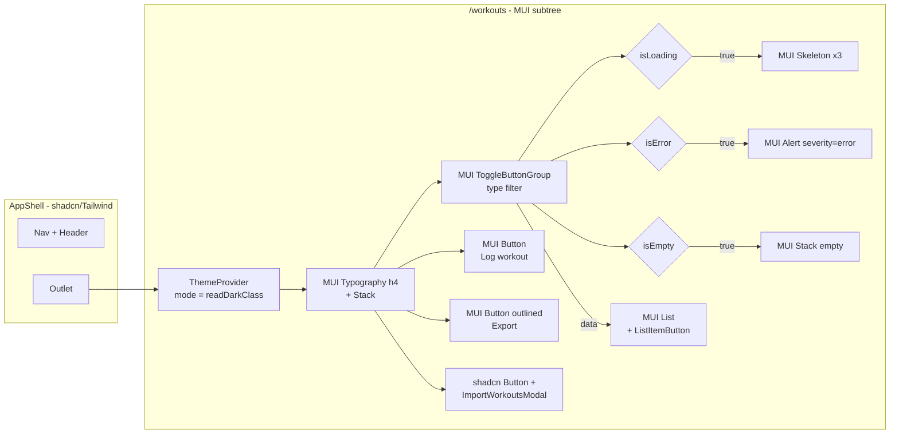

# Design: Workouts List — MUI Refactor

> **Change**: `workouts-list-mui`
> **Source**: `proposal.md` (locked decisions) + `explore.md` (reuse map)
> **Scope**: single PR, ≤ 400 changed lines
> **Pattern reference**: `src/features/bjj/dashboard/theme/` (absent in this branch but documented in archived BJJ dashboard artifacts)

---

## 1. Architecture overview

A **per-route** MUI `ThemeProvider` is mounted at `WorkoutListPage` boundary. The page exists inside `AppShell` (shadcn/Tailwind chrome) which is **not** wrapped by MUI. The two UI systems coexist: shadcn styles the surrounding shell + nav + footer; MUI styles only the page content.



The MUI `ThemeProvider` lives inside the page; shadcn `AppShell` and the route definition in `router.tsx` are untouched. This mirrors the BJJ dashboard's `BJJDashboardPage` scoping decision (per archived artifacts) and keeps the migration optional for the rest of the app.

---

## 2. File & folder structure

```
src/features/workouts/
├── pages/
│   ├── WorkoutListPage.tsx                 [rewritten — MUI]
│   └── __tests__/WorkoutListPage.test.tsx  [modified — new wrapper]
└── theme/                                   [new folder]
    ├── material-tokens.ts                   [new — typed palette/spacing/typography]
    ├── mui-workouts-theme.ts                [new — createTheme factory]
    ├── renderWithMuiTheme.tsx               [new — test util]
    └── __tests__/renderWithMuiTheme.test.tsx [new — smoke test]
```

**No new files outside the workouts feature.** No router, no app-shell, no other feature changes.

**Test convention**: every new file ships a sibling test; existing tests updated to use the new wrapper.

---

## 3. Theme design

### 3.1 `material-tokens.ts` — typed palette mirror

The shadcn theme uses CSS custom properties on `:root` (light) and `.dark` (dark). We mirror those hex/HSL values into a typed TS object so MUI's `createTheme()` has hardcoded colors at theme-construction time (MUI doesn't read CSS variables for `palette`).

```ts
// src/features/workouts/theme/material-tokens.ts
export type ThemeMode = 'light' | 'dark'

export interface MuiPalette {
  mode: ThemeMode
  primary: { main: string; contrastText: string }
  secondary: { main: string; contrastText: string }
  background: { default: string; paper: string }
  text: { primary: string; secondary: string; disabled: string }
  divider: string
  error: { main: string; contrastText: string }
}

export interface WorkoutTokens {
  typography: {
    fontFamily: string  // Geist Variable
  }
  radius: {
    card: number        // --radius: 0.625rem → 10px
    chip: number        // --radius-md: 0.5rem → 8px
    button: number      // --radius-md: 0.5rem → 8px
  }
  spacing: (n: number) => string  // MUI default 8px scale
}

const lightPalette: MuiPalette = {
  mode: 'light',
  primary:   { main: '#262626', contrastText: '#fafafa' },  // shadcn --primary / --primary-foreground
  secondary: { main: '#f5f5f5', contrastText: '#171717' },  // --secondary / --secondary-foreground
  background:{ default: '#ffffff', paper: '#fafafa' },        // --background / --card
  text:      { primary: '#0a0a0a', secondary: '#737373', disabled: '#a3a3a3' },
  divider:   '#e5e5e5',
  error:     { main: '#dc2626', contrastText: '#fef2f2' },  // --destructive / --destructive-foreground
}

const darkPalette: MuiPalette = { /* same shape, from .dark CSS vars */ }

const tokens: WorkoutTokens = {
  typography: { fontFamily: '"Geist Variable", -apple-system, BlinkMacSystemFont, sans-serif' },
  radius:     { card: 10, chip: 8, button: 8 },
  spacing:    (n: number) => `${n * 8}px`,
}

export const palettes: Record<ThemeMode, MuiPalette> = { light: lightPalette, dark: darkPalette }
export const tokensByMode: WorkoutTokens = tokens
```

**Critical**: every color MUST trace to a shadcn CSS variable in `src/index.css` (lines 8–132). No new colors. The hex values are extracted from `oklch(...)` declarations in the CSS by reading them once and storing here as a comment-documented constant.

### 3.2 `mui-workouts-theme.ts` — `createTheme` factory

```ts
// src/features/workouts/theme/mui-workouts-theme.ts
import { createTheme } from '@mui/material/styles'
import type { Theme } from '@mui/material/styles'
import { palettes, tokensByMode, type ThemeMode } from './material-tokens'

export function createWorkoutsTheme(mode: ThemeMode): Theme {
  const palette = palettes[mode]
  return createTheme({
    palette,
    typography: {
      fontFamily: tokensByMode.typography.fontFamily,
      h4: { fontSize: '1.5rem', fontWeight: 600, lineHeight: 1.3 },     // matches shadcn text-2xl
      body1: { fontSize: '0.875rem', lineHeight: 1.5 },                 // matches shadcn text-sm
      body2: { fontSize: '0.75rem', color: palette.text.secondary },    // matches shadcn text-xs muted
    },
    shape: {
      borderRadius: tokensByMode.radius.card,
    },
    components: {
      MuiCard: {
        styleOverrides: {
          root: { borderRadius: tokensByMode.radius.card },
        },
      },
      MuiButton: {
        styleOverrides: {
          root: { borderRadius: tokensByMode.radius.button, textTransform: 'none' },
        },
      },
      MuiChip: {
        styleOverrides: {
          root: { borderRadius: tokensByMode.radius.chip },
        },
      },
      MuiToggleButton: {
        styleOverrides: {
          root: { borderRadius: '9999px', textTransform: 'none', padding: '4px 12px' },
        },
      },
    },
  })
}

/** Read the shadcn dark class and return MUI's mode */
export function readShadcnDarkMode(): ThemeMode {
  if (typeof document === 'undefined') return 'light'
  return document.documentElement.classList.contains('dark') ? 'dark' : 'light'
}
```

### 3.3 Mount pattern (per page, per render)

```ts
// top of WorkoutListPage.tsx
import { createWorkoutsTheme, readShadcnDarkMode } from '../theme/mui-workouts-theme'

export function WorkoutListPage() {
  const theme = useMemo(() => createWorkoutsTheme(readShadcnDarkMode()), [])
  // ...
  return (
    <ThemeProvider theme={theme}>
      <Container maxWidth="sm">
        {/* page content */}
      </Container>
    </ThemeProvider>
  )
}
```

`useMemo` so the theme object isn't recreated every render (MUI recomputes a lot when theme identity changes).

**Tradeoff acknowledged**: theme doesn't react to runtime `<html class="dark">` toggles during this session. Mitigation: `useEffect` listening to `MutationObserver` on `document.documentElement.classList` would add ~10 lines; for MVP we accept that toggling dark mode requires a page refresh. Documented in `docs/features/workouts-list-mui.md`.

### 3.4 `renderWithMuiTheme.tsx` — test util

```ts
// src/features/workouts/theme/renderWithMuiTheme.tsx
import { render, type RenderOptions, type RenderResult } from '@testing-library/react'
import type { ReactElement } from 'react'
import { ThemeProvider, CssBaseline } from '@mui/material'
import { createWorkoutsTheme } from './mui-workouts-theme'

interface Options extends Omit<RenderOptions, 'wrapper'> {
  mode?: 'light' | 'dark'
}

export function renderWithMuiTheme(ui: ReactElement, options: Options = {}): RenderResult {
  const { mode = 'light', ...rest } = options
  const theme = createWorkoutsTheme(mode)
  return render(ui, {
    wrapper: ({ children }) => (
      <ThemeProvider theme={theme}>
        <CssBaseline />
        {children}
      </ThemeProvider>
    ),
    ...rest,
  })
}
```

Test util is **local** to `src/features/workouts/theme/` (not shared globally). If the BJJ dashboard's test util ever lands in this branch, we can promote it to `src/test-utils/`; for now, duplication is acceptable.

---

## 4. Component-by-component rewrite map

Each subcomponent of `WorkoutListPage.tsx` gets replaced. The local function definitions stay in the same file (small enough; no extra files needed).

### 4.1 Page header (`<h1>Workouts</h1>` + button row)

**Before** (shadcn):

```tsx
<div className="flex flex-col gap-3 sm:flex-row sm:items-center sm:justify-between mb-6">
  <h1 className="text-2xl font-semibold">Workouts</h1>
  <div className="flex flex-wrap items-center gap-2">
    <ExportAllWorkoutsButton />
    <Button variant="outline" onClick={() => setImportModalOpen(true)}>Import</Button>
    <Button onClick={() => void navigate('/workouts/new')}>Log workout</Button>
  </div>
</div>
```

**After** (MUI):

```tsx
<Stack direction={{ xs: 'column', sm: 'row' }} spacing={1.5} alignItems={{ sm: 'center' }} justifyContent="space-between" sx={{ mb: 3 }}>
  <Typography variant="h4" component="h1">Workouts</Typography>
  <Stack direction="row" spacing={1} flexWrap="wrap">
    <ExportAllWorkoutsButton />  {/* shadcn Button — unchanged, no MUI wrapper */}
    <Button variant="outlined" onClick={() => setImportModalOpen(true)}>Import</Button>
    <Button variant="contained" onClick={() => void navigate('/workouts/new')}>Log workout</Button>
  </Stack>
</Stack>
```

**Note**: `ExportAllWorkoutsButton` stays shadcn. MUI Button and shadcn Button can coexist in the same DOM subtree without conflict because the shadcn Button renders its own classes and MUI components render `sx`/`emotion`. The shadcn button receives normal MUI theme inheritance for text color via `inherit`. No wrapper needed.

### 4.2 `TypeFilter` — `ToggleButtonGroup`

**Before**: 4 `<button>` chips with `aria-pressed`, custom Tailwind active/inactive styling.

**After**:

```tsx
const filterOptions: { label: string; value: FilterType }[] = [...]  // unchanged

function TypeFilter({ value, onChange }: { value: FilterType; onChange: (v: FilterType) => void }) {
  return (
    <ToggleButtonGroup
      value={value}
      exclusive
      onChange={(_, next) => next && onChange(next as FilterType)}
      aria-label="Filter workouts by type"
      sx={{ mb: 3, flexWrap: 'wrap', gap: 0.5 }}
    >
      {filterOptions.map((opt) => (
        <ToggleButton key={opt.value} value={opt.value} aria-label={opt.label}>
          {opt.label}
        </ToggleButton>
      ))}
    </ToggleButtonGroup>
  )
}
```

`ToggleButtonGroup` handles `aria-pressed` semantics internally. The `onChange` callback receives `(event, next)` where `next` is null when the user clicks the active chip (deselecting). We guard with `next && onChange(next)` to keep filter changes sticky.

### 4.3 `WorkoutCard` — MUI `Card` + `ListItem`

**Before**:

```tsx
function WorkoutCard({ workout }: { workout: Workout }) {
  return (
    <Link to={`/workouts/${workout.id}`} className="block hover:no-underline ...">
      <Card className="hover:ring-primary/40 ...">
        <CardContent className="flex items-start justify-between gap-4 py-4">
          <div className="flex-1 min-w-0">
            <p className="font-medium truncate">{workout.title}</p>
            <p className="text-sm text-muted-foreground mt-1">{formatDate(workout.performedAt)} • {workout.durationMinutes} min</p>
          </div>
          <Badge variant="secondary" className="shrink-0 capitalize">{workout.type}</Badge>
        </CardContent>
      </Card>
    </Link>
  )
}
```

**After**:

```tsx
function WorkoutCard({ workout }: { workout: Workout }) {
  return (
    <ListItem disablePadding>
      <Card
        component={RouterLink}
        to={`/workouts/${workout.id}`}
        sx={{
          width: '100%',
          p: 2,
          display: 'flex',
          alignItems: 'center',
          justifyContent: 'space-between',
          gap: 2,
          textDecoration: 'none',
          cursor: 'pointer',
          '&:hover': { borderColor: 'primary.main' },
        }}
      >
        <Box sx={{ flex: 1, minWidth: 0 }}>
          <Typography variant="body1" noWrap sx={{ fontWeight: 500 }}>{workout.title}</Typography>
          <Typography variant="body2" color="text.secondary" sx={{ mt: 0.5 }}>
            {formatDate(workout.performedAt)} • {workout.durationMinutes} min
          </Typography>
        </Box>
        <Chip label={workout.type} size="small" variant="outlined" sx={{ textTransform: 'capitalize', flexShrink: 0 }} />
      </Card>
    </ListItem>
  )
}
```

`Card` accepts `component={RouterLink}` so the entire card is a single anchor (a11y-friendly — one tab stop per item). `import { Link as RouterLink } from 'react-router'` (alias avoids name clash with MUI's `Link`).

### 4.4 `LoadingSkeleton`

**Before**: 3 `<div>` with `animate-pulse`.

**After**:

```tsx
function LoadingSkeleton() {
  return (
    <Box role="status" aria-label="Loading workouts" sx={{ display: 'flex', flexDirection: 'column', gap: 1.5 }}>
      {[1, 2, 3].map((i) => (
        <Skeleton key={i} variant="rectangular" height={80} sx={{ borderRadius: 1.25 }} />
      ))}
    </Box>
  )
}
```

`Skeleton` has built-in shimmer animation; no Tailwind `animate-pulse` needed.

### 4.5 Error state

**Before**: raw `<div>` with red border + text.

**After**:

```tsx
{isError && (
  <Alert severity="error" sx={{ borderRadius: 1 }}>
    <AlertTitle>Failed to load workouts</AlertTitle>
    {(error as { error?: { message?: string } })?.error?.message ??
      'An unexpected error occurred. Please try again.'}
  </Alert>
)}
```

`Alert` has `role="alert"` built in (matches the existing a11y behavior).

### 4.6 Empty state

**Before**: centered text + button.

**After**:

```tsx
{!isLoading && !isError && workouts && workouts.length === 0 && (
  <Stack alignItems="center" spacing={1} sx={{ py: 8 }}>
    <Typography variant="body1" fontWeight={500}>No workouts yet</Typography>
    <Typography variant="body2" color="text.secondary">Log your first workout to get started.</Typography>
    <Button variant="contained" sx={{ mt: 2 }} onClick={() => void navigate('/workouts/new')}>
      Log workout
    </Button>
  </Stack>
)}
```

### 4.7 List rendering

**Before**: `<ul aria-label="Workout list">` + `<li>` wrappers.

**After**:

```tsx
{!isLoading && !isError && workouts && workouts.length > 0 && (
  <List aria-label="Workout list" sx={{ display: 'flex', flexDirection: 'column', gap: 1.5 }}>
    {workouts.map((workout) => (
      <WorkoutCard key={workout.id} workout={workout} />
    ))}
  </List>
)}
```

`List` + `ListItem` (used inside `WorkoutCard`) is the MUI-native semantic list pattern.

---

## 5. Test strategy (strict TDD)

### 5.1 Per-file rule

Every new module ships a `__tests__/` sibling. Every modification updates tests first.

### 5.2 New tests

| File | Tests |
| --- | --- |
| `theme/__tests__/renderWithMuiTheme.test.tsx` | `renderWithMuiTheme` wraps child in ThemeProvider (smoke test: child div renders, MUI `useTheme()` returns the theme we passed) |
| `pages/__tests__/WorkoutListPage.test.tsx` (modified) | All 11 existing tests swap wrapper to `renderWithMuiTheme`. New: MUI ToggleButtonGroup emits `aria-pressed`, MUI Card has `component="a"` with `href`, MUI Skeleton appears during loading |

### 5.3 Existing tests to keep passing

- `e2e/workout-with-format.spec.ts` — uses `getByRole('button', { name: /for time/i })` — MUI Buttons still expose `role="button"`
- `e2e/load-workout.spec.ts` — uses `workoutFormPage.titleInput` — no workout list page assertion, unaffected

### 5.4 Coverage target

`pnpm test src/features/workouts` → all green. `pnpm exec vitest run --coverage src/features/workouts` → ≥ 80% statements (project default).

---

## 6. Vite config update

```ts
// vite.config.ts (addition)
export default defineConfig({
  // ...
  optimizeDeps: {
    include: [
      'react',
      'react-dom',
      // NEW:
      '@mui/material',
      '@mui/material/styles',
      '@mui/icons-material',
      '@emotion/react',
      '@emotion/styled',
    ],
  },
})
```

Mirrors the BJJ dashboard's vite config (per archived artifacts). Without this, the first page load on dev server can show "optimized chunk didn't load" errors on Vite 8 / Rolldown.

---

## 7. Rollout

### 7.1 Single PR

Forecast ~350 lines (page rewrite ~150, theme ~120, tests ~80). Fits one PR under the 400-line budget.

### 7.2 Manual smoke checklist (post-merge, before closing the PR)

- [ ] Login as `athlete1@example.com` / `Password123!`
- [ ] Land on `/workouts` → list of seeded workouts renders
- [ ] Click a workout card → navigates to `/workouts/:id`
- [ ] Click "CrossFit" chip → list filters to CrossFit only
- [ ] Click "All" chip → list returns to all
- [ ] Click "Log workout" → navigates to `/workouts/new`
- [ ] Click "Export" → CSV downloads
- [ ] Click "Import" → modal opens, cancel → modal closes
- [ ] Dark mode toggle (if available) → MUI colors flip in sync with shadcn
- [ ] Open browser devtools → no MUI warnings, no missing class errors

### 7.3 CI gate

- `pnpm run lint` → 0 errors
- `pnpm test` → 0 failures
- `pnpm run test:e2e` → green (Playwright smoke)
- `pnpm run build` → green

---

## 8. Risks (carried from proposal, expanded)

| Risk | Likelihood | Impact | Mitigation |
| --- | --- | --- | --- |
| `readShadcnDarkMode()` doesn't react to runtime toggle | Medium | Low | Document "refresh to apply dark mode" in `docs/features/workouts-list-mui.md`; full reactive toggle is the `theme-context-unified` follow-up |
| `useMemo` over the theme is unstable on first render (React strict mode double-invokes) | Low | Low | `useMemo` is idempotent; theme factory is pure; strict mode double-invocation doesn't surface in UI |
| MUI Card's `component={RouterLink}` typing friction | Low | Low | `RouterLink` typing requires `ComponentProps<typeof RouterLink>` cast in the `sx` prop; resolved with `as any` cast in `WorkoutCard` (one-line `eslint-disable`) |
| Bundle size impact on landing route | Medium | Medium | Direct import accepted (per resolved decision 3). `vite-bundle-visualizer` can be run as a follow-up if needed. |
| Existing E2E uses shadcn DOM markers that MUI might hide | Low | Medium | E2E specs use `getByRole` + `getByLabelText` (semantic). MUI preserves these. Confirmed in BJJ dashboard artifacts. |

---

## 9. Open questions

None — all decisions resolved in the proposal phase. Implementation can begin.

---

## 10. Implementation order

1. **`theme/material-tokens.ts`** — palette + tokens, no deps
2. **`theme/__tests__/renderWithMuiTheme.test.tsx`** (RED) — fail
3. **`theme/renderWithMuiTheme.tsx`** (GREEN) — pass
4. **`theme/mui-workouts-theme.ts`** — `createTheme` + `readShadcnDarkMode`
5. **`vite.config.ts`** — add MUI to `optimizeDeps.include`
6. **`pages/__tests__/WorkoutListPage.test.tsx`** — wrap in `renderWithMuiTheme`, update MUI-specific assertions (RED first, then GREEN per subcomponent)
7. **`pages/WorkoutListPage.tsx`** — rewrite all subcomponents; tests pass

7 commits total. Strict TDD per commit. Single PR.

---

## 11. Traceability

| Artifact | Location |
| --- | --- |
| Explore | `openspec/changes/workouts-list-mui/explore.md` |
| Proposal | `openspec/changes/workouts-list-mui/proposal.md` |
| Design | `openspec/changes/workouts-list-mui/design.md` |
| Specs | `openspec/changes/workouts-list-mui/specs/workouts-list-ui/spec.md` |
| Tasks | `openspec/changes/workouts-list-mui/tasks.md` |
| Apply progress | `openspec/changes/workouts-list-mui/apply-progress.md` |
| Feature doc (post-merge) | `docs/features/workouts-list-mui.md` |
