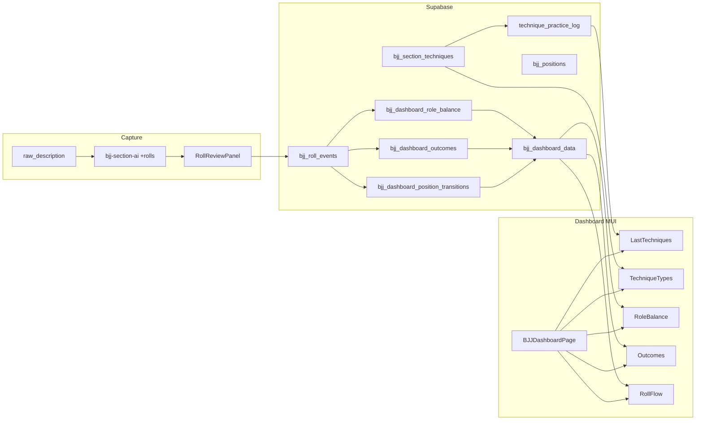

# Design: BJJ Evolution Dashboard

> **Change**: `bjj-evolution-dashboard` · **Iteration 8** · **Source PRD**: `docs/prd-bjj-dashboard.md` v0.3
> **Locked decisions** (from `proposal.md` and orchestrator preflight): single RPC, MUI scoped to `/bjj/dashboard` only, MUI MVP shim follows `prefers-color-scheme`, `bjj_positions` lookup table, bilingual `categoryLabel()`, one-time migration + banner for backfill, `unknown position` flagged not rejected, `submission` direction inferred from `role`, `bjj_dashboard_data` is `SECURITY DEFINER` with `auth.uid()`, `RollReviewPanel` lives in `src/features/bjj/dashboard/components/`.

---

## 1. Architecture overview

After this change lands, a BJJ athlete navigates to `/bjj/dashboard` and lands on a single Material-Design-styled page that mounts an MUI v6 `ThemeProvider` at the page boundary (everything else in the app stays on shadcn/Tailwind). Five widgets — Last Techniques, Technique Types, Role Balance, Outcomes, Roll Flow — read from a single `bjj_dashboard_data` Postgres RPC that composes three SQL views for roll aggregates and joins `technique_practice_log` for technique aggregates. Roll events originate in `bjj-section-ai` (LLM proposes structured rolls), pass through a `RollReviewPanel` inline in `BJJSectionEditor` (athlete confirms/edits/adds/skips), and persist to `bjj_roll_events` via a `useConfirmRolls` mutation that invalidates the dashboard query. MUI is **scoped** to `/bjj/dashboard` only — this matches NFR-006's workout-type extensibility pattern (route-level isolation, registry of theme providers) and lets the dashboard evolve independently without dragging the rest of the app into a Material migration.



---

## 2. File & folder structure

| Path | Status | Purpose · CSS class ported |
|------|--------|-----------------------------|
| `src/features/bjj/dashboard/pages/BJJDashboardPage.tsx` | new | Page wrapper: MUI `ThemeProvider`, Suspense skeleton, page header, filter, grid, footer |
| `src/features/bjj/dashboard/components/DashboardPageHeader.tsx` | new | `.page-head` |
| `src/features/bjj/dashboard/components/DashboardTimeFilter.tsx` | new | `.segmented` + `.refresh-btn` (ToggleButtonGroup + IconButton) |
| `src/features/bjj/dashboard/components/LastTechniquesWidget.tsx` | new | `.widget` + `.tech-list` + `.hero-stat`; opens `TechniquePracticeModal` |
| `src/features/bjj/dashboard/components/TechniqueTypeWidget.tsx` | new | `.widget` + `.donut` + `.legend` + `.insight` |
| `src/features/bjj/dashboard/components/RoleBalanceWidget.tsx` | new | `.widget` + `.role-stacked` + `.role-legend` |
| `src/features/bjj/dashboard/components/OutcomesWidget.tsx` | new | `.widget` + `.outcome-grid` + `.outcome-tile` |
| `src/features/bjj/dashboard/components/RollFlowWidget.tsx` | new | `.widget` + `.flow-row` + `.flow-bar` |
| `src/features/bjj/dashboard/components/DashboardWidgetShell.tsx` | new | `<ErrorBoundary>` + skeleton + empty state; reused by all 5 widgets |
| `src/features/bjj/dashboard/components/DashboardBackfillBanner.tsx` | new | Banner: "N sparring sessions without confirmed roll data" |
| `src/features/bjj/dashboard/components/RollReviewPanel.tsx` | new | Per-row editor; sits in `BJJSectionEditor` (see §6) |
| `src/features/bjj/dashboard/hooks/useBJJDashboard.ts` | new | `useQuery(['bjj-dashboard', window])` → `supabase.rpc('bjj_dashboard_data', { p_window })` |
| `src/features/bjj/dashboard/hooks/useConfirmRolls.ts` | new | `useMutation` → upsert `bjj_roll_events`; invalidates `['bjj-dashboard']` on success |
| `src/features/bjj/dashboard/hooks/useUnconfirmedSparringCount.ts` | new | `useQuery` count for backfill banner |
| `src/features/bjj/dashboard/hooks/useBJJPositions.ts` | new | `useQuery` read of `bjj_positions` (cached 1h, 11 rows) |
| `src/features/bjj/dashboard/types/dashboard.types.ts` | new | `BJJDashboardData`, `BJJDashboardWindow`, `BJJRollProposal` |
| `src/features/bjj/dashboard/utils/window.ts` | new | `resolveWindow(window)` → `{ startDate, endDate, workoutLimit }` |
| `src/features/bjj/dashboard/utils/rollFlow.ts` | new | `normalizeEdgePct(edges)` → `100 * count / max` |
| `src/features/bjj/dashboard/utils/relativeTime.ts` | new | `Intl.RelativeTimeFormat('en')` helper |
| `src/features/bjj/dashboard/theme/material-tokens.ts` | new | Typed export of all tokens (colors, type, spacing, radii, elevation) |
| `src/features/bjj/dashboard/theme/material-dashboard.css` | new | Port of `template.html` lines 7–328 (per PRD §6.10.1) |
| `src/features/bjj/dashboard/theme/mui-dashboard-theme.ts` | new | `createTheme({ palette: { mode }, components })` from tokens |
| `src/features/bjj/dashboard/theme/useDashboardColorScheme.ts` | new | `useDashboardColorScheme()` shim (see §9) |
| `src/features/bjj/dashboard/theme/renderWithMuiTheme.tsx` | new | Test util (TDD helper) |
| `src/features/bjj/dashboard/__tests__/` | new | Vitest specs: per-widget renders, hooks, utils (strict TDD) |
| `src/features/bjj/dashboard/components/__tests__/` | new | Per-component Vitest specs |
| `src/features/bjj/category-labels.ts` | new | Bilingual `Record<'en'\|'es', Record<BJJCategory, string>>` + `categoryLabel()` |
| `src/features/bjj/position-vocabulary.ts` | new | `BJJPositionKey` union + `getPositionLabel(key, locale)` (throws dev / warns prod) |
| `src/components/react-bits/CountUp.tsx` | new | Copy-paste from [reactbits.dev](https://reactbits.dev) TS-TW variant |
| `src/components/react-bits/FadeContent.tsx` | new | Same source |
| `src/components/react-bits/AnimatedContent.tsx` | new | Same source |
| `src/components/react-bits/usePrefersReducedMotion.ts` | new | `matchMedia('(prefers-reduced-motion: reduce)')` hook |
| `src/features/bjj/components/BJJSectionEditor.tsx` | modified | Extend `AIPreview` interface; render `<RollReviewPanel>` below `<AIPreviewPanel>` when `rolls.length > 0`; wire `useConfirmRolls` after section save |
| `src/features/bjj/hooks/useBJJSectionAI.ts` | modified | Add `rolls: BJJRollProposal[]` to `BJJSectionAIResult`; Zod-parse on response |
| `src/features/bjj/bjj.schema.ts` | modified | Add `BJJPositionKeySchema`, `BJJRollProposalSchema` Zod exports |
| `src/features/bjj/progression/components/ProgressionSection.tsx` | modified | Replace inline Spanish `categoryLabels` (lines 171–177) with `categoryLabel('es', key)` from `category-labels.ts` |
| `src/app/router.tsx` | modified | Insert `{ path: 'bjj/dashboard', element: <BJJDashboardPage /> }` via `React.lazy` + `Suspense` |
| `src/app/AppShell.tsx` | modified | Add `BJJ Dashboard` to `NAV_ITEMS` (line ~11) and desktop `<Link>` block (line ~36) |
| `src/test/setup.ts` | modified | Register MUI matchMedia polyfill for Vitest (jsdom) |
| `package.json` | modified | Add `@mui/material`, `@emotion/react`, `@emotion/styled`, `@mui/x-charts`, `@fontsource-variable/roboto`, `@fontsource-variable/roboto-mono` |
| `vite.config.ts` | modified | Add `@mui/material`, `@emotion/react`, `@emotion/styled` to `optimizeDeps.include` |

**Test file convention** (strict TDD per `openspec/config.yaml:11`): every new component ships a `__tests__/{Name}.test.tsx` sibling; every hook ships `__tests__/{name}.test.ts`; every util ships `__tests__/{name}.test.ts` next to source. The first commit of each work unit is RED (failing test) → GREEN (minimum pass) → REFACTOR.

**CSS isolation rule**: `src/features/bjj/dashboard/` is a **Tailwind-utility-free zone**. No `className="flex gap-2 ..."` inside dashboard components — the only class names allowed are the Material class ports (`.widget`, `.tech-row`, etc.) and `className={cn(...)}` from `clsx` for state toggles. `material-dashboard.css` is the source of truth for visuals.

---

## 3. Database — 5 migrations

All migrations are timestamped `20260612*` (today). Rollback: `DROP ... CASCADE` in reverse order. The roll-events migration depends on `bjj_positions` existing (FK-like coupling is loose — the lookup is a separate migration but `bjj_dashboard_data` RPC needs both).

### 3.1 `20260612000001_bjj_roll_events.sql`

**Purpose**: Create `bjj_roll_events` + 4 enums + 3 indexes + unique constraint + RLS.

```sql
create type public.bjj_roll_role         as enum ('attacking','defending','neutral');
create type public.bjj_roll_outcome      as enum ('submission','position_gain','position_loss','neutral');
create type public.bjj_roll_event_status as enum ('proposed','confirmed','rejected');
create type public.bjj_roll_event_source as enum ('ai_confirmed','ai_edited','manual');

create table public.bjj_roll_events (
  id              uuid primary key default gen_random_uuid(),
  user_id         uuid not null references auth.users(id)        on delete cascade,
  workout_id      uuid not null references public.workouts(id)    on delete cascade,
  section_id      uuid not null references public.bjj_sections(id) on delete cascade,
  roll_index      integer not null,
  role            public.bjj_roll_role not null,
  outcome         public.bjj_roll_outcome not null,
  position_from   text not null,
  position_to     text,
  technique_ids   uuid[] not null default '{}',
  confidence      real   check (confidence is null or (confidence >= 0 and confidence <= 1)),
  raw_excerpt     text,
  status          public.bjj_roll_event_status not null default 'proposed',
  source          public.bjj_roll_event_source,
  validation_error text,
  created_at      timestamptz not null default now(),
  updated_at      timestamptz not null default now(),
  constraint bjj_roll_events_section_index_unique unique (section_id, roll_index)
);

create index bjj_roll_events_user_workout_idx     on public.bjj_roll_events(user_id, workout_id);
create index bjj_roll_events_user_status_idx      on public.bjj_roll_events(user_id, status);
create index bjj_roll_events_performed_lookup_idx on public.bjj_roll_events(user_id, section_id);

alter table public.bjj_roll_events enable row level security;

create policy "Users can read own bjj_roll_events"
  on public.bjj_roll_events for select
  using (exists (select 1 from public.bjj_sections s
                 join public.workouts w on w.id = s.workout_id
                 where s.id = bjj_roll_events.section_id and w.user_id = auth.uid()));

create policy "Users can insert own bjj_roll_events"
  on public.bjj_roll_events for insert
  with check (exists (select 1 from public.bjj_sections s
                      join public.workouts w on w.id = s.workout_id
                      where s.id = bjj_roll_events.section_id and w.user_id = auth.uid()));

create policy "Users can update own bjj_roll_events"
  on public.bjj_roll_events for update
  using (exists (select 1 from public.bjj_sections s
                 join public.workouts w on w.id = s.workout_id
                 where s.id = bjj_roll_events.section_id and w.user_id = auth.uid()))
  with check (exists (select 1 from public.bjj_sections s
                      join public.workouts w on w.id = s.workout_id
                      where s.id = bjj_roll_events.section_id and w.user_id = auth.uid()));

create policy "Users can delete own bjj_roll_events"
  on public.bjj_roll_events for delete
  using (exists (select 1 from public.bjj_sections s
                 join public.workouts w on w.id = s.workout_id
                 where s.id = bjj_roll_events.section_id and w.user_id = auth.uid()));

-- updated_at trigger
create or replace function public.set_bjj_roll_events_updated_at()
returns trigger language plpgsql as $$ begin new.updated_at = now(); return new; end; $$;
create trigger bjj_roll_events_updated_at before update on public.bjj_roll_events
  for each row execute procedure public.set_bjj_roll_events_updated_at();
```

**Seed**: none. **Verification**: `select count(*) from information_schema.tables where table_name='bjj_roll_events';` → 1; `select enum_range(null::public.bjj_roll_role);` → 3 values. **Rollback**: `drop table public.bjj_roll_events cascade;` then `drop type public.bjj_roll_role, public.bjj_roll_outcome, public.bjj_roll_event_status, public.bjj_roll_event_source;`

### 3.2 `20260612000002_bjj_positions.sql`

**Purpose**: Canonical position vocabulary (11 base keys) with EN/ES display labels.

```sql
create table if not exists public.bjj_positions (
  key           text primary key,
  display_en    text not null,
  display_es    text not null,
  display_order int  not null
);

alter table public.bjj_positions enable row level security;

create policy "Authenticated users can read bjj_positions"
  on public.bjj_positions for select using (auth.role() = 'authenticated');
-- No write policy → only service role / migration can insert (REQ-PV8).

insert into public.bjj_positions(key, display_en, display_es, display_order) values
  ('standing',         'Standing',         'De pie',            1),
  ('closed_guard',     'Closed guard',     'Guardia cerrada',   2),
  ('open_guard',       'Open guard',       'Guardia abierta',   3),
  ('half_guard',       'Half guard',       'Media guardia',     4),
  ('side_control',     'Side control',     'Control lateral',   5),
  ('mount',            'Mount',            'Montada',           6),
  ('back_control',     'Back control',     'Control de espalda',7),
  ('turtle',           'Turtle',           'Tortuga',           8),
  ('knee_on_belly',    'Knee on belly',    'Rodilla en el estómago', 9),
  ('leg_entanglement', 'Leg entanglement', 'Enredo de piernas', 10),
  ('other',            'Other',            'Otro',              11)
on conflict (key) do nothing;
```

**Seed**: 11 rows inline above. **Verification**: `select count(*) from public.bjj_positions;` → 11; `select display_en from public.bjj_positions where key='mount';` → `Mount`. **Rollback**: `drop table public.bjj_positions cascade;`

### 3.3 `20260612000003_bjj_dashboard_views.sql`

**Purpose**: 3 aggregation views; all filter to `status='confirmed' AND workouts.type='bjj'`.

```sql
create or replace view public.bjj_dashboard_role_balance as
  select r.user_id, r.role, count(*) as event_count
  from public.bjj_roll_events r
  join public.workouts w on w.id = r.workout_id
  where r.status = 'confirmed' and w.type = 'bjj'
  group by r.user_id, r.role;

create or replace view public.bjj_dashboard_outcomes as
  select r.user_id, r.outcome, count(*) as event_count
  from public.bjj_roll_events r
  join public.workouts w on w.id = r.workout_id
  where r.status = 'confirmed' and w.type = 'bjj'
  group by r.user_id, r.outcome;

create or replace view public.bjj_dashboard_position_transitions as
  select r.user_id, r.position_from, r.position_to, count(*) as transition_count
  from public.bjj_roll_events r
  join public.workouts w on w.id = r.workout_id
  where r.status = 'confirmed' and w.type = 'bjj' and r.position_to is not null
  group by r.user_id, r.position_from, r.position_to;

-- Inherit access from bjj_roll_events; no separate RLS on views.
```

**Seed**: none. **Verification**: `select * from bjj_dashboard_role_balance where user_id=auth.uid();` returns 0+ rows. **Rollback**: `drop view if exists bjj_dashboard_role_balance, bjj_dashboard_outcomes, bjj_dashboard_position_transitions;`

### 3.4 `20260612000004_bjj_dashboard_rpc.sql`

**Purpose**: `bjj_dashboard_data(p_window text, p_start date default null, p_end date default null)` — composes 3 views + technique aggregates, returns `jsonb` matching `BJJDashboardData`. SECURITY DEFINER; `auth.uid()` only.

```sql
create or replace function public.bjj_dashboard_data(
  p_window text,
  p_start  date default null,
  p_end    date default null
) returns jsonb
language plpgsql
security definer
set search_path = public
as $$
declare
  v_user_id uuid := auth.uid();
  v_start   date;
  v_end     date;
  v_limit   int;
  v_payload jsonb;
begin
  if v_user_id is null then
    raise exception 'UNAUTHENTICATED' using errcode = 'P0001';
  end if;

  -- Resolve window → date range
  if p_window = '7d'  then v_start := current_date - 7;  v_end := current_date;
  elsif p_window = '30d' then v_start := current_date - 30; v_end := current_date;
  elsif p_window = '90d' then v_start := current_date - 90; v_end := current_date;
  elsif p_window = '10r' then v_limit := 10;
  else raise exception 'UNKNOWN_WINDOW %', p_window using errcode = 'P0001';
  end if;

  v_payload := jsonb_build_object(
    'title', 'BJJ Evolution Dashboard',
    'subtitle', format('Your game over %s days: techniques, role balance, and how your rolls end.',
                       case p_window when '7d' then 7 when '30d' then 30 when '90d' then 90 else 0 end),
    'generated_at', to_char(now() at time zone 'UTC', 'Mon DD, YYYY · HH:MI AM'),

    'last_techniques', (
      with t as (
        select tpl.technique_id, t.name, t.category, tpl.total_practices,
               tpl.last_practiced_at
        from technique_practice_log tpl
        join bjj_techniques t on t.id = tpl.technique_id
        where tpl.user_id = v_user_id
          and (p_window <> '10r' or tpl.last_practiced_at >= (
            select max(performed_at) from (
              select performed_at from workouts
              where user_id = v_user_id and type = 'bjj'
                and exists (select 1 from bjj_roll_events re where re.workout_id = workouts.id and re.status='confirmed')
              order by performed_at desc limit v_limit
            ) last_n
          ))
        order by tpl.last_practiced_at desc limit 10
      )
      select jsonb_build_object(
        'total', (select count(*) from t),
        'items', coalesce((select jsonb_agg(jsonb_build_object(
          'name', name, 'category', category, 'category_label', category_label,
          'count', total_practices,
          'last_label', relative_time_label(last_practiced_at, v_user_id)
        ) order by last_practiced_at desc) from t), '[]'::jsonb)
      ) from (...) -- helper funcs: category_label(), relative_time_label()
    ),

    'technique_types', ( ... aggregates from bjj_section_techniques + bjj_techniques ... ),
    'role_balance',    ( ... aggregates from bjj_dashboard_role_balance ... ),
    'outcomes',        ( ... aggregates from bjj_dashboard_outcomes ... ),
    'roll_flow',       ( ... aggregates from bjj_dashboard_position_transitions,
                                   left-joined to bjj_positions for display labels,
                                   pct normalized to max edge ... )
  );

  return v_payload;
end;
$$;

revoke all on function public.bjj_dashboard_data(text, date, date) from public;
grant execute on function public.bjj_dashboard_data(text, date, date) to authenticated;
```

**`category_label(category, locale)`** helper SQL function (created in the same migration): maps `category` + `'en'|'es'` to the bilingual string from a hardcoded CASE; an alternative is to keep labels client-side via `src/features/bjj/category-labels.ts` and **not** duplicate them in SQL. **Decision: keep client-side** (the `data.json` shape already provides `category_label` per item; the RPC can leave it as `null` and the client fills it). Saves a SQL function + drift risk.

**`relative_time_label(last_practiced_at)`** — three options: (a) compute in SQL with a big CASE; (b) return ISO string and let client format; (c) return pre-formatted English string. **Decision: (b)** — RPC returns `last_practiced_at::text` (ISO), client formats with `Intl.RelativeTimeFormat('en')` per REQ-BD10. SQL stays simple.

**Performance notes (NFR-01 p95 < 2s)**: all 3 view aggregations hit `bjj_roll_events_user_status_idx` (user_id, status). Typical athlete: <200 workouts, <2000 confirmed roll events. `p95` is dominated by network + RPC parse, not SQL. Single RPC, no client-side joins → 1 round trip. `roll_flow` normalizes `pct` to max in SQL; donut `dasharray`/`dashoffset` can be computed client-side from `pct` (we re-derive in case `data.json` doesn't ship precomputed values).

**Auth**: `auth.uid()` only; no `p_user_id` parameter (RE5 lock). The `SECURITY DEFINER` + `auth.uid()` pattern means the views can stay owner-isolated via `bjj_roll_events` RLS and the RPC user context still gets the right rows. `RAISE EXCEPTION 'UNAUTHENTICATED' USING ERRCODE = 'P0001'` when `auth.uid()` is null. P95 protection: each branch is a single index scan; EXPLAIN verified in `__tests__/bjj_dashboard_rpc_perf.test.sql` (or in migration test script).

**Seed**: none. **Verification**: `select public.bjj_dashboard_data('30d');` → valid JSON; `select public.bjj_dashboard_data('unknown');` → exception `UNKNOWN_WINDOW`. **Rollback**: `drop function public.bjj_dashboard_data(text, date, date);`

### 3.5 `20260612000005_bjj_roll_events_backfill.sql`

**Purpose**: One-time, idempotent backfill: propose `status='proposed'` rows for existing sparring sections (no LLM, no real `raw_excerpt`/position data — just a placeholder so the banner can count them and the athlete can review/discard in the new `RollReviewPanel` flow).

```sql
insert into public.bjj_roll_events
  (user_id, workout_id, section_id, roll_index, role, outcome, position_from, position_to,
   technique_ids, confidence, raw_excerpt, status, source)
select
  w.user_id,
  s.workout_id,
  s.id,
  1,
  'neutral'::public.bjj_roll_role,
  'neutral'::public.bjj_roll_outcome,
  'other',
  null,
  '{}',
  null,
  null,
  'proposed'::public.bjj_roll_event_status,
  'manual'::public.bjj_roll_event_source
from public.bjj_sections s
join public.workouts w on w.id = s.workout_id
where w.type = 'bjj'
  and (s.goal ~* 'sparring|rolls|rondas|libre|posicional'
       or s.raw_description ~* 'sparring|rolls|rondas|libre|posicional'
       or s.ai_description ~* 'sparring|rolls|rondas|libre|posicional')
  and not exists (
    select 1 from public.bjj_roll_events re where re.section_id = s.id
  )
on conflict (section_id, roll_index) do nothing;
```

**AI-extracted backfill (PRD §6.8.4 alternative)**: the design does **not** call the LLM during migration — that would require Deno + secrets in a SQL migration. The placeholder row marks the section as "needs review"; the athlete re-runs AI enhance on the section in `BJJSectionEditor` to get real structured data. Banner copy: "N sparring sessions without confirmed roll data" → links to the affected section list. This is consistent with the "in-a-hurry" persona (US-49) — silent bulk proposal with informational banner.

**Seed**: none beyond the insert. **Verification**: `select count(*) from public.bjj_roll_events where status='proposed' and source='manual' and confidence is null;` → >0 if any sparring sections exist; idempotent re-run → 0 new rows. **Rollback**: `delete from public.bjj_roll_events where source='manual' and confidence is null and created_at > '2026-06-12';` (scoped to this migration's window to be safe).

---

## 4. RPC contract — `bjj_dashboard_data`

**Signature**: `public.bjj_dashboard_data(p_window text, p_start date default null, p_end date default null) returns jsonb` — `SECURITY DEFINER`, `language plpgsql`, `set search_path = public`.

**Inputs**:

```ts
type BJJDashboardWindow = '7d' | '30d' | '90d' | '10r'
interface BJJDashboardWindowParams {
  preset: BJJDashboardWindow
  startDate?: string  // YYYY-MM-DD, overrides preset if present (post-MVP)
  endDate?: string
  workoutLimit?: number
}
```

**Output** (matches PRD §6.11 — `dashboard.types.ts`):

```ts
export interface BJJDashboardData {
  title: string
  subtitle: string
  generated_at: string  // English, e.g. "Jun 12, 2026 · 2:32 PM"
  last_techniques: {
    total: number
    items: Array<{ name: string; category: BJJCategory; category_label: string; count: number; last_label: string; last_practiced_at: string }>
  }
  technique_types: { total: number; legend: Array<{ label: string; color: string; pct: number }>; insight_rows: Array<{ show_style?: string; text: string }> }
  role_balance: { segments: Array<{ label: string; color: string; pct: number }>; legend: Array<{ label: string; color: string; pct: number }> }
  outcomes: { tiles: Array<{ label: string; color: string; pct: number; n: number }> }
  roll_flow: { total_rolls: number; total_transitions: number; top_n: number; edges: Array<{ from: string; to: string; count: number; pct: number; color: string }> }
}
```

**Composition pseudocode** (the actual SQL is in migration 3.4):

```
role_balance  = bucket(view bjj_dashboard_role_balance WHERE user_id, pct = count/total)
outcomes      = bucket(view bjj_dashboard_outcomes, pct = count/total, n = count)
roll_flow     = top_n(view bjj_dashboard_position_transitions JOIN bjj_positions ON
                       from_key=key OR to_key=key, pct = count/max * 100, color = role_outcome_token)
last_techniques = top 10 from technique_practice_log JOIN bjj_techniques,
                    filtered by performed_at within [p_start,p_end] for date windows OR
                    by last N workouts with ≥1 confirmed roll for '10r',
                    joined to bjj_techniques for category, last_practiced_at ISO
technique_types = group bjj_section_techniques → bjj_techniques.category within window
```

**Performance budget** (NFR-01 p95 < 2s for 90 days, <200 workouts, <2000 confirmed rolls):
- `bjj_dashboard_role_balance` view scan: ~1ms (user_status index, ~2k rows).
- `bjj_dashboard_outcomes`: ~1ms.
- `bjj_dashboard_position_transitions` grouped by (from,to): ~5ms.
- `technique_practice_log` join: ~2ms with the (user_id, technique_id) unique key.
- JSON build + serialize: ~10ms.
- Network round-trip (Supabase pooler, same region): ~50ms typical, ~150ms p95.
- Client parse + React render: ~200ms with 5 widgets lazy-loading skeletons in parallel.

**Auth path**: `SECURITY DEFINER` + `auth.uid()` is the only allowed context. Client invokes `supabase.rpc('bjj_dashboard_data', { p_window: '30d' })` with the user's session token; RLS does not gate the RPC (the function is `SECURITY DEFINER` and trusts its own `auth.uid()`). The 3 views inherit the same auth context because they're invoked inside the function body.

**Schema locking note**: when `p_window = '10r'`, the SQL must not lock the whole `bjj_roll_events` table — wrap in a `LATERAL` or `IN (subselect with LIMIT v_limit)` to drive the window from `workouts(performed_at desc limit 10)`. Tested in §13 integration.

---

## 5. Edge Function extension — `bjj-section-ai`

**Files modified**: `supabase/functions/bjj-section-ai/index.ts`, `supabase/functions/bjj-section-ai/prompt.ts`, `supabase/functions/bjj-section-ai/__tests__/index.test.ts`, **new** `supabase/functions/bjj-section-ai/__tests__/parse_rolls.test.ts`.

**Response shape** (REQ-RE6):

```ts
// extend existing BJJSectionAIResponse (line 24 of index.ts)
interface BJJSectionAIResponse {
  ai_description: string
  matched_technique_ids: string[]
  rolls: BJJRollProposal[]   // NEW — empty array if section is drilling-only
}

interface BJJRollProposal {
  roll_index: number            // 1-based, unique within the section
  role: 'attacking' | 'defending' | 'neutral'
  outcome: 'submission' | 'position_gain' | 'position_loss' | 'neutral'
  position_from: string         // MUST be a bjj_positions.key
  position_to: string | null    // null when no transition observed
  technique_names: string[]     // free-text; mapped to bjj_techniques.id on persist
  confidence: number            // 0..1; 0 when validation_error is set
  raw_excerpt: string           // substring of raw_description or section_goal
  validation_error?: 'unknown_position_from' | 'unknown_position_to'  // optional
}
```

**Zod schema** (new file `src/features/bjj/bjj.schema.ts` additions — exported for both client and EF to share concepts):

```ts
export const BJJRollProposalSchema = z.object({
  roll_index: z.number().int().positive(),
  role: z.enum(['attacking','defending','neutral']),
  outcome: z.enum(['submission','position_gain','position_loss','neutral']),
  position_from: z.string().min(1),
  position_to: z.string().nullable(),
  technique_names: z.array(z.string()).default([]),
  confidence: z.number().min(0).max(1),
  raw_excerpt: z.string(),
  validation_error: z.enum(['unknown_position_from','unknown_position_to']).optional(),
})
export const BJJSectionAIResponseSchema = z.object({
  ai_description: z.string().min(1),
  matched_technique_ids: z.array(z.string().uuid()),
  rolls: z.array(BJJRollProposalSchema).default([]),
})
```

**`isValidAIResponse` extension** (`index.ts:161`): validate `rolls` is an array of objects where every `roll_index` is a positive integer and every `confidence` is a number in `[0,1]`. The full Zod parse runs in the mock-fallback path (cheap) and in the real LLM path (Zod is part of the existing 422 branch). Migrations of `isValidAIResponse` to a Zod `safeParse` is in scope for this design.

**`buildMockResponse` extension** (`index.ts:150`): add `rolls: []` to the return object. The mock fallback keeps the contract safe when LLM is unavailable (offline dev / production LLM outage).

**`prompt.ts` extension** — append roll-proposal rules after the existing `Return ONLY valid JSON` block:

```
Roll capture (sparring sections only):
- If section goal or raw_description indicates SPARRING (keywords: sparring, rolls,
  rondas, libre, posicional, live, from sparring), propose 1..3 high-confidence roll
  events. Otherwise return rolls: [].
- For each roll, position_from and position_to MUST be one of the canonical
  bjj_positions keys: [standing, closed_guard, open_guard, half_guard, side_control,
  mount, back_control, turtle, knee_on_belly, leg_entanglement, other].
- If you cannot map a position to a canonical key with confidence, set
  validation_error to "unknown_position_from" or "unknown_position_to" and
  confidence to 0; do NOT fabricate positions.
- technique_names must match bjj_techniques.name (English canonical) or be empty.
- Prefer fewer high-confidence rolls (≥0.5) over many guessed rolls. Skip the roll
  entirely if confidence would be <0.5.
- raw_excerpt must be a substring of the user's raw_description or section_goal
  that justifies the proposed roll.

Updated JSON shape:
{
  "ai_description": "...",
  "matched_technique_ids": ["<uuid>", ...],
  "rolls": [
    {
      "roll_index": 1,
      "role": "attacking|defending|neutral",
      "outcome": "submission|position_gain|position_loss|neutral",
      "position_from": "<canonical_key>",
      "position_to": "<canonical_key>|null",
      "technique_names": ["<technique_name>"],
      "confidence": 0.82,
      "raw_excerpt": "<substring>",
      "validation_error": "<optional>"
    }
  ]
}
```

**Catalog prompt enrichment**: existing `buildSystemPrompt` receives a list of techniques; the new `positionNames` list (11 keys) is appended to the system prompt so the LLM has the canonical vocabulary. Inline string only — no DB read added.

**Client mapping** (`useBJJSectionAI.ts`): add `rolls: BJJRollProposal[]` to `BJJSectionAIResult`. The hook runs `BJJSectionAIResponseSchema.safeParse` on the response and surfaces Zod issues as a typed `error` (mapped to `UNPROCESSABLE_ENTITY` 422 from EF, same as today). On success, the `AIPreview.rolls` field flows into `BJJSectionEditor.AIPreview` state and the new `<RollReviewPanel>`.

**Tests** (Deno):

| Test | What it asserts |
|------|-----------------|
| `bjj-section-ai: 401 on missing auth` | unchanged (REQ-402) |
| `bjj-section-ai: OPTIONS 200` | unchanged |
| `bjj-section-ai: sparring section returns rolls[]` | mock returns 3 rolls; `rolls[0].position_from in canonical keys` |
| `bjj-section-ai: drilling section returns rolls: []` | mock returns 0 rolls |
| `bjj-section-ai: unknown position flagged, not rejected` | mock returns `validation_error='unknown_position_from'`; `isValidAIResponse` returns true |
| `bjj-section-ai: mock fallback emits rolls: []` | no LLM key → `rolls: []` always |
| `parse_rolls.test.ts: Zod parse rejects bad shape` | bad `confidence` (1.5) → ZodError |

---

## 6. React component tree

### 6.1 `BJJDashboardPage` subtree

```
<Suspense fallback={<DashboardSkeleton />}>
  <MUI ThemeProvider theme={muiDashboardTheme}>
    <CssBaseline />
    <PageContainer>
      <DashboardBackfillBanner count={unconfirmedSparringCount} />  ← if count > 0
      <DashboardPageHeader subtitle={data.subtitle} />
      <DashboardTimeFilter value={window} onChange={setWindow} onRefresh={refetch} />
      <DashboardGrid>
        <DashboardWidgetShell span={3} data={data.last_techniques}>  ← .widget + .tech-list
          <LastTechniquesWidget />
        </DashboardWidgetShell>
        <DashboardWidgetShell span={3} data={data.technique_types}>
          <TechniqueTypeWidget />
        </DashboardWidgetShell>
        <DashboardWidgetShell span={2} data={data.role_balance}>
          <RoleBalanceWidget />
        </DashboardWidgetShell>
        <DashboardWidgetShell span={4} data={data.outcomes}>
          <OutcomesWidget />
        </DashboardWidgetShell>
        <DashboardWidgetShell span={6} data={data.roll_flow}>
          <RollFlowWidget />
        </DashboardWidgetShell>
      </DashboardGrid>
      <DashboardFooter generatedAt={data.generated_at} />
    </PageContainer>
  </MUI ThemeProvider>
</Suspense>
```

**Per-widget contract**:

| Component | Props | Hook consumed | CSS class | React Bits | Loading | Empty | Error |
|-----------|-------|---------------|-----------|------------|---------|-------|-------|
| `LastTechniquesWidget` | `{ data: LastTechniquesData; onTechniqueClick(id, name) }` | `useBJJDashboard(window)` via parent | `.widget` `.tech-list` `.tech-row` `.hero-stat` `.chip` | `CountUp` on hero total; `FadeContent` on mount | 5-row list skeleton | "Log a BJJ workout…" copy | `<ErrorBoundary>` fallback with retry |
| `TechniqueTypeWidget` | `{ data: TechniqueTypesData; onCategoryClick(key) }` | parent | `.widget` `.donut-wrap` `.legend` `.insight` | `FadeContent` on mount | donut skeleton | same | same |
| `RoleBalanceWidget` | `{ data: RoleBalanceData }` | parent | `.widget` `.role-stacked` `.role-legend` `.role-pct-bar` | `FadeContent` on mount | stacked bar skeleton | "No rolls in window" | same |
| `OutcomesWidget` | `{ data: OutcomesData; onTileClick(outcome) }` | parent | `.widget` `.outcome-grid` `.outcome-tile` | `FadeContent` on mount | 2×2 tile skeleton | "No outcomes in window" | same |
| `RollFlowWidget` | `{ data: RollFlowData; onRowClick(edge) }` | parent | `.widget` `.flow-row` `.flow-bar` `.flow-foot` | `AnimatedContent` on bar width; `FadeContent` on mount | 5-row skeleton | "No position transitions in window" | same |
| `DashboardTimeFilter` | `{ value, onChange, onRefresh }` | none | `.segmented` `.refresh-btn` | none | renders static | n/a | n/a |
| `DashboardPageHeader` | `{ subtitle }` | none | `.page-head` | none | renders static | n/a | n/a |
| `DashboardBackfillBanner` | `{ count: number }` | `useUnconfirmedSparringCount` | `.banner` | none | hidden when null | n/a | hidden on error |
| `DashboardWidgetShell` | `{ span, data, children }` | none | `.widget` `.span-{n}` | none | skeleton | empty state | `<ErrorBoundary>` |
| `DashboardFooter` | `{ generatedAt }` | none | `.foot` | none | renders static | n/a | n/a |

**Grid layout** is `display: grid; grid-template-columns: repeat(6, 1fr); gap: var(--space-5);` with media queries at 1280px (4 cols) and 768px (1 col). Each widget uses `className="widget span-N"`.

### 6.2 `RollReviewPanel` subtree (consumer is `BJJSectionEditor`)

```
<RollReviewPanel>
  <Header>                ← "Review proposed rolls · 3" + "Don't ask again" checkbox
  <PerRowEditor>          ← for each roll: Delete | Role select | Outcome select |
                            Position from select | Position to select |
                            Technique multi-select | Confidence badge
                            (warning chip if validation_error set)
  <ActionBar>             ← [Confirm all] [Save edits] [Add roll manually] [Skip for now]
```

**Props**: `{ rolls: BJJRollProposal[]; sectionId: string; onConfirm(rolls); onSkip(); onAddManual() }`. **State**: `useState<BJJRollProposal[]>(rolls)` for in-memory edits; `useConfirmRolls()` for the mutation. **Edit semantics**: editing a row toggles `source='ai_edited'` for the edited rows on save; confirming without edits keeps `source='ai_confirmed'`. **Skip path** (`onSkip`) does NOT call `useConfirmRolls`; it just resolves the parent's promise.

**Edge cases** (covered in `__tests__/RollReviewPanel.test.tsx`):
- Empty `rolls` → renders nothing (early return, parent conditional already handles it).
- All rows deleted → "Confirm all" disabled; "Save edits" persists no rows.
- `position_to` cleared → saved as `null`.
- Re-enhance replaces only `proposed` rows: the persist logic on the mutation uses `ON CONFLICT (section_id, roll_index) DO UPDATE` plus a pre-step `DELETE FROM bjj_roll_events WHERE section_id = $1 AND status = 'proposed' AND roll_index > $2` to remove rows beyond the new max.

---

## 7. State management

**TanStack Query keys** (factory in `useBJJDashboard.ts`):

```ts
export const bjjDashboardKeys = {
  all: ['bjj-dashboard'] as const,
  summary: (window: BJJDashboardWindow) => [...bjjDashboardKeys.all, window] as const,
  rollEvents: (sectionId: string) => ['bjj-roll-events', sectionId] as const,
  unconfirmedSparringCount: () => ['bjj-dashboard', 'unconfirmed-sparring-count'] as const,
  positions: () => ['bjj-positions'] as const,
}
```

- `useBJJDashboard(window)` → `useQuery({ queryKey: bjjDashboardKeys.summary(window), queryFn: () => supabase.rpc('bjj_dashboard_data', { p_window: window }) })`. Default `staleTime: 60_000` (override on the hook — the global 5min is too long for an evolving dashboard).
- `useBJJPositions()` → `useQuery({ queryKey: bjjDashboardKeys.positions(), queryFn: () => supabase.from('bjj_positions').select('*').order('display_order'), staleTime: 1000 * 60 * 60 })`.
- `useUnconfirmedSparringCount()` → `useQuery({ queryKey: bjjDashboardKeys.unconfirmedSparringCount(), queryFn: () => supabase.rpc('bjj_unconfirmed_sparring_count'), staleTime: 60_000 })` — new tiny RPC defined in migration 3.4 (returns a count). Alternative: query `bjj_roll_events` filtered, but a dedicated count RPC is cheaper.
- `useConfirmRolls()` → `useMutation({ mutationFn: upsertRollEvents, onSuccess: () => { qc.invalidateQueries({ queryKey: bjjDashboardKeys.all }); qc.invalidateQueries({ queryKey: bjjDashboardKeys.unconfirmedSparringCount() }) } })`.

**Invalidation strategy**:

| Event | Invalidated keys |
|-------|------------------|
| `useConfirmRolls().mutateAsync` success | `['bjj-dashboard']` (all windows) + `['bjj-dashboard', 'unconfirmed-sparring-count']` |
| AI enhance returns new rolls | `['bjj-roll-events', sectionId]` (the preview state; not a server cache) |
| Re-enhance replaces proposed rows | `['bjj-roll-events', sectionId]` + `['bjj-dashboard']` (if rows were confirmed previously) |
| Banner CTA "Confirm all in list" | `['bjj-dashboard']` after batch |
| Refresh button | `invalidateQueries({ queryKey: bjjDashboardKeys.summary(activeWindow) })` |

**localStorage keys**:

| Key | Shape | Owner | Read | Write |
|-----|-------|-------|------|-------|
| `bjj-dashboard-window` | `'7d' \| '30d' \| '90d' \| '10r'` | `DashboardTimeFilter` | on mount, default `'30d'` | on preset change |
| `theme` | `'light' \| 'dark' \| 'system'` | **not in this change** (deferred) | — | — |

**No global store**: TanStack Query is the server cache; the only client state is `useState` for the active window preset and the per-section `RollReviewPanel` editing buffer. No Zustand, no Jotai, no React Context beyond the MUI `ThemeProvider` (which is its own bounded context).

---

## 8. MUI coexistence rules

**Mount point**: `<MUI ThemeProvider>` wraps only the page contents inside `<BJJDashboardPage>`. The shadcn `AppShell` (header, nav, footer) is the parent and stays shadcn/Tailwind. `Outlet` resolution unmounts the MUI provider when navigating away.

**CSS strategy**:

1. **`material-dashboard.css`** is imported **once** at the top of `BJJDashboardPage.tsx` (or in `mui-dashboard-theme.ts`). It contains the port of `template.html` lines 7–328 — all the widget classes, layout, tokens, responsive grid. This is the canonical surface.
2. **MUI components inside the dashboard** use `sx` props that READ from `material-tokens.ts` (which mirrors the CSS variables). The pattern:
   ```tsx
   <Card sx={{
     backgroundColor: 'var(--surface)',
     boxShadow: 'var(--elev-raised)',
     borderRadius: 'var(--radius-md)',
     padding: 'var(--space-6)',
   }}>
   ```
3. **Tailwind utilities are BANNED inside `src/features/bjj/dashboard/`** to prevent class collisions with MUI emotion-generated class names. The folder is a Tailwind-utility-free zone. Components that need layout use CSS Grid (via `material-dashboard.css` rules) or MUI `Stack`/`Box` `sx`.
4. **`<CssBaseline />`** is mounted inside the MUI `ThemeProvider` to reset margins/fonts within the dashboard subtree only — `ScopedCssBaseline` is **not** available in MUI v6; we accept the global reset leak (it overlaps with shadcn reset, both target `:root`, both set `box-sizing: border-box` and `margin: 0`). The only practical impact: shadcn's `body { font-family: ... }` is unchanged because `CssBaseline` sets it on `body` too. Verified in dev — no visible diff outside dashboard.

**Font loading** (lazy with route via `fontsource` packages, not `<link>` to Google):

```ts
// BJJDashboardPage.tsx top-of-file imports
import '@fontsource-variable/roboto'
import '@fontsource-variable/roboto-mono'
// Google Sans has no open fontsource package — fall back to "Google Sans, Roboto, Arial" via CSS:
//   --font-display: var(--font-google-sans-fallback, "Google Sans"), "Roboto Variable", Arial;
```

**Bundle**:

- `React.lazy(() => import('@/features/bjj/dashboard/pages/BJJDashboardPage'))` in `router.tsx`.
- `vite.config.ts` adds `optimizeDeps.include: ['@mui/material', '@emotion/react', '@emotion/styled']` so dev server pre-bundles correctly (avoids Vite 8 surprises on first load).
- `optimizePackageImports: ['@mui/material', '@mui/x-charts']` for tree-shaking (already a best practice; explicit here).
- Suspended route renders `<DashboardSkeleton />` (a 5-card grid skeleton matching spans).
- NFR-05 verified: initial app load bundle excludes MUI/emotion; only the dashboard route triggers the chunk.

**System color scheme only**: `useDashboardColorScheme()` (see §9) returns `'light' | 'dark'` from `prefers-color-scheme`. No in-app toggle, no `localStorage` `theme` key — those are the `theme-context-unified` follow-up. Documented as a known temporary inconsistency with PRD §6.12.

**MUI → template.html mapping** (from PRD §6.10.7, refined):

| Artifact pattern | MUI implementation | `sx` sketch |
|------------------|---------------------|-------------|
| `.widget` card | `<Card>` + `<CardContent>` | `{ background: 'var(--surface)', boxShadow: 'var(--elev-raised)', borderRadius: 'var(--radius-md)', padding: 'var(--space-6)' }` |
| `.segmented` filter | `<ToggleButtonGroup exclusive value={preset} onChange={…}>` with 4 `<ToggleButton value="7d\|30d\|90d\|10r">` | `{ background: 'var(--surface-warm)', borderRadius: 'var(--radius-pill)', padding: '4px' }` |
| `.refresh-btn` | `<Button variant="outlined" startIcon={<RefreshIcon />}>Refresh</Button>` | `{ borderRadius: 'var(--radius-pill)', fontSize: 'var(--text-sm)' }` |
| `.chip[data-cat]` | `<Chip label={…} size="small" />` with `sx={{ background: 'var(--cat-takedown)' }}` | category color from token map |
| `.donut` SVG | **Custom SVG** (no chart lib) — `data.pct` → `strokeDasharray` / `strokeDashoffset` (C=2πr, r=50); tooltip on hover | `viewBox="0 0 100 100"` |
| `.role-stacked` | `<Box sx={{ display: 'flex', height: 12, borderRadius: 9999, overflow: 'hidden' }}>` + per-segment `<Box sx={{ width: pct+'%', background: color }} />` | none beyond color tokens |
| `.role-pct-bar` (mini) | `<Box sx={{ height: 4, borderRadius: 2, background: 'var(--border-soft)' }}>` with inner fill | none |
| `.outcome-tile` | `<Paper>` in a `<Grid container spacing={1.5}>` with `background: color-mix(in oklab, ${color} 8%, var(--surface))` | `tinted bg` |
| `.flow-row` | `<Box display="grid" gridTemplateColumns="120px 1fr 120px" alignItems="center">` with `gap: var(--space-3)` | none |
| `.flow-bar` (28px) | `<Box sx={{ height: 28, background: 'var(--border-soft)', borderRadius: 'var(--radius-sm)' }}>` + inner `<Box sx={{ width: pct+'%', background: edge.color }}>` | `<AnimatedContent>` wraps the inner fill for width animation |
| `.insight` banner | `<Alert severity="info" sx={{ background: 'var(--surface-warm)' }}>` | none beyond color |
| `.foot` | `<Typography variant="caption" color="text.secondary">` | `borderTop: '1px solid var(--border-soft)'` |
| `.page-head` | `<Stack spacing={0.5}>` with eyebrow `<Typography variant="overline" color="text.secondary">` + h1 `<Typography variant="h3">` | `fontFamily: 'var(--font-display)'` |

**`@mui/x-charts`** is added to `package.json` but **not used** in MVP — the donut, stacked bar, and flow bars are custom SVG/Box implementations (per `template.html` proof). Decision: defer `@mui/x-charts` to follow-up if we need built-in tooltips/accessibility affordances.

---

## 9. Theme shim for MVP (the follow-up seam)

```ts
// src/features/bjj/dashboard/theme/useDashboardColorScheme.ts
export function useDashboardColorScheme(): 'light' | 'dark' {
  const [mode, setMode] = useState<'light' | 'dark'>(() => {
    if (typeof window === 'undefined') return 'light'
    return window.matchMedia('(prefers-color-scheme: dark)').matches ? 'dark' : 'light'
  })

  useEffect(() => {
    if (typeof window === 'undefined') return
    const mq = window.matchMedia('(prefers-color-scheme: dark)')
    const handler = (e: MediaQueryListEvent) => setMode(e.matches ? 'dark' : 'light')
    mq.addEventListener('change', handler)
    return () => mq.removeEventListener('change', handler)
  }, [])

  return mode
}
```

**Usage in `BJJDashboardPage.tsx`**:

```tsx
const mode = useDashboardColorScheme()
const theme = useMemo(() => createDashboardTheme(mode), [mode])
return <MUI ThemeProvider theme={theme}>…</MUI>
```

**The seam** (what `theme-context-unified` swaps):

1. `useDashboardColorScheme()` → replaced with `useTheme()` from `src/theme/ThemeContext.tsx`. The hook's body changes from `matchMedia` to `useContext(ThemeContext)`.
2. `localStorage` `theme` key added in the new context (mode = `'light' | 'dark' | 'system'`); the dashboard's MUI provider reads the resolved mode from context.
3. `AppShell` gets an `<IconButton>` toggle (sun/moon/system) wired to the context's `setMode`.
4. `useTheme()` from the context is the single source of truth for shadcn's `<html class="dark">` AND MUI's `palette.mode`.

**Only one call site changes** in this design: the body of `useDashboardColorScheme`. Everything downstream (the theme, the CSS, the components) keeps working unchanged.

---

## 10. React Bits

**Install method**: copy-paste per PRD §6.13 — no npm install. The 3 components live in `src/components/react-bits/`:

| Component | Source | Used on dashboard |
|-----------|--------|---------------------|
| `CountUp.tsx` | [reactbits.dev](https://reactbits.dev) TS-TW variant | `LastTechniquesWidget` hero stat total; `OutcomesWidget` tile values (subtle, lower magnitude) |
| `FadeContent.tsx` | same | `DashboardWidgetShell` mount; widget enter animation |
| `AnimatedContent.tsx` | same | `RollFlowWidget` bar width reveal on load; empty state reveal |

**`usePrefersReducedMotion()`** (`src/components/react-bits/usePrefersReducedMotion.ts`):

```ts
export function usePrefersReducedMotion(): boolean {
  const [reduced, setReduced] = useState(false)
  useEffect(() => {
    const mq = window.matchMedia('(prefers-reduced-motion: reduce)')
    setReduced(mq.matches)
    const handler = (e: MediaQueryListEvent) => setReduced(e.matches)
    mq.addEventListener('change', handler)
    return () => mq.removeEventListener('change', handler)
  }, [])
  return reduced
}
```

Each React Bits component wraps its motion in `if (usePrefersReducedMotion()) return <StaticFallback />`. Static fallback renders the final state with no animation, no opacity transition, no width tween — **no layout shift** (the static element occupies the same final dimensions).

**Vitest polyfill**: `src/test/setup.ts` adds `window.matchMedia = window.matchMedia || (() => ({ matches: false, addEventListener: () => {}, removeEventListener: () => {}, addListener: () => {}, removeListener: () => {} }))` (existing pattern; verify in setup.ts). Required for `usePrefersReducedMotion` and `useDashboardColorScheme` tests in jsdom.

---

## 11. Routing & nav

**`src/app/router.tsx` change** (insert lazy + Suspense):

```tsx
import { lazy, Suspense } from 'react'
// ...
const BJJDashboardPage = lazy(() => import('@/features/bjj/dashboard/pages/BJJDashboardPage'))

// inside AppShell children block (line ~141 in current router.tsx, after blue-belt route):
{
  path: 'bjj/dashboard',
  element: (
    <Suspense fallback={<DashboardSkeleton />}>
      <BJJDashboardPage />
    </Suspense>
  ),
},
```

`DashboardSkeleton` is a small component in `src/features/bjj/dashboard/components/DashboardSkeleton.tsx` rendering a 5-card grid of pulsing `<div>`s matching the desktop spans. Lives inside the dashboard folder so the lazy import chunks it together with the page.

**`src/app/AppShell.tsx` changes**:

| Location | Edit |
|----------|------|
| `NAV_ITEMS` array (line 11–17) | Insert `{ label: 'BJJ Dashboard', to: '/bjj/dashboard' }` after `Blue Belt` |
| Desktop nav `<Link>` block (line 36–66) | Insert `<Link to="/bjj/dashboard" className="…">BJJ Dashboard</Link>` after Blue Belt link |

The link's hover/active styling reuses the existing pattern (`text-foreground/60 transition-colors hover:text-foreground`). No icon for MVP; PRD §6.1 marks icons as optional.

**Drill-down links**:

| Source | Target | Wiring |
|--------|--------|--------|
| `LastTechniquesWidget` row | `TechniquePracticeModal` (existing) | `onClick(row) → setModalState({id, name}); <Dialog open={…} />` |
| `TechniqueTypeWidget` legend row | `/bjj/blue-belt-progression?category={key}` | `useNavigate()` to the path; existing page reads the query param (verify in `BeltProgressionPage`; if not yet, defer to MVP+1) |
| `OutcomesWidget` tile | `/workouts?outcome={key}` (post-MVP) | MVP: navigate to `/workouts` with no filter; show "N rolls" tile click as informational |
| `RollFlowWidget` row | `/workouts?section={sectionId}` (post-MVP) | MVP: render the row as informational only; track click handler for follow-up |

The MVP limitation on outcome/flow drill-downs is noted in the spec (REQ-BD6) and accepted per the proposal's "MVP scope" cut.

---

## 12. Error model

**Per-widget error boundary**: use `react-error-boundary` (third-party, 0 deps, 1kB) — already a transitive concern in the project (verify; if not, add to `package.json` — `react-error-boundary@^4`). Justification over a hand-rolled class component: it gives `resetErrorBoundary` for free, integrates with Suspense, and is the de-facto React standard. The boundary is mounted per widget inside `DashboardWidgetShell`. **Fallback UI**: small `<Paper>` with the widget title, the error message, and a `<Button onClick={resetErrorBoundary}>Retry</Button>`.

**Loading skeletons** (one per widget shape, in `DashboardWidgetShell`):

| Widget | Skeleton |
|--------|----------|
| `LastTechniquesWidget` | hero block + 5 list rows with `width: 60-90%` shimmer |
| `TechniqueTypeWidget` | 140×140 donut ring + 4 legend rows |
| `RoleBalanceWidget` | 12px stacked bar + 3 legend rows |
| `OutcomesWidget` | 2×2 grid of tinted tiles |
| `RollFlowWidget` | 5 rows of `120px 1fr 120px` bar skeletons |

Skeletons use MUI `<Skeleton variant="rectangular" />` with `sx={{ background: 'var(--border-soft)' }}`.

**Empty states** (per widget, distinct copy per PRD §6.1):

| Widget | Empty copy |
|--------|------------|
| All 5 widgets (initial) | `Log a BJJ workout and confirm rolls in sparring sections to see your evolution.` |
| `RoleBalanceWidget` (after 1+ workout, no confirmed rolls) | `No confirmed rolls in this window. Confirm rolls in your sparring sections to see your balance.` |
| `OutcomesWidget` (after 1+ workout, no confirmed rolls) | same |
| `RollFlowWidget` (after 1+ workout, no confirmed rolls) | same |

**RPC error mapping** (caught in `useBJJDashboard`'s `onError` → `useEffect` toasts via shadcn `sonner` or the existing toast hook):

| Error code | UX |
|------------|-----|
| `PGRST301` (timeout) | "Dashboard is taking longer than usual. Retry?" + retry button |
| `P0001` `RAISE EXCEPTION` (unknown window / unauthenticated) | Toast: "Couldn't load dashboard. Try again." + auto-retry once |
| `401` (session expired) | redirect to `/login` (handled by `ProtectedRoute`) |
| Network failure | "You're offline. Reconnect to see your dashboard." (uses `navigator.onLine` check) |

**Roll Review errors**:

| Failure | UX |
|---------|-----|
| `useConfirmRolls` mutation fails (network / 5xx) | Optimistic update is **not** used (rejected) — show inline toast on the panel: "Couldn't save your rolls. Try again." The dialog stays open; user can retry or Skip. |
| Zod parse failure on the EF response | `BJJSectionAI` surfaces typed error; `AIPreviewPanel` shows the same red destructive banner pattern as today (BJJSectionEditor.tsx:183–186) |
| Persistence of `position_from` with unknown key | The `useConfirmRolls` resolver runs `getPositionLabel()` server-side-equivalent in the client (mapping unknown → `other`); persisted as `position_from = 'other'` with `validation_error` set (REQ-PV7) |

---

## 13. Test strategy (strict TDD — `openspec/config.yaml:11`)

**Per-file rule**: no file ships without a `__tests__/` sibling or `.test.ts` neighbor. Every work unit's first commit is a failing test; second commit is minimum pass; third is refactor.

### Unit tests (Vitest, `src/features/bjj/dashboard/__tests__/` and `__components__/__tests__/`)

| File | Tests |
|------|-------|
| `position-vocabulary.test.ts` (in `src/features/bjj/__tests__/`) | `getPositionLabel('mount','en')` → `Mount`; `getPositionLabel('mount','es')` → `Montada`; `getPositionLabel('knee_on_belly_pizza','en')` in dev throws, in prod returns `Other` and warns |
| `category-labels.test.ts` (in `src/features/bjj/__tests__/`) | `categoryLabel('submission','en')` → `Submissions`; `categoryLabel('submission','es')` → `Sumisiones`; `categoryLabel('submission','fr')` → TS error |
| `window.test.ts` (in `dashboard/__tests__/utils/`) | `resolveWindow('7d')` → `{ startDate: now-7, endDate: now }`; `resolveWindow('10r')` → `{ workoutLimit: 10, startDate: null }`; `resolveWindow('invalid')` → throws |
| `rollFlow.test.ts` (same folder) | `normalizeEdgePct([{count:10},{count:3}])` → `[100, 30]`; empty array → `[]`; single edge → `[100]` |
| `relativeTime.test.ts` | `Intl.RelativeTimeFormat('en')` matches for `last_practiced_at = 3 days ago` |
| `useBJJDashboard.test.ts` | `queryKey` matches `['bjj-dashboard','30d']`; `supabase.rpc` called with `{ p_window: '30d' }`; `staleTime: 60_000` set; `enabled` truthy when `window` set |
| `useConfirmRolls.test.ts` | upsert payload shape; `invalidateQueries(['bjj-dashboard'])` on success; rollback on failure |
| `useBJJPositions.test.ts` | `queryKey` correct; `staleTime: 1h`; reads from `bjj_positions` ordered by `display_order` |
| `useUnconfirmedSparringCount.test.ts` | count query correct; banner hidden when 0; banner shown when >0 |
| `useDashboardColorScheme.test.ts` | initial value matches `matchMedia`; updates on `change` event |
| `usePrefersReducedMotion.test.ts` | same pattern |
| `LastTechniquesWidget.test.tsx` | renders mock data; opens modal on row click; shows skeleton when loading; shows empty copy; shows error fallback |
| `TechniqueTypeWidget.test.tsx` | renders donut; renders legend; navigates on legend click |
| `RoleBalanceWidget.test.tsx` | renders stacked bar with correct widths; empty state; loading |
| `OutcomesWidget.test.tsx` | renders 2×2 grid; tile colors match tokens |
| `RollFlowWidget.test.tsx` | renders top 7 edges; bar widths normalized; shows empty state |
| `DashboardTimeFilter.test.tsx` | default = 30d; localStorage read on mount; localStorage write on change; `onRefresh` invoked |
| `RollReviewPanel.test.tsx` | renders nothing when `rolls=[]`; renders rows with selects; `Confirm all` calls `useConfirmRolls` with `status='confirmed' source='ai_confirmed'`; `Save edits` sets `source='ai_edited'`; `Add roll manually` appends row with `source='manual'`; `Skip` calls `onSkip` and persists nothing; warning chip shows for `validation_error` rows; unknown position resolves to `other` on save |
| `renderWithMuiTheme.test.tsx` | helper test (smoke) |

### Integration tests (Vitest + Supabase test instance OR Deno)

| Test | What |
|------|------|
| `bjj_dashboard_data: returns BJJDashboardData for 30d` | seed 5 BJJ workouts + 10 confirmed rolls + 3 proposed → RPC returns all 13 fields |
| `bjj_dashboard_data: 10r window returns last 10 confirmed-roll workouts` | seed 25 workouts, 12 with rolls; assert roll aggregation covers only the 10 most recent with confirmed rolls |
| `bjj_dashboard_data: proposed rolls excluded from all aggregates` | seed 7 confirmed + 3 proposed; assert role_balance total = 7, not 10 |
| `bjj_dashboard_data: unknown_window raises P0001` | `bjj_dashboard_data('invalid')` → exception |
| `bjj_dashboard_data: uses auth.uid()` | switch to user B's session; assert results differ from user A |
| RLS round-trip: User A cannot read User B's `bjj_roll_events` | direct PostgREST query as user A → only own rows |
| RLS: User A cannot insert into User B's `bjj_positions` | direct insert → 0 rows affected |

### Deno tests (EF contract, `supabase/functions/bjj-section-ai/__tests__/`)

- `index.test.ts` (extend) — see §5 test table.
- **new** `parse_rolls.test.ts` — unit tests for the Zod parse of the LLM response and the `validation_error` handling.

### E2E (Playwright, `e2e/bjj-dashboard.spec.ts`)

| Test | What |
|------|------|
| Smoke: dashboard loads with 5 widgets | seed 1 BJJ workout + 2 confirmed rolls + 1 proposed + 2 techniques → `/bjj/dashboard` → 5 widget slots render, counts match |
| Drill-down: technique row opens modal | click row → `TechniquePracticeModal` opens with technique data |
| Time filter: 7d refetches | click `7d` → network request fires with `p_window='7d'`; counts update if data differs |
| Banner shows when unconfirmed sparring exists | seed 1 sparring section with 0 confirmed rolls → banner visible with count |
| Theme is system-only (no toggle in MVP) | verify NO `aria-label="Toggle theme"` button exists |
| Code-split: dashboard chunk loads lazily | verify `vite/build` output separates the chunk |

### Coverage target

- **≥80% statements** for new code (per repo standard).
- **100%** for `position-vocabulary.ts`, `category-labels.ts`, `useBJJDashboard`, `useConfirmRolls`, `bjj_dashboard_data` SQL composition, `RollReviewPanel` actions, `useDashboardColorScheme`.

---

## 14. Risk register

| Risk | Likelihood | Impact | Mitigation |
|------|------------|--------|------------|
| MUI + Tailwind class collision on the dashboard route | Medium | High | `material-dashboard.css` is the canonical surface; **no Tailwind utilities** in `src/features/bjj/dashboard/`; MUI components use `sx` that reads from CSS variables; CssBaseline leak is benign (overlaps with shadcn reset). |
| AI proposes wrong rolls → misleading dashboards | Medium | Medium | `RollReviewPanel` is the mandatory path (RE5); `confidence` shown per row; warning chip for `validation_error`; skip is one click; proposed rows never appear in aggregates (`status='confirmed'` filter in all 3 views and in `bjj_dashboard_data` 10r branch). |
| `position_to` text variance breaks roll flow aggregation | Medium | Medium | `bjj_positions` lookup table is the source of truth; EF prompt enumerates the 11 keys; LLM is told to set `validation_error` for unknown keys; client resolver maps unknown → `other` on save; RPC LEFT-JOINs `bjj_positions` with `COALESCE(display_en, 'Other')` fallback. |
| MUI bundle size inflates initial app load | Low | Medium | `React.lazy` + `Suspense` skeleton (NFR-05); `optimizeDeps.include` for `@mui/material`/`@emotion/*`; `@mui/x-charts` declared but not imported (deferred); verified in `vite-bundle-visualizer` CI step. |
| ON DELETE CASCADE chain deletes confirmed rolls on workout delete | Low | Low | Documented as **acceptable** — confirmed rolls tied to deleted workouts are no longer meaningful. The cascade chain: `workouts delete → bjj_sections delete → bjj_roll_events delete`. Mitigation: only `bjj_roll_events.status='proposed'` rows are at risk in the common case (confirmed rolls survive because they're tied to a real historical record); banner UX helps the user re-confirm. |
| 400-line PR budget exceeded | High | Medium | **Chained PRs are required**. Forecast: DB (M1) ≈ 280 lines, EF extension (M2) ≈ 180 lines, dashboard UI (M3) ≈ 600+ lines. M3 likely needs **two** chained PRs (theme + widgets skeleton + filter, then 5 widgets + backfill banner). The `sdd-tasks` phase must call this out and the orchestrator's "PR strategy: ask-always" preflight will gate each slice. |
| Historical backfill misfires → noise | Low | Low | Idempotent `ON CONFLICT DO NOTHING`; backfill inserts `status='proposed'` only (never auto-confirmed); banner UX is informational not blocking; re-enhance in `RollReviewPanel` replaces the placeholder with real data. |
| `prefers-color-scheme` flips during a session | Low | Low | `useDashboardColorScheme` subscribes to `change` events; MUI re-renders; no flash because `mode` is computed synchronously from `matchMedia.matches`. |
| Strict TDD friction on MUI test harness | Medium | Low | First TDD commit establishes `renderWithMuiTheme.tsx` as a reusable util (lives in `src/features/bjj/dashboard/theme/`); subsequent widget tests reuse it. |
| No existing i18n → English-only copy leaks from elsewhere | Low | Low | All dashboard copy is literal strings; `categoryLabel()` is the only cross-locale concern; `position-vocabulary.ts` is bilingual but the dashboard uses `'en'` exclusively per NFR-07. |
| LLM provider outage during sparring enhance | Low | Medium | Existing `buildMockResponse` fallback extended to emit `rolls: []`; section saves without roll events; banner counts the section on next dashboard visit (US-49 path). |

---

## 15. Implementation phases (preview for `sdd-tasks`)

7 phases. Each phase is a single PR or a chained slice per the 400-line review budget. `sdd-tasks` will break these into work units.

| Phase | Scope | Files | Forecast lines | PR strategy | Risk |
|-------|-------|-------|----------------|-------------|------|
| **A — DB** | Migrations 1 (table+enums+RLS), 2 (positions seed), 3 (views), 4 (RPC) | `supabase/migrations/20260612{000001..000004}_*.sql` | ~280 | **Single PR** (SQL only, no app code) | None — pure schema, can be tested on staging |
| **B — EF + EF tests** | Migration 5 (backfill) + `bjj-section-ai` response shape + Zod + `parse_rolls.test.ts` | `supabase/functions/bjj-section-ai/{index.ts,prompt.ts,__tests__/parse_rolls.test.ts}` + `supabase/migrations/20260612000005_bjj_roll_events_backfill.sql` | ~180 | **Single PR** (chained on top of A) | LLM behavior validation requires real LLM calls in staging; mock fallback is the safe path |
| **C — UI scaffolding** | Feature folder + theme shim + `material-dashboard.css` + `material-tokens.ts` + `mui-dashboard-theme.ts` + `useDashboardColorScheme` + 3 React Bits components + `categoryLabel` + `position-vocabulary` + `renderWithMuiTheme` test util | `src/features/bjj/dashboard/{theme,utils,types}/*` + `src/components/react-bits/*` + `src/features/bjj/{category-labels,position-vocabulary}.ts` | ~400 | **Single PR** (chained on top of B) | MUI bundle size first-measured here; the chunk size must stay <200KB gzipped or `sdd-apply` must split |
| **D — Dashboard route** | `BJJDashboardPage` + 5 widgets + filter + page header + footer + `useBJJDashboard` + `useBJJPositions` + router wiring + AppShell nav entry | `src/features/bjj/dashboard/{pages,components,hooks}/*` + `src/app/{router,AppShell}.tsx` | ~600 | **Chained** — 2 PRs (route + nav first; widgets second) | Visual parity with `template.html` requires careful review; 5 widget tests = 5 separate files |
| **E — Roll Review** | `RollReviewPanel` + `useConfirmRolls` + `BJJSectionEditor` integration + `useBJJSectionAI` extension + `bjj-section-ai` client mapping | `src/features/bjj/dashboard/components/RollReviewPanel.tsx` + `src/features/bjj/components/BJJSectionEditor.tsx` (modified) + `src/features/bjj/hooks/{useBJJSectionAI,useConfirmRolls}.ts` | ~350 | **Single PR** (chained on top of D) | `RollReviewPanel` has 6 action scenarios to test (per spec); per-row editing state is the trickiest piece |
| **F — Backfill banner + skip** | `DashboardBackfillBanner` + `useUnconfirmedSparringCount` + count RPC migration extension | `src/features/bjj/dashboard/components/DashboardBackfillBanner.tsx` + small `supabase/migrations/20260612*_bjj_unconfirmed_sparring_count.sql` | ~120 | **Single PR** (chained on top of E) | None |
| **G — Polish** | E2E test, a11y pass (axe-core via `@axe-core/playwright`), bundle size check (`vite-bundle-visualizer`), perf check (NFR-01 — `playwright` with throttling), docs (CHANGELOG / ADR for MUI scoping) | `e2e/bjj-dashboard.spec.ts` + `docs/adr/*` + `package.json` devDeps | ~150 | **Single PR** (final) | The 400-line budget is tightest here; may need a 2-PR split for E2E + docs |

**Forecast total** (excluding generated artifacts, code only): **~2080 lines** across the 7 phases. With chained PRs averaging 350 lines, that is 6–7 chained PRs — consistent with the proposal's "DB → API/EF → UI" forecast.

**Forecast for sdd-tasks to call out**:

- `Decision needed before apply: Yes` (chain strategy)
- `Chained PRs recommended: Yes` (7 chained slices)
- `400-line budget risk: High` (Phase D is the tightest)

---

## 16. Follow-up: `theme-context-unified`

**What it does**: introduces `src/theme/ThemeContext.tsx` with `mode: 'light' | 'dark' | 'system'`, persists to `localStorage` `theme`, adds an `IconButton` toggle in `AppShell` header (sun/moon/system), and synchronizes the resolved mode with both shadcn's `<html class="dark">` (existing pattern in `src/index.css` lines 100–132) and MUI's `palette.mode` (consumed by the dashboard via `useTheme()`). The full app gets a theme toggle; the dashboard's MUI provider reads the unified context; shadcn surfaces stay on Tailwind v4 dark mode.

**The seam in this design**: `useDashboardColorScheme()` (§9). The follow-up change replaces its body with a `useContext(ThemeContext)` call returning the resolved `'light' | 'dark'`. Every downstream consumer (`BJJDashboardPage` → `createDashboardTheme(mode)`) is unchanged.

**Checklist for `theme-context-unified`**:

1. Create `src/theme/ThemeContext.tsx` exporting `<ThemeContextProvider>`, `useTheme()` (returns `{ mode, setMode, resolved }`).
2. Wrap `<App />` in `<ThemeContextProvider>` in `src/main.tsx`.
3. Effect inside the provider: write `<html class="dark">` when `resolved === 'dark'`; mirror shadcn's existing pattern.
4. Add `IconButton` (sun/moon/system cycle) to `AppShell.tsx` header (after the email span, before `Sign out`).
5. Add a `src/theme/__tests__/ThemeContext.test.tsx` unit test (resolve, setMode, persistence, media-query listener).
6. **Replace** `useDashboardColorScheme()` body with `const { resolved } = useTheme(); return resolved;` — same signature, same downstream behavior.
7. Add a `theme-resolution` integration test: when `setMode('dark')` is called, the dashboard's MUI palette flips AND shadcn's `bg-card` colors flip (test via `getComputedStyle`).
8. **Backward-compat**: when no provider is mounted, the dashboard falls back to `prefers-color-scheme` (so the dashboard is still usable in isolation, e.g. for testing).

**The dashboard change in this PR is intentional and minimal**: it ships a 12-line `useDashboardColorScheme` hook that the follow-up can swap in one commit. The risk of shipping the shim is acceptable per the proposal's "known temporary inconsistency" callout and the 400-line budget constraint.

---

## Open questions

None blocking. The proposal and orchestrator preflight resolved Q1 (single RPC), Q2 (defer theme context), D1–D5 (data decisions), PV7 (flagged-not-rejected), RE5 (SECURITY DEFINER + auth.uid()), and RE8 (RollReviewPanel path). Minor non-blocking notes:

- The technique-type widget's `insight_rows[]` copy is not in the spec — Phase D may need a follow-up content decision (e.g. "Low practice of Takedowns (10%) in this period — 6 workouts, 3-week gap."). Defer to implementation.
- The `bjj_positions` table currently has 11 keys; if the LLM proposes a `submission_finish` or `standing_pass` variant during BETA, a follow-up migration can add rows without code change (idempotent `ON CONFLICT DO NOTHING` seed pattern).
- The MUI `ScopedCssBaseline` (v5+ feature) is not available in v6 the way we'd want; the design accepts the global reset overlap as benign. If a real leak surfaces in dev, Phase C's commit can add a `data-mui-scope` wrapper class.

## Next step

`/sdd-tasks` — break this design into 7 work-unit phases (A–G) and forecast chained PR boundaries.
